# Oracle To Azure Database for PostgreSQL Rapid Migration POC

A configurable rapid POC for converting an Oracle schema to **Azure Database for PostgreSQL**,
deployed by a single **Deploy to Azure** button. Choose the complete environment or only the
components you need:

- a **Windows workstation** running desktop **Visual Studio Code + the Microsoft PostgreSQL
  extension** (the tool that performs the AI conversion),
- an **Oracle source database** (Oracle Database Free 23ai in a container) pre-seeded with a
  sample **HR** schema  so you can prove the tooling end to end with zero external dependencies,
- an **Azure Database for PostgreSQL flexible server** as the conversion target, and
- an **Azure OpenAI (Microsoft Foundry)** model deployment that powers the AI conversion.

Everything is network-isolated and reached privately over **Azure Bastion**. No custom
conversion logic runs here — the PostgreSQL extension does the work; this repo just stands
up the whole environment for you.

> **Scope: schema only, not data.** This POC converts and deploys the **schema** — tables,
> views, constraints, types, and other DDL objects. It does **not** copy table **rows** (the
> conversion only reads the Oracle source). The deployed PostgreSQL tables are empty until you
> load data with a separate tool such as **Azure Database Migration Service**, **`ora2pg`**, or
> **`pgloader`**.

You can run the POC two ways:

1. **Against the built-in Oracle source** (recommended first) — validates the workstation,
   Bastion access, the PostgreSQL target, and your Azure OpenAI quota with no external
   dependencies, using the pre-seeded HR schema.
2. **Against your own dev/test Oracle** — once the built-in run succeeds, point the wizard at
   a real Oracle database instead. See [Use your own Oracle source](#use-your-own-oracle-source)
   for the prerequisites.

## Logical architecture

[](azure/media/schema-conversions-vm-workstation/logical-architecture.png)

The migration workstation runs Visual Studio Code and the PostgreSQL extension inside the
virtual network. Users connect through Azure Bastion; direct inbound RDP is blocked. From the
workstation, the conversion workflow reads Oracle metadata, uses Microsoft Foundry for
AI-assisted conversion, and validates generated objects in the PostgreSQL scratch database.
Customer-provided Oracle sources can replace the sample Oracle VM when the workstation has a
network route to them.

The diagram shows the complete environment. The deployment form can omit the workstation,
sample Oracle source, PostgreSQL target, or AI conversion component; shared networking is
created automatically when a selected component requires it.

## Prerequisites: resource providers

The template uses four Azure resource providers. On an established subscription they are
usually already registered; on a **brand-new subscription** one or more may not be:

| Resource provider | Used for |
|---|---|
| `Microsoft.Compute` | Windows workstation + Oracle source VMs |
| `Microsoft.Network` | VNet, NSG, public IPs, NICs, Bastion, private DNS |
| `Microsoft.DBforPostgreSQL` | Azure Database for PostgreSQL flexible server |
| `Microsoft.CognitiveServices` | Azure OpenAI (Microsoft Foundry) account + deployment |

**Deploying with the button (portal):** the Azure portal registers any missing providers
automatically during validation, so you normally don't have to do anything.

**Deploying from the CLI / PowerShell, or to be safe on a fresh subscription:** register them
first. Each call is idempotent and returns immediately; registration finishes in the
background within a minute or two. You need `Contributor` or `Owner` on the subscription.

```bash
# Azure CLI — register all four (safe to re-run)
for rp in Microsoft.Compute Microsoft.Network Microsoft.DBforPostgreSQL Microsoft.CognitiveServices; do
  az provider register --namespace "$rp"
done

# optional: confirm all four report "Registered" before deploying
for rp in Microsoft.Compute Microsoft.Network Microsoft.DBforPostgreSQL Microsoft.CognitiveServices; do
  printf '%s\t%s\n' "$rp" "$(az provider show --namespace "$rp" --query registrationState -o tsv)"
done
```

```powershell
# PowerShell equivalent
'Microsoft.Compute','Microsoft.Network','Microsoft.DBforPostgreSQL','Microsoft.CognitiveServices' |
  ForEach-Object { Register-AzResourceProvider -ProviderNamespace $_ }
```

If a provider is not registered, the deployment fails with `MissingSubscriptionRegistration`
("The subscription is not registered to use namespace 'Microsoft.X'"). Registering the named
provider and redeploying resolves it.

### Public IP feature flag (first-time subscriptions)

Separately from the providers above, some subscriptions gate public-IP creation behind a
**subscription feature flag** (registered through Azure Feature Exposure Control, `az feature`).
If deployment fails with:

> `... is not registered for feature Microsoft.Network/AllowBringYourOwnPublicIpAddress
> required to carry out the requested operation`

register the feature, wait until it reports **Registered**, then re-register the provider so
the change propagates and redeploy. Unlike resource providers, the portal does **not**
auto-register these feature flags, so this step is manual and can take a few minutes:

```bash
# Azure CLI
az feature register --namespace Microsoft.Network --name AllowBringYourOwnPublicIpAddress

# poll until this prints "Registered"
az feature show --namespace Microsoft.Network --name AllowBringYourOwnPublicIpAddress \
  --query properties.state -o tsv

# propagate the feature to the provider, then redeploy
az provider register --namespace Microsoft.Network
```

```powershell
# PowerShell
Register-AzProviderFeature -FeatureName AllowBringYourOwnPublicIpAddress -ProviderNamespace Microsoft.Network
(Get-AzProviderFeature -FeatureName AllowBringYourOwnPublicIpAddress -ProviderNamespace Microsoft.Network).RegistrationState
Register-AzResourceProvider -ProviderNamespace Microsoft.Network
```

> The flag name is misleading: this template does **not** use BYOIP or custom IP prefixes. It
> only creates ordinary Azure-allocated Standard public IPs (one for Azure Bastion, one for the
> workstation). On some subscriptions Azure gates *all* Standard public IP creation behind this
> flag despite its name, so registering it simply enables ordinary public IPs.

## Deploy to Azure

Click the button, sign in to the Azure portal, fill in the form (admin username and
password), choose **Deploy all components** or select individual components, configure the
visible component settings, and select **Review + create**. Shared networking is added
automatically when required. No CLI is required.

<p>
  <a href="https://portal.azure.com/#blade/Microsoft_Azure_CreateUIDef/CustomDeploymentBlade/uri/https%3A%2F%2Fraw.githubusercontent.com%2FMicrosoftLearning%2Fmslearn-postgresql%2Fmain%2FAllfiles%2FDeploy%2Fazure%2Fazuredeploy.json/createUIDefinitionUri/https%3A%2F%2Fraw.githubusercontent.com%2FMicrosoftLearning%2Fmslearn-postgresql%2Fmain%2FAllfiles%2FDeploy%2Fazure%2FcreateUiDefinition.json"></a>
</p>
<p>
  <a href="http://armviz.io/#/?load=https%3A%2F%2Fraw.githubusercontent.com%2FMicrosoftLearning%2Fmslearn-postgresql%2Fmain%2FAllfiles%2FDeploy%2Fazure%2Fazuredeploy.json"></a>
</p>

Start on **Project details**: select the subscription, create or select a resource group,
choose a supported region, and enter the administrator credentials. Then select **Next** to
choose the components to deploy.

[](azure/media/deployment-guide/01-configure-project-details.png)

On **Components**, keep **Select all** for the full POC, or clear it and choose one or more
individual components. Then select **Next** to configure your selection.

[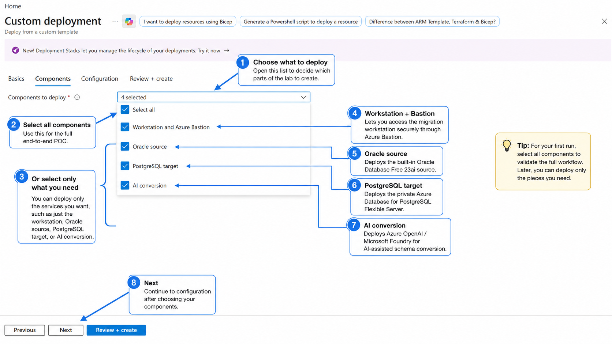](azure/media/deployment-guide/02-select-components.png)

On **Configuration**, review the settings for the selected components. The defaults are
suitable for the rapid POC; adjust VM sizes for quota or availability and change the model
deployment name only when deploying a different model configuration.

After configuration, use **Review + create** to confirm the project details, selected
components, and component settings. When validation succeeds, select **Create**.

[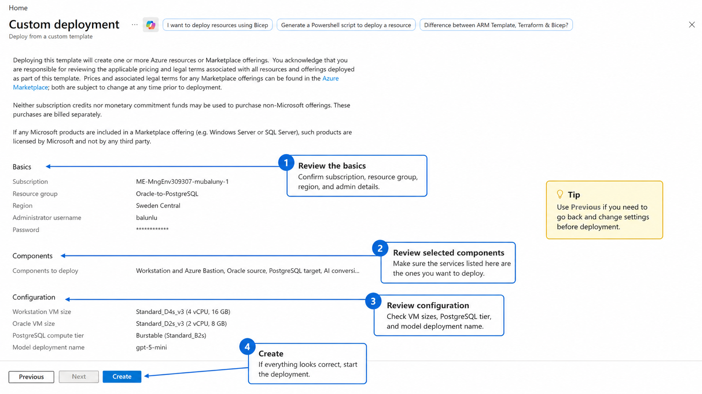](azure/media/deployment-guide/03-review-and-create.png)

After deployment, open the resource group and verify that the resources for your selected
components were created. If you deployed the workstation, open **migration-workstation** next.

[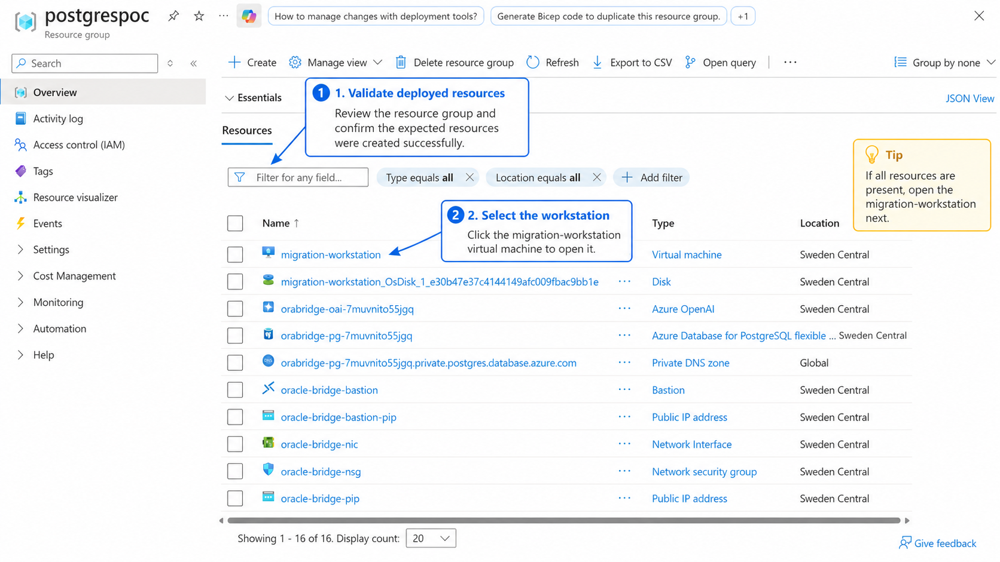](azure/media/deployment-guide/04-validate-deployed-resources.png)

> **If a resource looks unreachable, check it isn't stopped.** Some subscriptions have
> governance or auto-shutdown policies that stop compute to save cost. Before you connect,
> confirm these are **Running** in the portal and start any that were stopped:
> the **PostgreSQL flexible server**, the **migration-workstation** VM, and the
> **oracle-source-vm**.

On the workstation page, select **Connect** > **Connect via Bastion** for browser access. The
deployment blocks direct public RDP; use Bastion or the documented Bastion tunnel instead.

[](azure/media/deployment-guide/05-connect-via-bastion.png)

## What's installed on the workstation

The workstation is a Windows Server 2022 VM provisioned at deploy time by
[azure/setup.ps1](azure/setup.ps1).

**VS Code extensions** (installed at first interactive logon):

| Extension | ID | Purpose |
|---|---|---|
| PostgreSQL (Microsoft) | `ms-ossdata.vscode-pgsql` | Runs the Migration Wizard and performs the AI schema conversion |
| GitHub Copilot | `github.copilot` | Copilot agent used to triage and fix conversion tasks |
| GitHub Copilot Chat | `github.copilot-chat` | Chat / agent mode for resolving flagged items |

**Command-line tooling** (installed system-wide during deployment):

- **Visual Studio Code** (desktop, added to `PATH`)
- **Oracle Instant Client 21.13** (thick-client mode, on `PATH`) — connects to the Oracle source
- **Azure CLI** — Azure sign-in (`az login`) for working with the deployed resources

> **First-logon note:** the three extensions install via a Windows `RunOnce` entry the first
> time you sign in, so they need outbound access to the VS Code Marketplace at that moment and
> appear a few seconds after the desktop loads. The setup log's `PROVISION_COMPLETE` line is
> written *before* that logon, so it confirms the deploy-time steps finished — not that the
> extensions installed. If any are missing, run the `code --install-extension` commands from
> [azure/setup.ps1](azure/setup.ps1) manually in a terminal.

On first logon, keep the setup command open while it installs the per-user Visual Studio Code
extensions. For browser-based Bastion, allow cookies and pop-ups for the Azure portal.

[](azure/media/deployment-guide/06-complete-workstation-setup.png)

Dismiss the Windows first-logon prompts and close Server Manager pop-ups. Network discovery
isn't required for this workflow, so select **No** unless your organization requires it.

[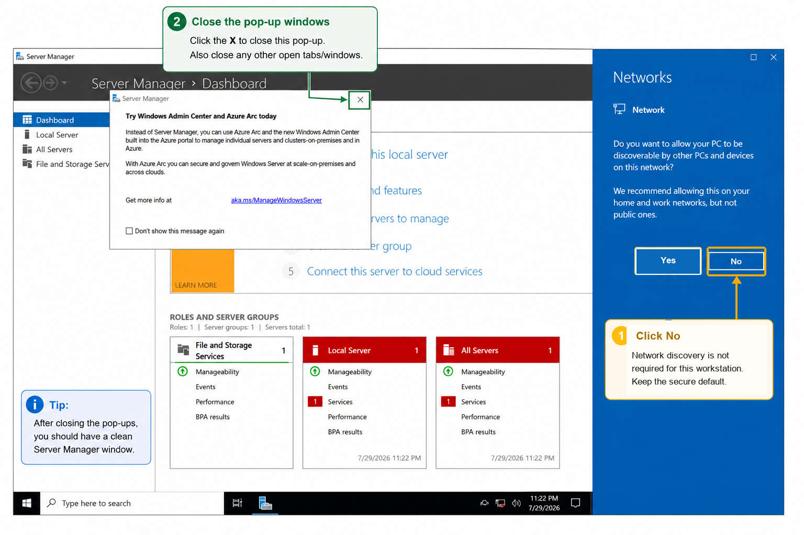](azure/media/deployment-guide/07-dismiss-first-logon-prompts.png)

Open **connection-info.txt** from the public desktop and keep it available for the Migration
Wizard. It contains connection metadata for the selected components, but no passwords, API
keys, or tokens.

[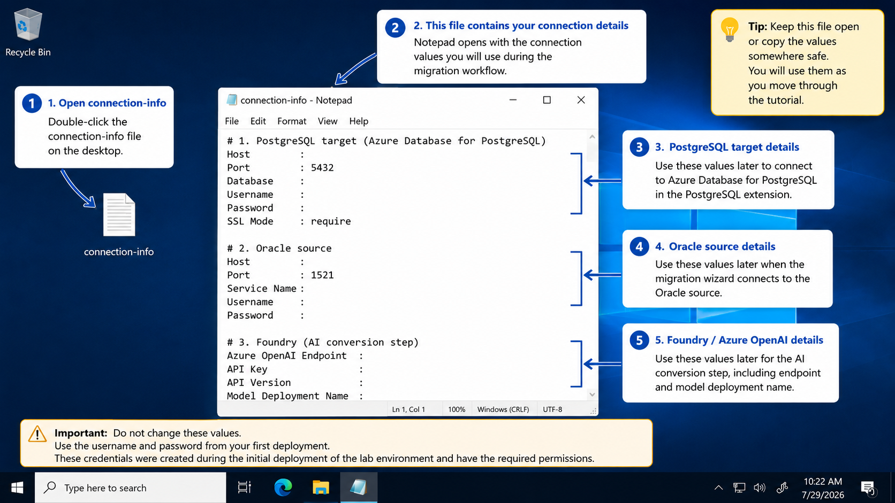](azure/media/deployment-guide/08-review-connection-info.png)

Open the Windows **Start** menu, launch **Visual Studio Code**, and confirm the PostgreSQL
extension is installed before starting the Migration Wizard. If the initial GitHub sign-in
welcome screen appears, close it and authenticate later when the workflow requests it.

[](azure/media/deployment-guide/09-open-visual-studio-code.png)

## Run the schema conversion

The conversion runs inside VS Code on the workstation — the Migration Wizard and GitHub
Copilot can't run headlessly. Every value the wizard asks for is on the workstation desktop
in **connection-info.txt**; the passwords are the deploy password you set.

### 1. Connect to the target and open Migrations

In the PostgreSQL extension, select **Add Connection**. Use `postgresFqdn`, port `5432`,
`postgresDatabase`, SSL mode `require`, `postgresAdmin`, and your deployment password.
Don't save the password on a shared or long-lived workstation.

[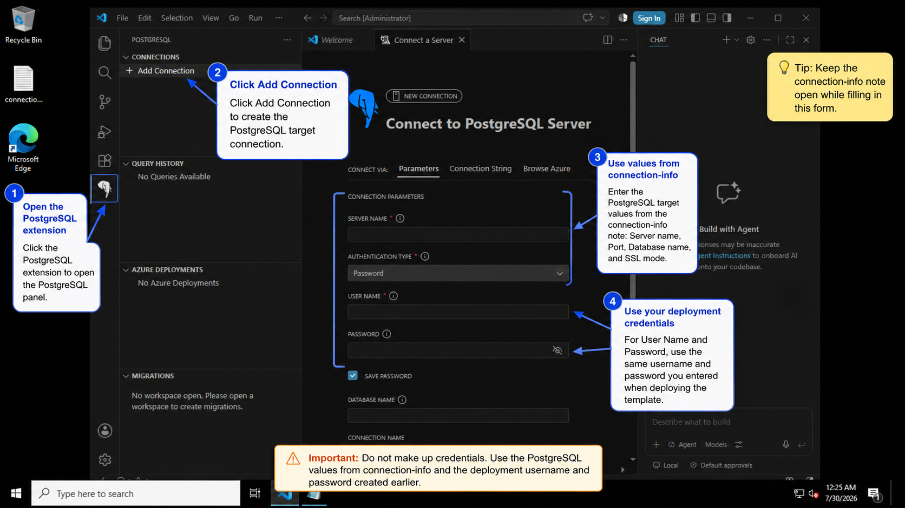](azure/media/deployment-guide/10-connect-postgresql-target.png)

Confirm the server appears under **Connections**, open **Migrations**, and choose a writable
project folder. Desktop is used for this POC, but any suitable folder works.

[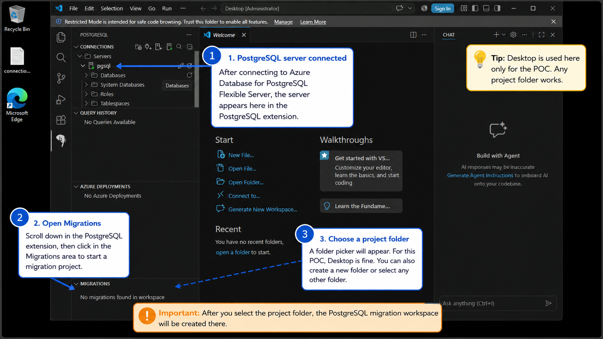](azure/media/deployment-guide/11-open-migrations-workspace.png)

### 2. Create the migration project

In the PostgreSQL extension, open the **Migrations (preview)** view → **Create Migration Project**:

1. **Project Setup** — name the project, then **Next**.

  [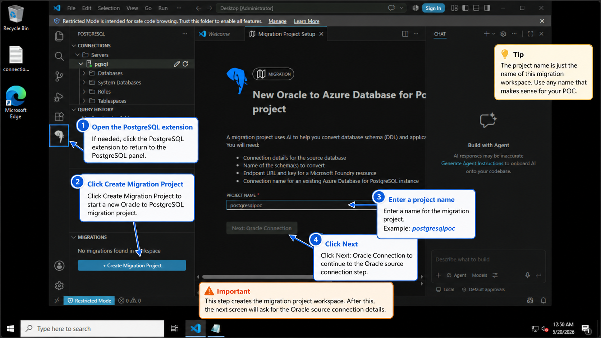](azure/media/deployment-guide/12-create-migration-project.png)

2. **Connect to Oracle** — host `oraclePrivateIp`, port `1521`, service `FREEPDB1`, user
   `MIG` with your deploy password. Copy these values from the **connection-info** Notepad
   file on the workstation desktop. Select **Load Schemas**, choose **HR**, then **Next**.

  [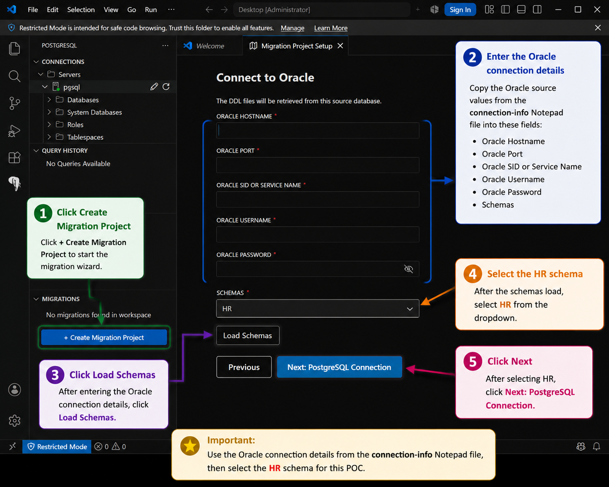](azure/media/deployment-guide/13-connect-to-oracle.png)

3. **Scratch database** — connect to the PostgreSQL flexible server (`postgresFqdn`) with
   admin `azureuser` and your deploy password (SSL mode `require`). Pick the pre-created
   `migration_sandbox` database (output `postgresDatabase`) as the target — the recommended
   extensions are already installed there — select **Verify Extensions**, then **Next**.

  [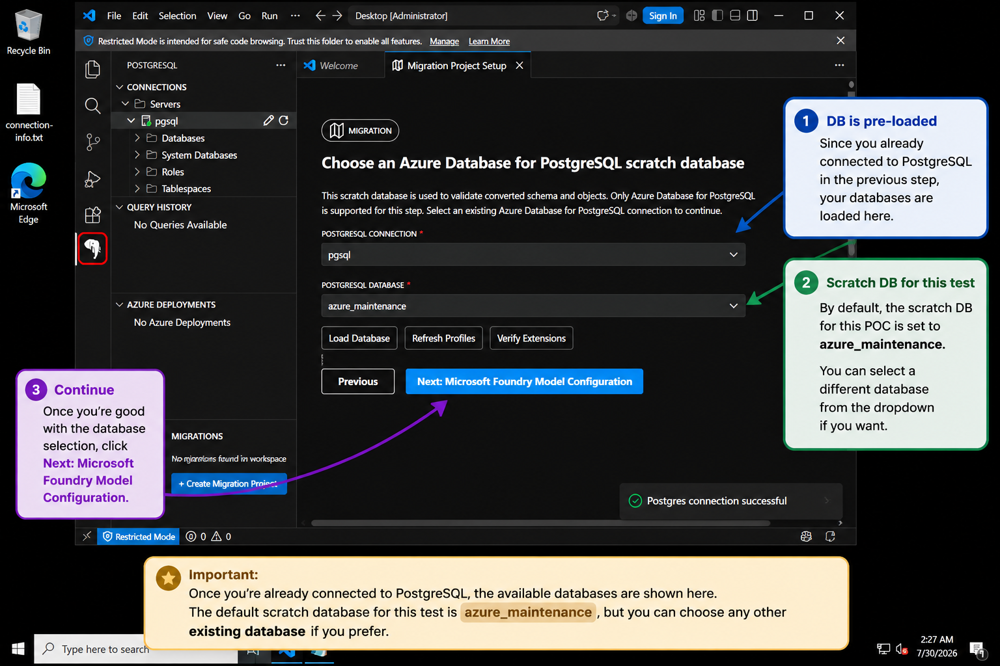](azure/media/deployment-guide/14-select-scratch-database.png)

4. **Microsoft Foundry** — enter `foundryEndpoint` and the **deployment name** `gpt-5-mini`
   (this is the model deployment, not the resource name; both are also set on the workstation
   as the machine environment variables `FOUNDRY_ENDPOINT` and `FOUNDRY_DEPLOYMENT`).
   Authenticate either way:
   - **API key** (simplest) — copy it from the Azure OpenAI resource → **Keys and Endpoint**.
     Reading the key requires Contributor/Owner on the resource, which you have as the deployer.
     *If the portal shows "API key authentication is disabled by your resource owner", your
     subscription has a policy that disables local auth (`disableLocalAuth = true`) — keys are
     unavailable, so use the Microsoft Entra ID option below instead.*
   - **Microsoft Entra ID** — sign in with the **same account you deployed with**. The template
     grants that account the **Cognitive Services OpenAI User** role on the resource, so
     inference calls are authorized without a key. This is the **required** path in governed
     subscriptions where key auth is disabled by policy. (A *different* account has no access
     and will fail with `PermissionDenied` — grant it the same role.)
5. Select **Test Connection**, then **Create Migration Project**.

  [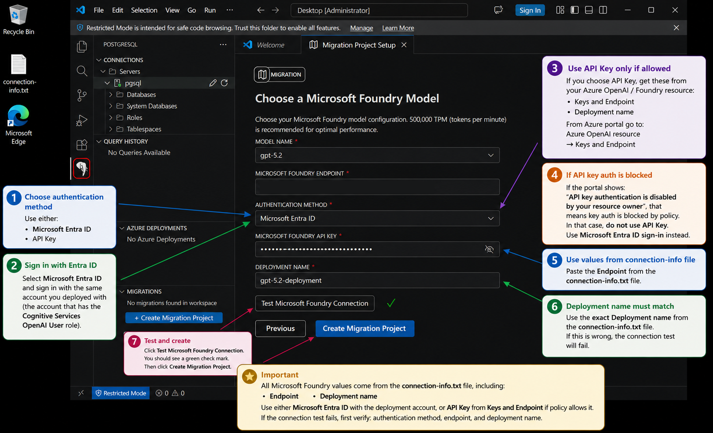](azure/media/deployment-guide/15-configure-foundry-model.png)

### 3. Run the conversion

On the **Schema Migration** card select **Migrate**, watch the *Extracting → Converting*
stages, and wait for **Migration Complete**. Select **View Migration Report**.

[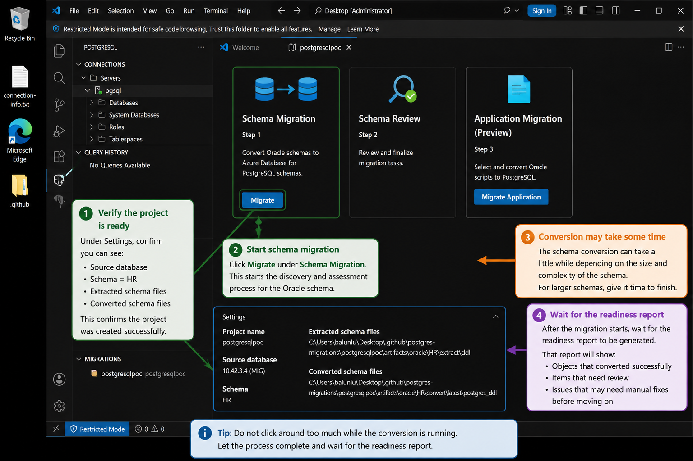](azure/media/deployment-guide/16-run-schema-migration.png)

### 4. Review, triage, and resolve

The conversion handled everything it could automatically and flagged the rest as **review
tasks**. Your only job in this step is to clear every **Mandatory** task — then you're ready to
deploy.

[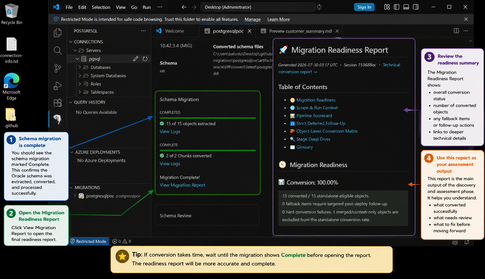](azure/media/deployment-guide/17-migration-readiness-report.png)

1. Skim `reports/customer_summary.md` in the session folder for the readiness decision, the
   success percentage, and how many **Mandatory** tasks you have.
2. In the **Schema Review** pane, filter to **Status = Pending** and **Priority = Mandatory**.
   (The **Grouped** view organizes tasks by theme such as *Numeric Semantics*; the **Tasks**
   view lets you work them one at a time.)
3. For each task, select **Run Task** to open **GitHub Copilot agent mode** with the source and
   converted DDL loaded. Review the proposed fix, apply it to the object's `.sql` file under
   `postgres_ddl/<schema>/<object_type>/`, then select **Resolve**.

[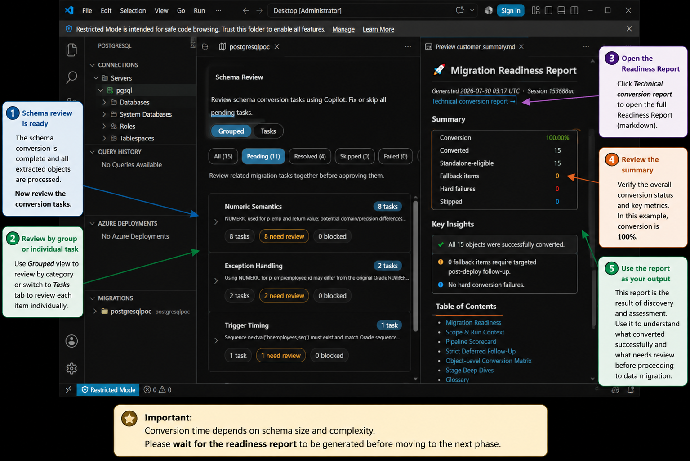](azure/media/deployment-guide/18-review-pending-tasks.png)

The first time you select **Run Task**, VS Code prompts you to sign in to GitHub Copilot —
choose **Continue with GitHub** and use the account that holds your Copilot license.

[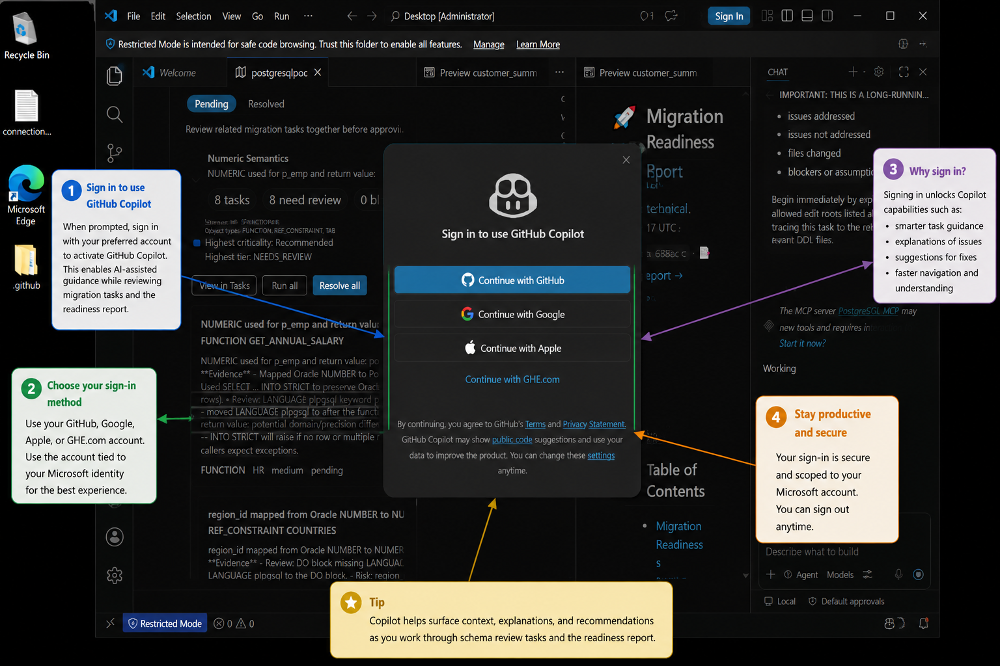](azure/media/deployment-guide/19-sign-in-to-copilot.png)

Once you're signed in, a **Resolved N tasks in the selected group** confirmation appears and
each fixed item shows **RESOLVED** in the **Tasks** view. Keep working the list until every
**Mandatory** task is **Resolved** — that's your signal to move to Step 5. (The **Migration
Readiness Report** is also available if you want to re-check assumptions and *Tasks Not
Addressed*.) If the confirmation or tasks don't appear, refresh the page and confirm your GitHub
sign-in completed.

[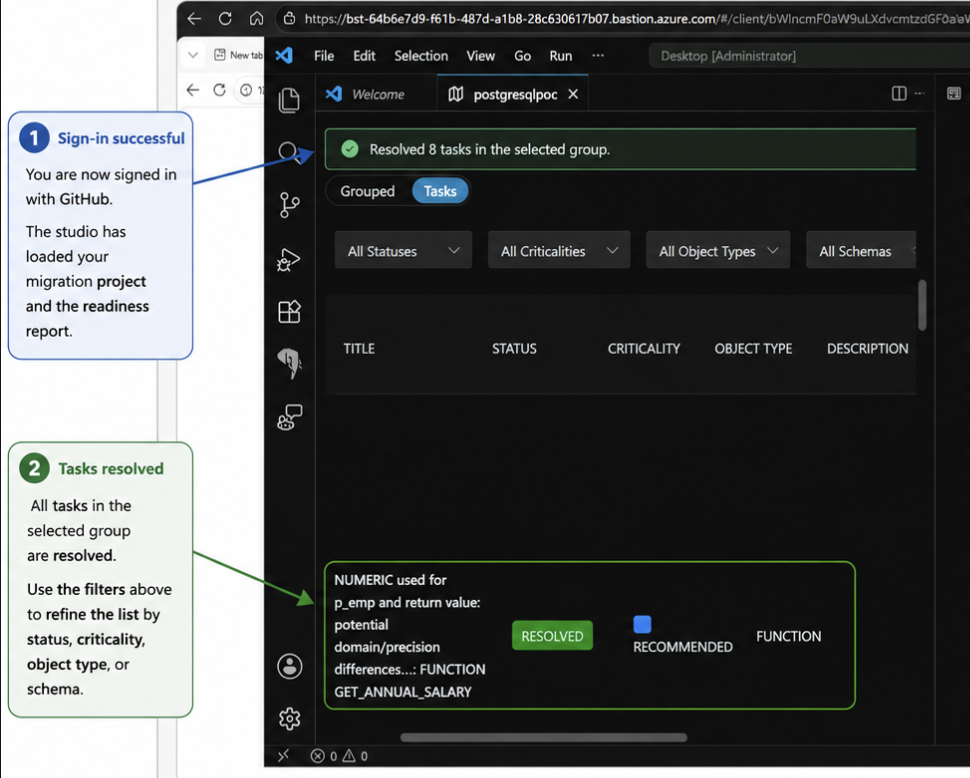](azure/media/deployment-guide/20-resolved-tasks-review.png)

> **Validate before you trust it.** Independently check each AI-assisted fix — the success
> percentage reflects automated coverage, not deployment readiness. For per-object DDL and a
> deeper technical view, open `reports/technical_conversion_report.md` in the session folder.

### 5. Produce and deploy `deploy.sql`

Now deploy the converted schema — this part is quick. The conversion already produced a single
consolidated **`deploy.sql`** that creates every object in dependency order; you just open it and
run it against `migration_sandbox`. Find it **inside your migration project folder** (the
writable folder you chose in Step 1 — the Desktop for this POC), at
`artifacts/oracle/<schema>/convert/sessions/<session-id>/deploy.sql` — for the `HR` schema, for
example, `Desktop\<project>\artifacts\oracle\HR\convert\sessions\<session-id>\deploy.sql`.

> **Only if you resolved tasks in Step 4:** resolving a task updates that object's file under
> `postgres_ddl/<schema>/<object_type>/`, but it does **not** rewrite the consolidated
> `deploy.sql`. Rerun the conversion (Step 3) once more *before* deploying so a fresh `deploy.sql`
> is generated **with your fixes** — or deploy the updated per-object files from `postgres_ddl/`
> instead. If you had no Mandatory tasks, deploy the existing `deploy.sql` as-is.

To deploy it to the PostgreSQL target:

1. **Pick the target database first.** `deploy.sql` contains no database-switch command, so its
   objects land in whatever database the editor is connected to. Make that **`migration_sandbox`**
   (`postgresDatabase`) — **not** the server's default `postgres` maintenance database. Select it
   one of two ways:
   - **Right-click `migration_sandbox` in the PostgreSQL explorer → New Query** — opens an editor
     already connected to that database.
   - **Or set the database on the connection** — use the database selector at the top-right of the
     SQL editor, or set the **Database** field to `migration_sandbox` in the connection profile,
     then reconnect.
2. **In VS Code, open `deploy.sql`** from the session folder above into that
   `migration_sandbox`-connected editor (or paste its contents into the **New Query** window).
3. Run the whole file (**Run Query**). The objects are created in dependency order.
4. Refresh the explorer and confirm the schema objects now exist under the **`public`** schema in
   **`migration_sandbox`**. (The Oracle `HR` objects map into PostgreSQL's default `public`
   schema — there's no separate `hr` schema.)

[](azure/media/deployment-guide/21-deploy-sql-overview.png)

You should now see the deployed table — and every other schema object that migrated (tables,
views, sequences, and so on) — under the **`public`** schema of **`migration_sandbox`** in the
PostgreSQL explorer.

[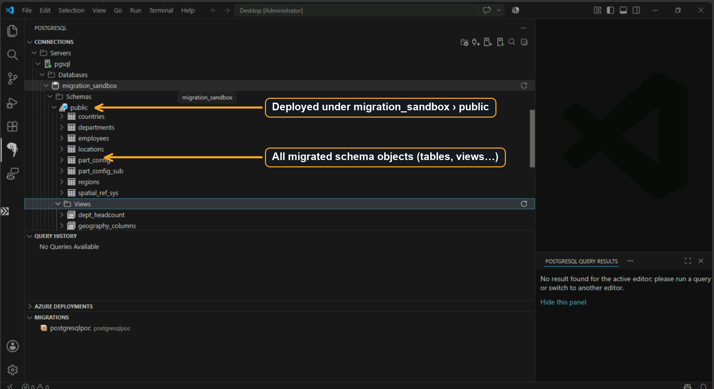](azure/media/deployment-guide/22-migrated-schema-verified.png)

These tables are **empty** — this POC deploys the schema, not the data. To also move the rows,
run a separate data-migration tool (**Azure DMS**, **`ora2pg`**, or **`pgloader`**) against the
new PostgreSQL objects.

> **Watch the active database.** A flexible-server connection defaults to `postgres`, so if you
> run `deploy.sql` without selecting `migration_sandbox` the schema lands in the wrong database.
> To undo that, connect to `postgres` and reset its `public` schema with
> `DROP SCHEMA public CASCADE; CREATE SCHEMA public;` (this clears everything in that database's
> `public` schema), then re-run against `migration_sandbox`.

**Troubleshooting** — skip unless something fails:

> **If the connection times out** (`Could not connect to '…postgres.database.azure.com' within
> 15 seconds`): the server is almost always **stopped**, not unreachable. Some subscriptions
> have governance or auto-shutdown policies that stop compute to save cost. Open the
> **PostgreSQL flexible server** in the portal, select **Start** if it's stopped, wait for
> **Running**, then retry. (Also confirm you're connecting from the workstation — the server
> has no public endpoint and resolves only inside the VNet.)

> **If "Verify Extensions" fails:** Azure Database for PostgreSQL requires extensions to be
> allow-listed before use. Add the ones your schema needs to the `azure.extensions` server
> parameter (the server's **Server parameters** blade) and retry.
>
> **If "Load Schemas" fails with a permission error on `SYS.ARGUMENT$`:** the migration user
> needs dictionary read access. Connect as a privileged user and run
> `GRANT SELECT ANY DICTIONARY TO MIG;` (new deployments already include this grant).

## Use your own Oracle source

The built-in `oracle-source-vm` exists so you can prove the end-to-end flow with zero external
dependencies. Once that run succeeds, you can point the Migration Wizard at your own
**dev/test** Oracle instead — nothing on the workstation changes (the Oracle Instant Client is
already installed). Before you connect, make sure the following are in place.

> **Recommended:** run the POC once against the built-in Oracle source first. It validates the
> workstation, Bastion access, the PostgreSQL target, and your Azure OpenAI quota — so if
> anything is off, you know it isn't your own database or network.

**1. Network path (workstation → your Oracle on port 1521)**

The `migration-workstation` must be able to reach your Oracle listener on **1521**. Choose one:

- **VNet peering** — peer this deployment's VNet with the VNet hosting your Oracle.
- **Site-to-site VPN or ExpressRoute** — for an on-premises Oracle.
- **Public endpoint** — the workstation has outbound internet, so your Oracle's firewall/NSG can
  instead allow inbound 1521 from the workstation's public IP (`publicFqdn`). Least preferred;
  only for non-sensitive dev/test.

**2. A read-only migration login**

Create a login for the wizard with the same privileges the built-in `MIG` user gets:

```sql
CREATE USER MIG IDENTIFIED BY "<strong-password>";
GRANT CREATE SESSION        TO MIG;
GRANT SELECT ANY DICTIONARY TO MIG;   -- covers SYS.ARGUMENT$ etc. the wizard reads
GRANT SELECT_CATALOG_ROLE    TO MIG;
GRANT SELECT ANY TABLE       TO MIG;   -- or grant SELECT only on the schemas you convert
```

The conversion **only reads** the source — it never writes to your Oracle — so it is safe to run
against dev/test.

**3. The correct connect identifier**

Use the **service name** of the pluggable database (PDB) you want to convert — not the CDB root
— along with the host and port 1521. A wrong service name is the most common connection failure.

**4. TLS/wallet (only if your Oracle enforces TCPS)**

The default path assumes plain TCP on 1521. If your Oracle requires encrypted connections
(TCPS), supply the wallet/certificate to the Oracle Instant Client on the workstation.

Everything else in the workflow above is identical — just enter your Oracle's host, port, service
name, and the migration-user credentials at the **Connect to Oracle** step.

## Tear down

When you're done, remove everything by deleting the resource group. Azure has no native
one-click *delete* URL (by design), so this button opens the **Resource groups** blade in
the portal — pick the POC's resource group (for example `oracle-bridge-rg`) and choose
**Delete resource group**:

[](https://portal.azure.com/#browse/resourcegroups)

Or run the teardown script (deletes the group and purges the soft-deleted Azure OpenAI
account so its name is freed):

```bash
./azure/teardown.sh oracle-bridge-rg
```

Equivalent one-liner:

```bash
az group delete -n oracle-bridge-rg --yes
```

## What's in this repo

| Path | Purpose |
|---|---|
| [azure/azuredeploy.json](azure/azuredeploy.json) | Compiled ARM template behind the **Deploy to Azure** button |
| [azure/createUiDefinition.json](azure/createUiDefinition.json) | Portal form definition for the one-click deployment |
| [azure/main.bicep](azure/main.bicep) | Bicep source — provisions the whole POC environment: VNet/NSG/Bastion, the Windows workstation, the Oracle source VM, the PostgreSQL flexible server, and the Azure OpenAI deployment |
| [azure/setup.ps1](azure/setup.ps1) | PowerShell run by an Azure Run Command — installs VS Code + PostgreSQL extension + Oracle Instant Client + Azure CLI on the workstation |
| [azure/teardown.sh](azure/teardown.sh) | Deletes the resource group and purges the soft-deleted Azure OpenAI account |
| [azure/cloud-init.yaml](azure/cloud-init.yaml) | Cloud-init for the **Oracle source VM** — installs Docker, runs Oracle Database Free 23ai, and seeds the sample HR schema on first boot |

## Deploy from the command line (optional)

If you prefer the CLI over the portal button:

```bash
az group create -n oracle-bridge-rg -l westeurope

az deployment group create -g oracle-bridge-rg -f azure/main.bicep \
  -p adminUsername=azureuser \
     adminPassword='<strong-password>'
```

The admin username and password are reused for the workstation RDP login and for the
Oracle and PostgreSQL admin accounts. The template also creates an Azure OpenAI model
deployment (default `gpt-5-mini`) and grants the workstation's managed identity the
**Cognitive Services OpenAI User** role — so the deploying identity needs permission to
create role assignments (**Owner** or **User Access Administrator** on the resource group).

> If the deployment fails preflight with a `QuotaExceeded` error for a VM family, your
> subscription has no quota for that size in the region. Run `az vm list-usage -l <region>`
> and pass a size you do have, for example `-p vmSize=Standard_D4s_v3` (workstation) or
> `-p oracleVmSize=Standard_D2s_v3` (Oracle source). If the OpenAI deployment fails with
> a model-deprecation error, pass a currently available model, for example
> `-p openAiModelName=gpt-5-mini openAiModelVersion=2025-08-07`.

The deployment outputs `publicFqdn`, `vmResourceId`, `bastionRdpTunnelCommand`,
`oraclePrivateIp`, `oracleServiceName`, `postgresFqdn`, `postgresAdmin`, `foundryEndpoint`,
and `foundryDeployment`. Access is **RDP only, via an Azure Bastion tunnel** — no SSH, no
public RDP port, no public web ports. Open the tunnel, RDP to `localhost:13389` with the
password you set, then use VS Code. Reset the password later via `az vm run-command`.

## Security

- RDP only, via an Azure Bastion tunnel — no SSH, no public RDP port; RDP (3389) is reachable only from the virtual network.
- The Oracle source (1521) and the PostgreSQL flexible server are reachable **only from within the virtual network** — no public database endpoints. PostgreSQL uses private access with a private DNS zone.
- No public web ports.
- The login password is a `@secure()` deploy-time parameter (not stored in the template) and can be rotated with `az vm run-command`. It is reused for the Oracle and PostgreSQL admin accounts for POC convenience — change them for anything beyond a POC.
- The workstation uses a system-assigned managed identity, granted only the **Cognitive Services OpenAI User** role on the lab's Azure OpenAI account.
- Independently validate all converted objects before deploying to production.

## Contributors

_The following people contributed to this project._

Principal author:

- [Lukman Balunywa](https://www.linkedin.com/in/lukman-balunywa-a68620118) | Principal Solution Engineer, Cloud/AI Platforms

Other contributors:

- Naren Narendra | Principal Group Program Manager, R&D Data – SQL DB
- [Vijayalakshmi Somasundaram](https://www.linkedin.com/in/sviji/) | Principal Solution Engineer, Cloud/AI Platforms
- [Huan Lee](https://www.linkedin.com/in/huanlee) | Principal Solution Engineer, Cloud/AI Platforms
- [Jarrett Long](https://www.linkedin.com/in/jarrettlong) | Principal Solution Engineer, Cloud/AI Platforms
- [Jamail Abelhad](https://www.linkedin.com/in/jamailabelhad) | Senior Solution Engineer, Cloud/AI Platforms

_To see nonpublic LinkedIn profiles, sign in to LinkedIn._
