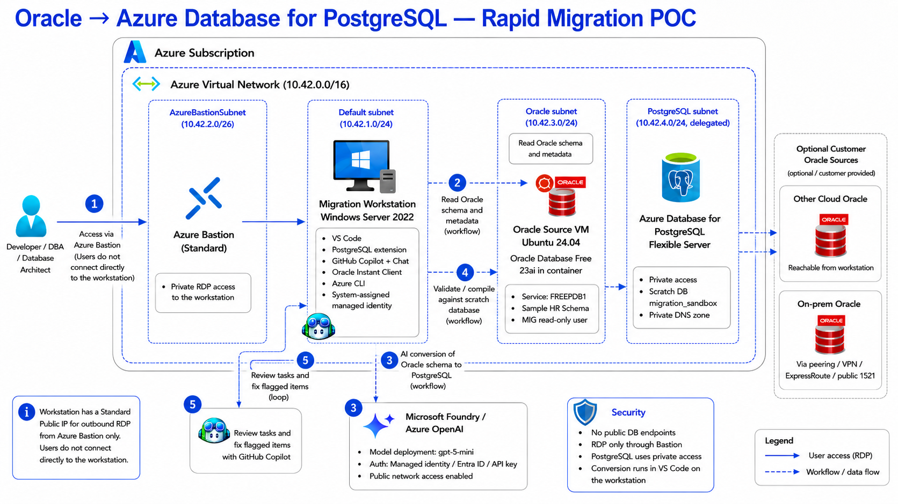

# Run schema conversion from a network-isolated workstation

The Oracle to Azure Database for PostgreSQL schema conversion feature runs in the
Visual Studio Code PostgreSQL extension on the machine where you start it. That
machine must reach three endpoints during a conversion: the source Oracle
database, the Azure Database for PostgreSQL flexible server that hosts the scratch
database, and the Microsoft Foundry deployment. For more information, see
[Security and networking](schema-conversions-overview.md#security-and-networking)
and [Secure the conversion workflow](schema-conversions-best-practices.md#secure-the-conversion-workflow).

> [!NOTE]
> This is a Microsoft Learn source article. Links to other `schema-conversions-*`
> articles resolve on Microsoft Learn and are not part of this repository.

In many enterprises the source Oracle database is reachable only from inside a
private virtual network, and a local machine has no route to it. Rather than open
inbound access to Oracle, run the PostgreSQL extension from a Visual Studio Code
instance that already lives inside the network the source database trusts. This
article describes how to host that Visual Studio Code instance on a
VNet-integrated Azure virtual machine, so the supported conversion feature runs
unchanged with line of sight to all three endpoints.

> [!NOTE]
> This approach changes only *where* Visual Studio Code runs. The conversion is
> still performed by the PostgreSQL extension with Microsoft Foundry and validated
> in a scratch database, exactly as described in
> [What is Oracle to Azure Database for PostgreSQL schema conversion?](schema-conversions-overview.md).

## When to use a network-isolated workstation

Consider a VNet-integrated workstation when:

- The source Oracle database accepts connections only from inside a virtual network or on-premises network, and your local machine has no route to it.
- Security policy requires that the conversion run inside a controlled Azure boundary rather than on a personal device.
- You want a reproducible, prebuilt environment that already has the Visual Studio Code PostgreSQL extension and the required Oracle connectivity prerequisites installed.

If your local machine can already reach the source Oracle database, the scratch
database, and Microsoft Foundry, use the standard local workflow instead. See
[Install the extension](schema-conversions-overview.md#install-the-extension).

## Architecture

The workstation is a virtual machine that runs Visual Studio Code inside the
virtual network that the source Oracle database trusts. The conversion components
are unchanged from the standard flow:

- **Source Oracle database**: Reached over private networking (virtual network peering, a private endpoint, or a site-to-site or point-to-site VPN) from the workstation's subnet.
- **Workstation virtual machine**: An Azure virtual machine inside the virtual network. It runs Visual Studio Code with the PostgreSQL extension and, when required, Oracle Instant Client for thick client mode.
- **Azure Database for PostgreSQL flexible server**: Hosts the scratch schemas the tool uses to validate converted objects, and the production target.
- **Microsoft Foundry**: Provides the language models that power AI-driven schema transformation, reached over a private endpoint.

The supplied deployment uses Azure Bastion for RDP and blocks direct inbound RDP
to the workstation. The workstation's public IP supports its required outbound
downloads; it isn't the user access path. When you use a customer-provided Oracle
source, route the workstation to that source through virtual network peering, VPN,
ExpressRoute, or an explicitly secured endpoint.

The workstation needs a network path to each endpoint. Peer or connect its
virtual network with the network that holds Oracle, and use a private endpoint or
firewall rules to reach the Azure Database for PostgreSQL flexible server, as
described in
[Use private endpoints or firewall rules for the target](schema-conversions-best-practices.md#use-private-endpoints-or-firewall-rules-for-the-target).

## Prerequisites

- An Azure subscription, and permission to create a virtual machine and supporting network resources in it.
- A virtual network that has, or can be peered to, a route to the source Oracle database.
- An Azure Database for PostgreSQL flexible server to use as the scratch database, prepared as described in [Prepare the scratch database](schema-conversions-best-practices.md#prepare-the-scratch-database).
- A Microsoft Foundry resource with a model deployment, and its endpoint. For authentication options, see [Authentication for Microsoft Foundry](schema-conversions-overview.md#authentication-for-microsoft-foundry).
- The source Oracle privileges and session settings described in [Prepare the source Oracle environment](schema-conversions-best-practices.md#prepare-the-source-oracle-environment).

> [!IMPORTANT]
> Schema conversion is supported on Windows and Linux only, and isn't supported
> on ARM64. Choose a virtual machine size and image that match a supported
> platform. For more information, see
> [Schema conversion limitations](schema-conversions-limitations.md).

## Create the workstation

1. **Create a virtual machine in the right virtual network**: Deploy a Windows or Linux virtual machine into the virtual network that can reach the source Oracle database. Place it in a subnet that has, or can be peered to, a route to Oracle.

1. **Connect to the virtual machine privately**: Connect by using Azure Bastion so you don't expose a public management port or manage SSH keys. This deployment signs in over RDP with the admin password you set at deploy time; for stronger control you can enable Microsoft Entra ID sign-in and gate access with Azure role-based access control. For more information, see [What is Azure Bastion?](/azure/bastion/bastion-overview).

1. **Install Visual Studio Code and the PostgreSQL extension**: On the virtual machine, install Visual Studio Code and the PostgreSQL extension published by Microsoft, as described in [Install the extension](schema-conversions-overview.md#install-the-extension).

1. **Install Oracle Instant Client if thick client mode is required**: If your source Oracle environment uses native network encryption, install Oracle Instant Client on the virtual machine. To determine whether thick client mode is required, see [Oracle connectivity modes](schema-conversions-overview.md#oracle-connectivity-modes).

1. **Confirm connectivity to all three endpoints**: From the virtual machine, verify that Visual Studio Code can reach the source Oracle database, the Azure Database for PostgreSQL flexible server, and the Microsoft Foundry endpoint before you start a conversion, as described in [Confirm network connectivity from Visual Studio Code](schema-conversions-best-practices.md#confirm-network-connectivity-from-visual-studio-code).

## Run the conversion

After the workstation can reach all three endpoints, run the conversion exactly
as you would on a local machine. Open the PostgreSQL extension, start the
Migration Wizard, and follow the standard workflow to connect to Oracle,
configure the scratch database and Microsoft Foundry, convert the schema, resolve
review tasks with GitHub Copilot agent mode, and generate the PostgreSQL output
files. For the end-to-end steps, see
[Tutorial: Convert Oracle schemas to Azure Database for PostgreSQL](schema-conversions-tutorial.md).

## Security considerations

A VNet-integrated workstation lets you apply the controls in
[Secure the conversion workflow](schema-conversions-best-practices.md#secure-the-conversion-workflow)
inside an Azure boundary:

- **Private connectivity**: Keep the source Oracle database, the scratch database, and Microsoft Foundry on private endpoints or restricted firewall rules. The workstation reaches them from inside the virtual network, so you don't open inbound access to Oracle.
- **Identity-based access to the workstation**: Reach the workstation only through Azure Bastion (this deployment uses a deploy-time RDP password; optionally enable Microsoft Entra ID sign-in), and control who can connect by using Azure role-based access control.
- **Microsoft Entra ID for the target database**: Connect to Azure Database for PostgreSQL flexible server with Microsoft Entra authentication instead of passwords. See [Use Microsoft Entra ID authentication](schema-conversions-best-practices.md#use-microsoft-entra-id-authentication).
- **Credential handling**: Don't embed Oracle or PostgreSQL credentials in plain text. Store them in Azure Key Vault and reference them at connect time, as described in [Manage credentials safely](schema-conversions-best-practices.md#manage-credentials-safely).
- **Customer validation responsibility**: Independently validate all converted objects and review-task resolutions before you deploy to production.

## Clean up

When the migration is complete, delete the workstation virtual machine and any
networking resources you created solely for it, so you don't continue to incur
cost.

## Related content

- [What is Oracle to Azure Database for PostgreSQL schema conversion?](schema-conversions-overview.md)
- [Tutorial: Convert Oracle schemas to Azure Database for PostgreSQL](schema-conversions-tutorial.md)
- [Best practices for Oracle to Azure Database for PostgreSQL schema conversion](schema-conversions-best-practices.md)
- [Schema conversion limitations](schema-conversions-limitations.md)
