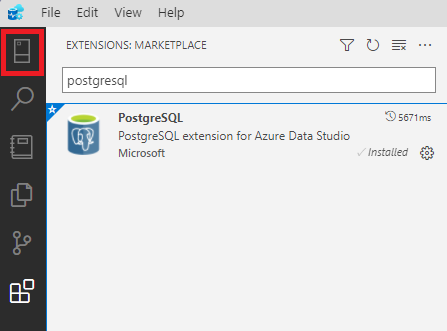

---
lab:
    title: 'Explore PostgreSQL with client tools'
    module: 'Understand client-server communication in PostgreSQL'
---

# Explore PostgreSQL with client tools

In this exercise you will download and install psql and Azure Data studio. If you already have Azure Data Studio installed on your machine you can jump ahead to Connect to Azure Database for PostgreSQL flexible server.

## Before you start

You need your own Azure subscription to complete this exercise. If you do not have an Azure subscription, you can create an [Azure free trial](https://azure.microsoft.com/free).

## Create the exercise environment

In this exercise and all later exercises you will use Bicep in the Azure Cloud Shell to deploy your PostgreSQL server.

### Deploy resources into your Azure subscription

This step guides you through using Azure CLI commands from the Azure Cloud Shell to create a resource group and run a Bicep script to deploy the Azure services necessary for completing this exercise into your Azure subscription.

> Note
>
> If you are doing multiple modules in this learning path, you can share the Azure environment between them. In that case, you only need to complete this resource deployment step once.

1. Open a web browser and navigate to the [Azure portal](https://portal.azure.com/).

2. Select the **Cloud Shell** icon in the Azure portal toolbar to open a new [Cloud Shell](https://learn.microsoft.com/azure/cloud-shell/overview) pane at the bottom of your browser window.

    

3. If prompted, select the required options to open a *Bash* shell. If you have previously used a *PowerShell* console, switch it to a *Bash* shell.

4. At the Cloud Shell prompt, enter the following to clone the GitHub repo containing exercise resources:

    ```bash
    git clone https://github.com/MicrosoftLearning/mslearn-postgresql.git
    ```

5. Next, you run three commands to define variables to reduce redundant typing when using Azure CLI commands to create Azure resources. The variables represent the name to assign to your resource group (`RG_NAME`), the Azure region (`REGION`) into which resources will be deployed, and a randomly generated password for the PostgreSQL administrator login (`ADMIN_PASSWORD`).

    In the first command, the region assigned to the corresponding variable is `eastus`, but you can also replace it with a location of your preference.

    ```bash
    REGION=eastus
    ```

    The following command assigns the name to be used for the resource group that will house all the resources used in this exercise. The resource group name assigned to the corresponding variable is `rg-learn-work-with-postgresql-$REGION`, where `$REGION` is the location you specified above. However, you can change it to any other resource group name that suits your preference.

    ```bash
    RG_NAME=rg-learn-work-with-postgresql-$REGION
    ```

    The final command randomly generates a password for the PostgreSQL admin login. Make sure you copy it to a safe place so that you can use it later to connect to your PostgreSQL flexible server.

    ```bash
    a=()
    for i in {a..z} {A..Z} {0..9}; 
       do
       a[$RANDOM]=$i
    done
    ADMIN_PASSWORD=$(IFS=; echo "${a[*]::18}")
    echo "Your randomly generated PostgreSQL admin user's password is:"
    echo $ADMIN_PASSWORD
    ```

6. If you have access to more than one Azure subscription, and your default subscription is not the one in which you want to create the resource group and other resources for this exercise, run this command to set the appropriate subscription, replacing the `<subscriptionName|subscriptionId>` token with either the name or ID of the subscription you want to use:

    ```azurecli
    az account set --subscription <subscriptionName|subscriptionId>
    ```

7. Run the following Azure CLI command to create your resource group:

    ```azurecli
    az group create --name $RG_NAME --location $REGION
    ```

8. Finally, use the Azure CLI to execute a Bicep deployment script to provision Azure resources in your resource group:

    ```azurecli
    az deployment group create --resource-group $RG_NAME --template-file "mslearn-postgresql/Allfiles/Labs/Shared/deploy-postgresql-server.bicep" --parameters adminLogin=pgAdmin adminLoginPassword=$ADMIN_PASSWORD
    ```

    The Bicep deployment script provisions the Azure services required to complete this exercise into your resource group. The resources deployed are an Azure Database for PostgreSQL - Flexible Server. The bicep script also creates a database - which can be configured on the commandline as a parameter.

    The deployment typically takes several minutes to complete. You can monitor it from the Cloud Shell or navigate to the **Deployments** page for the resource group you created above and observe the deployment progress there.

8. Close the Cloud Shell pane once your resource deployment is complete.

### Troubleshooting deployment errors

You may encounter a few errors when running the Bicep deployment script. The most common messages and the steps to resolve them are:

- If you previously ran the Bicep deployment script for this learning path and subsequently deleted the resources, you may receive an error message like the following if you are attempting to rerun the script within 48 hours of deleting the resources:

    ```bash
    {"code": "InvalidTemplateDeployment", "message": "The template deployment 'deploy' is not valid according to the validation procedure. The tracking id is '4e87a33d-a0ac-4aec-88d8-177b04c1d752'. See inner errors for details."}
    
    Inner Errors:
    {"code": "FlagMustBeSetForRestore", "message": "An existing resource with ID '/subscriptions/{subscriptionId}/resourceGroups/rg-learn-postgresql-ai-eastus/providers/Microsoft.CognitiveServices/accounts/{accountName}' has been soft-deleted. To restore the resource, you must specify 'restore' to be 'true' in the property. If you don't want to restore existing resource, please purge it first."}
    ```

    If you receive this message, modify the `azure deployment group create` command above to set the `restore` parameter equal to `true` and rerun it.

- If the selected region is restricted from provisioning specific resources, you must set the `REGION` variable to a different location and rerun the commands to create the resource group and run the Bicep deployment script.

    ```bash
    {"status":"Failed","error":{"code":"DeploymentFailed","target":"/subscriptions/{subscriptionId}/resourceGroups/{resourceGrouName}/providers/Microsoft.Resources/deployments/{deploymentName}","message":"At least one resource deployment operation failed. Please list deployment operations for details. Please see https://aka.ms/arm-deployment-operations for usage details.","details":[{"code":"ResourceDeploymentFailure","target":"/subscriptions/{subscriptionId}/resourceGroups/{resourceGroupName}/providers/Microsoft.DBforPostgreSQL/flexibleServers/{serverName}","message":"The resource write operation failed to complete successfully, because it reached terminal provisioning state 'Failed'.","details":[{"code":"RegionIsOfferRestricted","message":"Subscriptions are restricted from provisioning in this region. Please choose a different region. For exceptions to this rule please open a support request with Issue type of 'Service and subscription limits'. See https://review.learn.microsoft.com/en-us/azure/postgresql/flexible-server/how-to-request-quota-increase for more details."}]}]}}
    ```

- If the script is unable to create an AI resource due to the requirement to accept the responsible AI agreement, you may experience the following error; in which case use the Azure Portal user interface to create an Azure AI Services resource, and then re-run the deployment script.

    ```bash
    {"code": "InvalidTemplateDeployment", "message": "The template deployment 'deploy' is not valid according to the validation procedure. The tracking id is 'f8412edb-6386-4192-a22f-43557a51ea5f'. See inner errors for details."}
     
    Inner Errors:
    {"code": "ResourceKindRequireAcceptTerms", "message": "This subscription cannot create TextAnalytics until you agree to Responsible AI terms for this resource. You can agree to Responsible AI terms by creating a resource through the Azure Portal then trying again. For more detail go to https://go.microsoft.com/fwlink/?linkid=2164190"}
    ```

## Client tools to connect to PostgreSQL

### Connect to Azure Database for PostgreSQL with psql

You can install psql locally or connect from the Azure Portal which will open Cloud Shell and prompt you for the password of the admin account.

#### Connecting locally

1. Install psql from [here](https://sbp.enterprisedb.com/getfile.jsp?fileid=1258893).
    1. In the setup wizard, when you reach the **Select Components** dialog box, select **Command Line Tools**.
    > Note
    >
    > To check if **psql** is already installed in your environment, open command line/terminal, and run the command ***psql***. If it returns a message like "*psql: error: connection to server on socket...*", that means that the **psql** tool is already installed in your environment and there is no need to re-install it.


1. Bring up a commandline.
1. The syntax for connecting to the server is:

    ```sql
    psql --h <servername> --p <port> -U <username> <dbname>
    ```

1. At the command prompt enter **`--host=<servername>.postgres.database.azure.com`** where `<servername>` is the name of the Azure Database for PostgreSQL created above.
    1. You can find the Server name in **Overview** in the Azure portal or as an output from the bicep script.

    ```sql
   psql -h <servername>.postgres.database.azure.com -p 5432 -U pgAdmin postgres
    ```

    1. You will be prompted for the password for the admin account you copied above.

1. To create a blank database at the prompt, type:

    ```sql
    CREATE DATABASE mypgsqldb;
    ```

1. At the prompt, execute the following command to switch connection to the newly created database **mypgsqldb**:

    ```sql
    \c mypgsqldb
    ```

1. Now that you have connected to the server, and created a database you can execute familiar SQL queries, such as create tables in the database:

    ```sql
    CREATE TABLE inventory (
        id serial PRIMARY KEY,
        name VARCHAR(50),
        quantity INTEGER
        );
    ```

1. Load data into the tables

    ```sql
    INSERT INTO inventory (id, name, quantity) VALUES (1, 'banana', 150);
    INSERT INTO inventory (id, name, quantity) VALUES (2, 'orange', 154);
    ```

1. Query and update the data in the tables

    ```sql
    SELECT * FROM inventory;
    ```

1. Update the data in the tables.

    ```sql
    UPDATE inventory SET quantity = 200 WHERE name = 'banana';
    ```

## Install Azure Data Studio

> Note
>
> If Azure Data Studio is already installed, go to the *Install the PostgreSQL extension* step.

To install Azure Data Studio for use with Azure Database for PostgreSQL:

1. In a browser, navigate to [Download and install Azure Data Studio](https://go.microsoft.com/fwlink/?linkid=2282284) and under the Windows platform, select **User installer (recommended)**. The executable file is downloaded to your Downloads folder.
1. Select **Open file**.
1. The License agreement is displayed. Read and **accept the agreement**, then select **Next**.
1. In **Select additional Tasks**, select **Add to PATH**, and any other additions you require. Select **Next**.
1. The **Ready to Install** dialog box is displayed. Review your settings. Select **Back** to make changes or select **Install**.
1. The **Completing the Azure Data Studio Setup Wizard** dialog box is displayed. Select **Finish**. Azure Data Studio starts.

## Install the PostgreSQL extension

1. Open Azure Data Studio if it is not already open.
2. From the left menu, select **Extensions** to display the Extensions panel.
3. In the search bar, enter **PostgreSQL**. The PostgreSQL extension for Azure Data Studio icon is displayed.
   

   
4. Select **Install**. The extension installs.

## Connect to Azure Database for PostgreSQL flexible server

1. Open Azure Data Studio if it is not already open.
2. From the left menu, select **Connections**.
   


3. Select **New Connection**.
   


4. Under **Connection Details**, in **Connection type** select **PostgreSQL** from the drop-down list.
5. In **Server name**, enter the full server name as it appears on the Azure portal.
6. In **Authentication type**, leave Password.
7. In User name and Password, enter the user name **pgAdmin** and password **the random admin password** you created above
8. Select [ x ] Remember password.
9. The remaining fields are optional.
10. Select **Connect**. You are connected to the Azure Database for PostgreSQL server.
11. A list of the server databases is displayed. This includes system databases, and user databases.

## Create the zoo database

1. Either navigate to the folder with your exercise script files, or download the **Lab2_ZooDb.sql** from [MSLearn PostgreSQL Labs](https://github.com/MicrosoftLearning/mslearn-postgresql/tree/main/Allfiles/Labs/02).
1. Open Azure Data Studio if it is not already open.
1. Select **File**, **Open file** and navigate to the folder where you saved the scripts. Select **../Allfiles/Labs/02/Lab2_ZooDb.sql** and **Open**.
   1. Highlight the **DROP** and **CREATE** statements and run them.
   1. At the top of the screen, use the drop-down arrow to display the databases on the server, including zoodb and system databases. Select the **zoodb** database.
   1. Highlight the **Create tables**, **Create foreign keys**, and **Populate tables** sections and run them.
   1. Highlight the 3 **SELECT** statements at the end of the script and run them to verify that the tables were created and populated.
