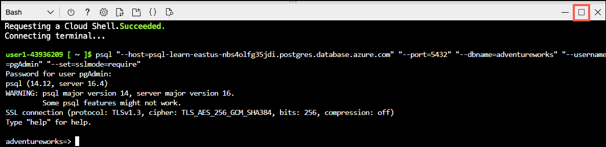

---
lab:
    title: 'Understand locking'
    module: 'Understand concurrency in PostgreSQL'
---

# Understand locking

In this exercise you will look at system parameters and metadata in PostgreSQL.

## Before you start

You need your own Azure subscription to complete the exercises in this module. If you don't have an Azure subscription, you can set up a free trial account at [Build in the cloud with an Azure free account](https://azure.microsoft.com/free/).

## Create the exercise environment

### Deploy resources into your Azure subscription

This step guides you through using Azure CLI commands from the Azure Cloud Shell to create a resource group and run a Bicep script to deploy the Azure services necessary for completing this exercise into your Azure subscription.

1. Open a web browser and navigate to the [Azure portal](https://portal.azure.com/).

2. Select the **Cloud Shell** icon in the Azure portal toolbar to open a new [Cloud Shell](https://learn.microsoft.com/azure/cloud-shell/overview) pane at the bottom of your browser window.

    

    If prompted, select the required options to open a *Bash* shell. If you have previously used a *PowerShell* console, switch it to a *Bash* shell.

3. At the Cloud Shell prompt, enter the following to clone the GitHub repo containing exercise resources:

    ```bash
    git clone https://github.com/MicrosoftLearning/mslearn-postgresql.git
    ```

4. Next, you run three commands to define variables to reduce redundant typing when using Azure CLI commands to create Azure resources. The variables represent the name to assign to your resource group (`RG_NAME`), the Azure region (`REGION`) into which resources will be deployed, and a randomly generated password for the PostgreSQL administrator login (`ADMIN_PASSWORD`).

    In the first command, the region assigned to the corresponding variable is `eastus`, but you can also replace it with a location of your preference.

    ```bash
    REGION=eastus
    ```

    The following command assigns the name to be used for the resource group that will house all the resources used in this exercise. The resource group name assigned to the corresponding variable is `rg-learn-work-with-postgresql-$REGION`, where `$REGION` is the location you specified above. However, you can change it to any other resource group name that suits your preference.

    ```bash
    RG_NAME=rg-learn-work-with-postgresql-$REGION
    ```

    The final command randomly generates a password for the PostgreSQL admin login. Make sure you copy it to a safe place so that you can use it later to connect to your PostgreSQL flexible server.

    ```bash
    a=()
    for i in {a..z} {A..Z} {0..9}; 
       do
       a[$RANDOM]=$i
    done
    ADMIN_PASSWORD=$(IFS=; echo "${a[*]::18}")
    echo "Your randomly generated PostgreSQL admin user's password is:"
    echo $ADMIN_PASSWORD
    ```

5. If you have access to more than one Azure subscription, and your default subscription is not the one in which you want to create the resource group and other resources for this exercise, run this command to set the appropriate subscription, replacing the `<subscriptionName|subscriptionId>` token with either the name or ID of the subscription you want to use:

    ```azurecli
    az account set --subscription <subscriptionName|subscriptionId>
    ```

6. Run the following Azure CLI command to create your resource group:

    ```azurecli
    az group create --name $RG_NAME --location $REGION
    ```

7. Finally, use the Azure CLI to execute a Bicep deployment script to provision Azure resources in your resource group:

    ```azurecli
    az deployment group create --resource-group $RG_NAME --template-file "mslearn-postgresql/Allfiles/Labs/Shared/deploy-postgresql-server.bicep" --parameters adminLogin=pgAdmin adminLoginPassword=$ADMIN_PASSWORD databaseName=adventureworks
    ```

    The Bicep deployment script provisions the Azure services required to complete this exercise into your resource group. The resources deployed are an Azure Database for PostgreSQL - Flexible Server. The bicep script also creates a database - which can be configured on the commandline as a parameter.

    The deployment typically takes several minutes to complete. You can monitor it from the Cloud Shell or navigate to the **Deployments** page for the resource group you created above and observe the deployment progress there.

8. Close the Cloud Shell pane once your resource deployment is complete.

### Troubleshooting deployment errors

You may encounter a few errors when running the Bicep deployment script. The most common messages and the steps to resolve them are:

- If you previously ran the Bicep deployment script for this learning path and subsequently deleted the resources, you may receive an error message like the following if you are attempting to rerun the script within 48 hours of deleting the resources:

    ```bash
    {"code": "InvalidTemplateDeployment", "message": "The template deployment 'deploy' is not valid according to the validation procedure. The tracking id is '4e87a33d-a0ac-4aec-88d8-177b04c1d752'. See inner errors for details."}
    
    Inner Errors:
    {"code": "FlagMustBeSetForRestore", "message": "An existing resource with ID '/subscriptions/{subscriptionId}/resourceGroups/rg-learn-postgresql-ai-eastus/providers/Microsoft.CognitiveServices/accounts/{accountName}' has been soft-deleted. To restore the resource, you must specify 'restore' to be 'true' in the property. If you don't want to restore existing resource, please purge it first."}
    ```

    If you receive this message, modify the `azure deployment group create` command above to set the `restore` parameter equal to `true` and rerun it.

- If the selected region is restricted from provisioning specific resources, you must set the `REGION` variable to a different location and rerun the commands to create the resource group and run the Bicep deployment script.

    ```bash
    {"status":"Failed","error":{"code":"DeploymentFailed","target":"/subscriptions/{subscriptionId}/resourceGroups/{resourceGrouName}/providers/Microsoft.Resources/deployments/{deploymentName}","message":"At least one resource deployment operation failed. Please list deployment operations for details. Please see https://aka.ms/arm-deployment-operations for usage details.","details":[{"code":"ResourceDeploymentFailure","target":"/subscriptions/{subscriptionId}/resourceGroups/{resourceGroupName}/providers/Microsoft.DBforPostgreSQL/flexibleServers/{serverName}","message":"The resource write operation failed to complete successfully, because it reached terminal provisioning state 'Failed'.","details":[{"code":"RegionIsOfferRestricted","message":"Subscriptions are restricted from provisioning in this region. Please choose a different region. For exceptions to this rule please open a support request with Issue type of 'Service and subscription limits'. See https://review.learn.microsoft.com/en-us/azure/postgresql/flexible-server/how-to-request-quota-increase for more details."}]}]}}
    ```

- If the script is unable to create an AI resource due to the requirement to accept the responsible AI agreement, you may experience the following error; in which case use the Azure Portal user interface to create an Azure AI Services resource, and then re-run the deployment script.

    ```bash
    {"code": "InvalidTemplateDeployment", "message": "The template deployment 'deploy' is not valid according to the validation procedure. The tracking id is 'f8412edb-6386-4192-a22f-43557a51ea5f'. See inner errors for details."}
     
    Inner Errors:
    {"code": "ResourceKindRequireAcceptTerms", "message": "This subscription cannot create TextAnalytics until you agree to Responsible AI terms for this resource. You can agree to Responsible AI terms by creating a resource through the Azure Portal then trying again. For more detail go to https://go.microsoft.com/fwlink/?linkid=2164190"}
    ```

## Connect to your database using psql in the Azure Cloud Shell

In this task, you connect to the `adventureworks` database on your Azure Database for PostgreSQL server using the [psql command-line utility](https://www.postgresql.org/docs/current/app-psql.html) from the [Azure Cloud Shell](https://learn.microsoft.com/azure/cloud-shell/overview).

1. In the [Azure portal](https://portal.azure.com/), navigate to your newly created Azure Database for PostgreSQL flexible server.

2. In the resource menu, under **Settings**, select **Databases** select **Connect** for the `adventureworks` database.

    

3. At the "Password for user pgAdmin" prompt in the Cloud Shell, enter the randomly generated password for the **pgAdmin** login.

    Once logged in, the `psql` prompt for the `adventureworks` database is displayed.

4. Throughout the remainder of this exercise, you continue working in the Cloud Shell, so it may be helpful to expand the pane within your browser window by selecting the **Maximize** button at the top right of the pane.

    

### Populate the database with data

1. You need to create a table within the database and populate it with sample data so you have information to work with as you review locking in this exercise.
1. Run the following command to create the `production.workorder` table for loading in data:

    ```sql
    DROP SCHEMA IF EXISTS production CASCADE;
    CREATE SCHEMA production;
    
    DROP TABLE IF EXISTS production.workorder;
    CREATE TABLE production.workorder
    (
        workorderid integer NOT NULL,
        productid integer NOT NULL,
        orderqty integer NOT NULL,
        scrappedqty smallint NOT NULL,
        startdate timestamp without time zone NOT NULL,
        enddate timestamp without time zone,
        duedate timestamp without time zone NOT NULL,
        scrapreasonid smallint,
        modifieddate timestamp without time zone NOT NULL DEFAULT now()
    )
    WITH (
        OIDS = FALSE
    )
    TABLESPACE pg_default;
    ```

1. Next, use the `COPY` command to load data from CSV files into the table you created above. Start by running the following command to populate the `production.workorder` table:

    ```sql
    \COPY production.workorder FROM 'mslearn-postgresql/Allfiles/Labs/08/Lab8_workorder.csv' CSV HEADER
    ```

    The command output should be `COPY 72591`, indicating that 72591 rows were written into the table from the CSV file.

1. Close the Cloud Shell pane once the data has loaded

### Connect to the database with Azure Data Studio

1. If you haven't installed Azure Data Studio yet, [download and install ***Azure Data Studio***](https://go.microsoft.com/fwlink/?linkid=2282284).
1. Start Azure Data Studio.
1. If you haven't installed the **PostgreSQL** extension in Azure Data Studio, install it now.
1. Select **Servers** and select **New connection**.
1. In **Connection type**, select **PostgreSQL**.
1. In **Server name**, type the value that you specified when you deployed the server.
1. In **User name**, type **pgAdmin**.
1. In **Password**, type enter the randomly generated password for the **pgAdmin** login you generated
1. Select **Remember password**.
1. Click **Connect**

## Task 1: Investigate default locking behavior

1. Open Azure Data Studio.
1. Expand **Databases**, right-click **adventureworks** and select **New Query**.
   
    

1. Go to **File** and **New Query**. You should now have a query tab with a name beginning **SQL_Query_1** and another query tab with a name beginning **SQL_Query_2**.
1. Select the **SQLQuery_1** tab, type the following query and select **Run**.

    ```sql
    SELECT * FROM production.workorder
    ORDER BY scrappedqty DESC;
    ```

1. Notice that the **scrappedqty** value for the first row is **673**.
1. Select the **SQLQuery_2** tab, type the following query and select **Run**.

    ```sql
    BEGIN TRANSACTION;
    UPDATE production.workorder
        SET scrappedqty=scrappedqty+1;
    ```

1. Notice that the second query begins a transaction, but doesn't commit the transaction.
1. Return to **SQLQuery_1** and run the query again.
1. Notice that the **stockedqty** value for the first row is still **673**. The query is using a snapshot of the data and isn't seeing the updates from the other transaction.
1. Select the **SQLQuery_2** tab, delete the existing query, type the following query and select **Run**.

    ```sql
    ROLLBACK TRANSACTION;
    ```

## Task 2: Apply table locks to a transaction

1. Select the **SQLQuery_2** tab, type the following query and select **Run**.

    ```sql
    BEGIN TRANSACTION;
    LOCK TABLE production.workorder IN ACCESS EXCLUSIVE MODE;
    UPDATE production.workorder
        SET scrappedqty=scrappedqty+1;
    ```

1. Notice that the second query begins a transaction, but doesn't commit the transaction.
1. Return to **SQLQuery_1** and run the query again.
1. Notice that the transaction is blocked and won't complete, however long you wait.
1. Select the **SQLQuery_2** tab, delete the existing query, type the following query and select **Run**.

    ```sql
    ROLLBACK TRANSACTION;
    ```

1. Return to **SQLQuery_1**, wait for a few seconds and notice that the query has completed once the block was removed.

In this exercise, we've seen the default locking behavior. We then applied locks explicitly and saw that although some locks provide very high levels of protection, these locks can also have performance implications.

## Exercise Clean-up

The Azure Database for PostgreSQL we deployed in this exercise will incur charges you can delete the server after this exercise. Alternatively, you can delete the **rg-learn-work-with-postgresql-eastus** resource group to remove all resources that we deployed as part of this exercise.
