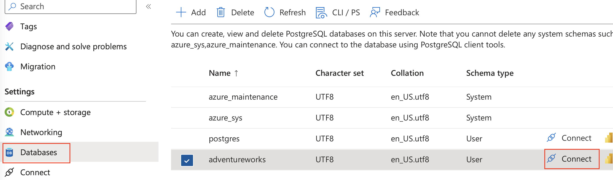
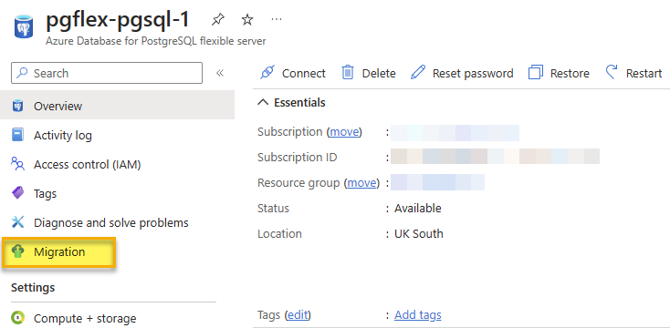
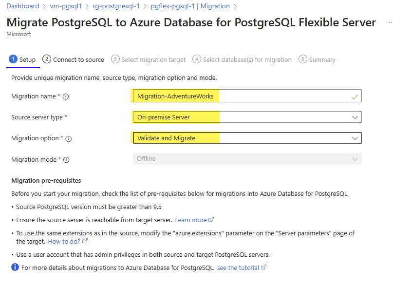
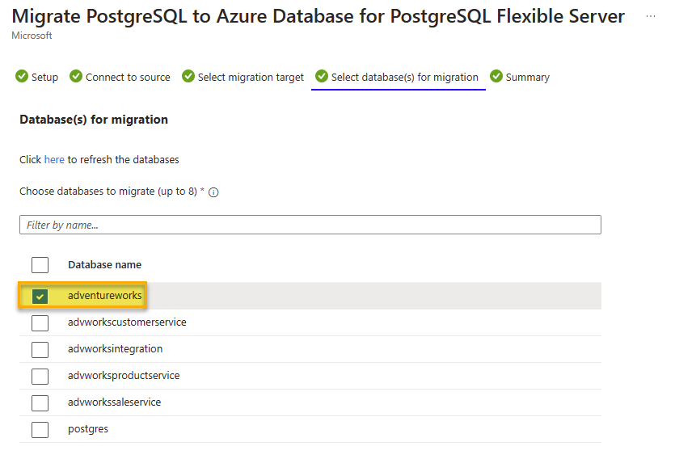

---
lab:
    title: 'Offline PostgreSQL Database Migration'
    module: 'Migrate to Azure Database for PostgreSQL Flexible Server'
---

# Offline PostgreSQL Database Migration

In this exercise, you'll create an Azure Database for PostgreSQL flexible server and perform an offline database migration from either an on-premise PostgreSQL server or an Azure Database for PostgreSQL server using the Migration feature within the Azure Database for PostgreSQL Flexible Server.

## Before you start

You need your own Azure subscription to complete this exercise. If you don't have an Azure subscription, you can create an [Azure free trial](https://azure.microsoft.com/free).

### Edit pg_hba.conf file to allow connectivity from Azure (skip if not migrating from an external PostgreSQL server)

> [!NOTE]
> This lab creates two Azure Database for PostgreSQL to use as a source and destination for the migration. However, if you are using your own environment, to complete this exercise, you will need access to an existing PostgreSQL server with a database, appropriate permissions, and network access.
> 
> If you use your own environment, this exercise will require that the server you use as a source for the migration is accessible to the Azure Database for PostgreSQL Flexible Server so that it can connect and migrate databases. This will require that the source server is accessible via a public IP address and port. A list of Azure Region IP Addresses can be downloaded from [Azure IP Ranges and Service Tags – Public Cloud](https://www.microsoft.com/en-gb/download/details.aspx?id=56519) to help minimize the allowed ranges of IP Addresses in your firewall rules-based on the Azure region used. Open your servers firewall to allow the Migration feature within the Azure Database for PostgreSQL Flexible Server access to the source PostgreSQL Server, which is TCP port **5432** by default.
>
> When using a firewall appliance in front of your source database, you may need to add firewall rules to allow the Migration feature within the Azure Database for PostgreSQL Flexible Server to access the source database(s) for migration.
>
> The maximum supported version of PostgreSQL for migration is version 16.

The source PostgreSQL server will need to have the pg_hba.conf file updated to ensure that the instance will allow connectivity from the Azure Database for PostgreSQL Flexible Server.

1. You will add entries to pg_hba.conf to allow connections from the Azure IP ranges. Entries in pg_hba.conf dictate which hosts can connect, which databases, which users, and what authentication methods can be used.
1. For example, if your Azure services are within the IP range 104.45.0.0/16. To allow all users to connect to all databases from this range using password authentication, you would add:

``` bash
host    all    all    104.45.0.0/16    md5
```

1. When allowing connections over the internet, including from Azure, ensure you have strong authentication mechanisms in place

- Use strong passwords.
- Restrict access to as few IP addresses as practical.
- Use a VPN or VNet: If possible, configure a Virtual Private Network (VPN) or Azure Virtual Network (VNet) to provide a secure tunnel between Azure and your PostgreSQL server.

1. After saving changes to pg_hba.conf, you must reload the PostgreSQL configuration for changes to take effect using a SQL command within a psql session:

```sql
SELECT pg_reload_conf();
```

1. Test the connection from Azure to your local PostgreSQL server to ensure that the configuration works as expected. You can do this from an Azure VM or a service that supports outbound database connections.

### Deploy resources into your Azure subscription

This step guides you through using Azure CLI commands from the Azure Cloud Shell to create a resource group and run a Bicep script to deploy the Azure services necessary for completing this exercise into your Azure subscription.

1. Open a web browser and navigate to the [Azure portal](https://portal.azure.com/).

1. Select the **Cloud Shell** icon in the Azure portal toolbar to open a new [Cloud Shell](https://learn.microsoft.com/azure/cloud-shell/overview) pane at the bottom of your browser window.

    

    If prompted, select the required options to open a *Bash* shell. If you have previously used a *PowerShell* console, switch it to a *Bash* shell.

1. At the Cloud Shell prompt, enter the following to clone the GitHub repo containing exercise resources:

    ```bash
    git clone https://github.com/MicrosoftLearning/mslearn-postgresql.git
    ```

1. Next, you run three commands to define variables to reduce redundant typing when using Azure CLI commands to create Azure resources. The variables represent the name to assign to your resource group (`RG_NAME`), the Azure region (`REGION`) into which resources will be deployed, and a randomly generated password for the PostgreSQL administrator login (`ADMIN_PASSWORD`).

    In the first command, the region assigned to the corresponding variable is `eastus`, but you can also replace it with a location of your preference.

    ```bash
    REGION=eastus
    ```

    The following command assigns the name to be used for the resource group that will house all the resources used in this exercise. The resource group name assigned to the corresponding variable is `rg-learn-work-with-postgresql-$REGION`, where `$REGION` is the location you specified above. However, you can change it to any other resource group name that suits your preference.

    ```bash
    RG_NAME=rg-learn-work-with-postgresql-$REGION
    ```

    The final command randomly generates a password for the PostgreSQL admin login. Make sure you copy it to a safe place to use later to connect to your PostgreSQL flexible server.

    ```bash
    a=()
    for i in {a..z} {A..Z} {0..9}; 
       do
       a[$RANDOM]=$i
    done
    ADMIN_PASSWORD=$(IFS=; echo "${a[*]::18}")
    echo "Your randomly generated PostgreSQL admin user's password is:"
    echo $ADMIN_PASSWORD
    ```

1. If you have access to more than one Azure subscription, and your default subscription is not the one in which you want to create the resource group and other resources for this exercise, run this command to set the appropriate subscription, replacing the `<subscriptionName|subscriptionId>` token with either the name or ID of the subscription you want to use:

    ```azurecli
    az account set --subscription <subscriptionName|subscriptionId>
    ```

1. Run the following Azure CLI command to create your resource group:

    ```azurecli
    az group create --name $RG_NAME --location $REGION
    ```

1. Finally, use the Azure CLI to execute a Bicep deployment script to provision Azure resources in your resource group:

    ```azurecli
    az deployment group create --resource-group $RG_NAME --template-file "mslearn-postgresql/Allfiles/Labs/Shared/deploy-postgresql-server-migration.bicep" --parameters adminLogin=pgAdmin adminLoginPassword=$ADMIN_PASSWORD databaseName=adventureworks
    ```

    The Bicep deployment script provisions the Azure services required to complete this exercise into your resource group. The resources deployed are two Azure Database for PostgreSQL - Flexible Servers. A source and a destination server for the migration.

    The deployment typically takes several minutes to complete (5-10+ minutes). You can monitor it from the Cloud Shell or navigate to the **Deployments** page for the resource group you created above and observe the deployment progress there.

1. Close the Cloud Shell pane once your resource deployment is complete.

1. On the Azure portal, review the names of the two new Azure Database for PostgreSQL servers. Notice that when you list the databases of the source server it includes the **adventureworks** database but the destination one doesn't.

1. Under the **Networking** section of *both* servers,
    1. Select **+ Add current IP address (xxx.xxx.xxx)** and **Save**.
    1. Select the **Allow public access from any Azure service within Azure to this server** checkbox.
    1. Select the **Allow public access to this resource through the internet using a public IP address** checkbox.

> [!NOTE]
> On a production environment you would need to select only those options, networks and IPs you would want to have access your Azure Database for PostgreSQL servers. 

> [!NOTE]
> As previously stated, this Bicep script will create two Azure Database for PostgreSQL servers, a source and a destination one.  ***If you are using an on-premise PostgreSQL server in your environment as the source server for this lab, replace the source sever connection information in all the following instructions with the connection information of your on-premise server in your environment***.  Make sure you enable the necessary firewall rules in both your environment and in Azure.
    
### Troubleshooting deployment errors

You may encounter a few errors when running the Bicep deployment script. The most common messages and the steps to resolve them are:

- If you previously ran the Bicep deployment script for this learning path and subsequently deleted the resources, you may receive an error message like the following if you are attempting to rerun the script within 48 hours of deleting the resources:

    ```bash
    {"code": "InvalidTemplateDeployment", "message": "The template deployment 'deploy' is not valid according to the validation procedure. The tracking id is '4e87a33d-a0ac-4aec-88d8-177b04c1d752'. See inner errors for details."}
    
    Inner Errors:
    {"code": "FlagMustBeSetForRestore", "message": "An existing resource with ID '/subscriptions/{subscriptionId}/resourceGroups/rg-learn-postgresql-ai-eastus/providers/Microsoft.CognitiveServices/accounts/{accountName}' has been soft-deleted. To restore the resource, you must specify 'restore' to be 'true' in the property. If you don't want to restore existing resource, please purge it first."}
    ```

    If you receive this message, modify the `azure deployment group create` command above to set the `restore` parameter equal to `true` and rerun it.

- If the selected region is restricted from provisioning specific resources, you must set the `REGION` variable to a different location and rerun the commands to create the resource group and run the Bicep deployment script.

    ```bash
    {"status":"Failed","error":{"code":"DeploymentFailed","target":"/subscriptions/{subscriptionId}/resourceGroups/{resourceGrouName}/providers/Microsoft.Resources/deployments/{deploymentName}","message":"At least one resource deployment operation failed. Please list deployment operations for details. Please see https://aka.ms/arm-deployment-operations for usage details.","details":[{"code":"ResourceDeploymentFailure","target":"/subscriptions/{subscriptionId}/resourceGroups/{resourceGrouName}/providers/Microsoft.DBforPostgreSQL/flexibleServers/{serverName}","message":"The resource write operation failed to complete successfully, because it reached terminal provisioning state 'Failed'.","details":[{"code":"RegionIsOfferRestricted","message":"Subscriptions are restricted from provisioning in this region. Please choose a different region. For exceptions to this rule please open a support request with Issue type of 'Service and subscription limits'. See https://review.learn.microsoft.com/en-us/azure/postgresql/flexible-server/how-to-request-quota-increase for more details."}]}]}}
    ```

- If the script is unable to create an AI resource due to the requirement to accept the responsible AI agreement, you may experience the following error; in which case use the Azure Portal user interface to create an Azure AI Services resource, and then re-run the deployment script.

    ```bash
    {"code": "InvalidTemplateDeployment", "message": "The template deployment 'deploy' is not valid according to the validation procedure. The tracking id is 'f8412edb-6386-4192-a22f-43557a51ea5f'. See inner errors for details."}
     
    Inner Errors:
    {"code": "ResourceKindRequireAcceptTerms", "message": "This subscription cannot create TextAnalytics until you agree to Responsible AI terms for this resource. You can agree to Responsible AI terms by creating a resource through the Azure Portal then trying again. For more detail go to https://go.microsoft.com/fwlink/?linkid=2164190"}
    ```

## Create a database, table and data for migration

This lab gives you the option to migrate from an on-premise PostreSQL server or from an Azure Database for PostgreSQL server. Follow the instructions for type of server you are migrating from.

### Create a database on the on-premise PostgreSQL server (Skip if migrating from an Azure Database for PostgreSQL server)

Now, we need to set up the database, which you will migrate to the Azure Database for PostgreSQL Flexible Server. This step needs to be completed on your source PostgreSQL Server instance, which will need to be accessible to the Azure Database for PostgreSQL Flexible Server in order to complete this lab.

First, we need to create an empty database, which we will create a table and then load it with data. First of all, you will need to download the ***Lab10_setupTable.sql*** and ***Lab10_workorder.csv*** files from the [repository](https://github.com/MicrosoftLearning/mslearn-postgresql/tree/main/Allfiles/Labs/10) to your local drive (for example, **C:\\**).
Once you have these files, we can create the database using the following command, **replace the values for host, port, and username as required for your PostgreSQL server.**

```bash
psql --host=localhost --port=5432 --username=pgadmin --command="CREATE DATABASE adventureworks;"
```

Run the following command to create the `production.workorder` table for loading in data:

```sql
    DROP SCHEMA IF EXISTS production CASCADE;
    CREATE SCHEMA production;
    
    DROP TABLE IF EXISTS production.workorder;
    CREATE TABLE production.workorder
    (
        workorderid integer NOT NULL,
        productid integer NOT NULL,
        orderqty integer NOT NULL,
        scrappedqty smallint NOT NULL,
        startdate timestamp without time zone NOT NULL,
        enddate timestamp without time zone,
        duedate timestamp without time zone NOT NULL,
        scrapreasonid smallint,
        modifieddate timestamp without time zone NOT NULL DEFAULT now()
    )
    WITH (
        OIDS = FALSE
    )
    TABLESPACE pg_default;
    ALTER TABLE production.workorder OWNER to pgAdmin;
```

```sql
psql --host=localhost --port=5432 --username=postgres --dbname=adventureworks --command="\COPY production.workorder FROM 'C:\Lab10_workorder.csv' CSV HEADER"
```

The command output should be `COPY 72101`, indicating that 72101 rows were written into the table from the CSV file.

## Pre-Migration (Skip if migrating from an Azure Database for PostgreSQL server)

Prior to starting the offline migration of the database from the source server, we need to ensure that the target server is configured and ready.

1. Migrate users and roles from the source server to the new flexible server. This can be achieved using the pg_dumpall tool with the following code.
    1. Superuser roles are not supported on Azure Database for PostgreSQL, so any users with these privileges should have them removed before migration.

```bash
pg_dumpall --globals-only -U <<username>> -f <<filename>>.sql
```

1. Match server parameter values from the source server on the target server.
1. Disable High Availability and Read Replicas on the target.

### Create a database on the Azure Database for PostgreSQL server (Skip if migrating from an the on-premise PostgreSQL server)

Now, we need to set up the database, which you will migrate to the Azure Database for PostgreSQL Flexible Server. This step needs to be completed on your source PostgreSQL Server instance, which will need to be accessible to the Azure Database for PostgreSQL Flexible Server in order to complete this lab.

First, we need to create an empty database, which we will create a table and then load it with data. 

1. In the [Azure portal](https://portal.azure.com/), navigate to the newly created source Azure Database for PostgreSQL server (_**psql-learn-source**_-location-uniquevalue).

1. In the resource menu, under **Settings**, select **Databases** select **Connect** for the `adventureworks` database.

    

1. At the "Password for user pgAdmin" prompt in the Cloud Shell, enter the randomly generated password for the **pgAdmin** login.

    Once logged in, the `psql` prompt for the `adventureworks` database is displayed.

1. Run the following command to create the `production.workorder` table for loading in data:

    ```sql
        DROP SCHEMA IF EXISTS production CASCADE;
        CREATE SCHEMA production;
        
        DROP TABLE IF EXISTS production.workorder;
        CREATE TABLE production.workorder
        (
            workorderid integer NOT NULL,
            productid integer NOT NULL,
            orderqty integer NOT NULL,
            scrappedqty smallint NOT NULL,
            startdate timestamp without time zone NOT NULL,
            enddate timestamp without time zone,
            duedate timestamp without time zone NOT NULL,
            scrapreasonid smallint,
            modifieddate timestamp without time zone NOT NULL DEFAULT now()
        )
        WITH (
            OIDS = FALSE
        )
        TABLESPACE pg_default;
    ```

    ```sql
    \COPY production.workorder FROM 'mslearn-postgresql/Allfiles/Labs/10/Lab10_workorder.csv' CSV HEADER
    ```

    The command output should be `COPY 72101`, indicating that 72101 rows were written into the table from the CSV file.

1. Close the **Cloud Shell**.

## Create Database Migration Project in Azure Database for PostgreSQL Flexible Server

1. On the destination server, select **Migration** from the menu on the left of the flexible server blade.

   

1. Click on the **+ Create** option at the top of the **Migration** blade.
   > **Note**: If the **+ Create** option is unavailable, select **Compute + storage** and change the compute tier to either **General Purpose** or **Memory Optimized** and try to create the Migration process again. After the Migration is successful, you can change the compute tier back to **Burstable**.
1. On the **Setup** tab, enter each field as follows:
    1. Migration name - **`Migration-AdventureWorks`**.
    1. Source server type - For this lab, no matter if you are doing a migration from on-premise or from an Azure Database for PostgreSQL, select **On-premise Server**. On a production environment, pick the correct source server type.
    1. Migration option - **Validate and Migrate**.
    1. Migration mode - **Offline**. 
    1. Select **Next: Select Runtime Server >**.
    1. Select **No** for *Use Runtime Server*.
    1. Select **Connect to source >**.

    

1. For migration from an Azure Database for PostgreSQL- On the **Connect to source** tab, enter each field as follows:
    1. Server name - The address of your server that you are using as the source.
    1. Port - The port your instance of PostgreSQL uses on your source server (default of 5432).
    1. Server admin login name - The name of an admin user for your PostgreSQL instance (default pgAdmin).
    1. Password - The password for the PostgreSQL admin user you specified in the previous step.
    1. SSL mode - Prefer.
    1. Click on the **Connect to source** option to validate the connectivity details provided.
    1. Click on the **Next: Select migration target** button to progress.

1. The connectivity details should be automatically completed for the target server we are migrating to.
    1. In the password field - enter the randomly generated password for the **pgAdmin** login you created with the bicep script.
    1. Click on the **Connect to target** option to validate the connectivity details provided.
    1. Click on the **Next : Select database(s) for migration >** button to progress.
1. On the **Select database(s) for migration** tab, select the **adventureworks** from the source server you want to migrate to the flexible server.

    

1. Click on the **Next : Summary >** button to progress and review the data provided.
1. On the **Summary** tab, review the information and then click the **Start Validation and Migration** button to start the migration to the flexible server.
1. On the **Migration** tab, you can monitor the migration progress by using the **Refresh** button in the top menu to view the progress through the validation and migration process.
    1. By clicking on the **Migration-AdventureWorks** activity, you can view detailed information about the migration activity’s progress.
1. Once the migration is complete, check the destination server, you should now find the **adventureworks** database also listed under that server.

Once the migration process is complete, we can perform post-migration tasks such as data validation in the new database and configuring high availability before pointing the application at the database and turning it on again.

## Exercise Clean-up

The Azure Database for PostgreSQL we deployed in this exercise will be used in the next exercise. It will incur charges so that you can stop the server after this exercise. Alternatively, you can delete the **rg-learn-work-with-postgresql-eastus** resource group to remove all resources we deployed as part of this exercise. This means you have to repeat the steps in this exercise to complete the next exercise.
