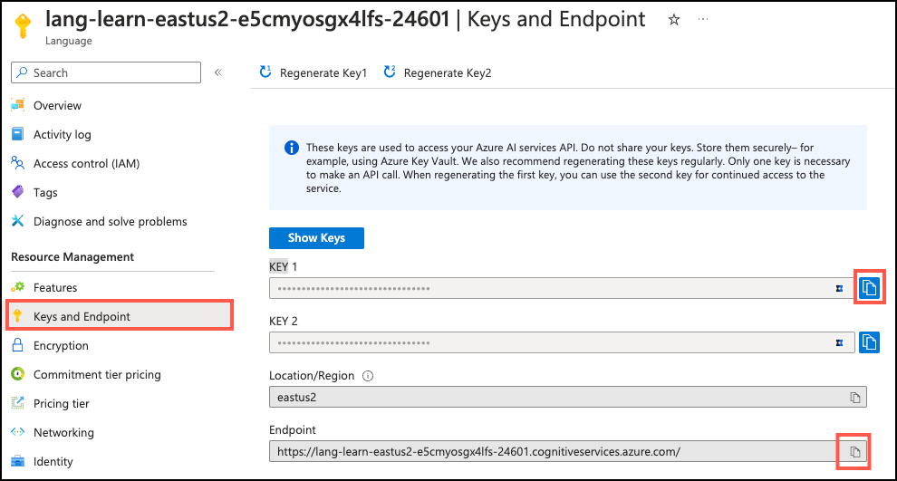

---
lab:
    title: 'Explore the Azure AI Extension'
    module: 'Build AI apps with Azure Database for PostgreSQL'
---

# Explore the Azure AI Extension

As the lead developer of an AI-powered rental recommendation system for Margie's Travel, you are interested in gaining a better understanding of the generative AI functionality available through the `azure_ai` extension and how it can help you achieve your goal of building an AI-powered app. To accomplish this, you will conduct an in-depth exploration of the functionality it provides, installing the `azure_ai` extension in an Azure Database for PostgreSQL - Flexible Server database and exploring its capabilities for integrating Azure AI and ML services.

## Before you start

You will need an [Azure subscription](https://azure.microsoft.com/free) with administrative rights, and you must be approved for Azure OpenAI access in that subscription. If you need Azure OpenAI access, apply at the [Azure OpenAI limited access](https://learn.microsoft.com/legal/cognitive-services/openai/limited-access) page.

### Deploy resources into your Azure subscription

1. Open a web browser and navigate to the [Azure portal](https://portal.azure.com/).

2. Select the **Cloud Shell** icon in the Azure portal toolbar to open a new [Cloud Shell](https://learn.microsoft.com/azure/cloud-shell/overview) pane at the bottom of your browser window.

    

3. At the cloud shell prompt, enter the following to clone the GitHub repo containing exercise resources:

    ```bash
    git clone https://github.com/MicrosoftLearning/mslearn-postgresql.git
    ```

4. Next, you will run a couple of commands to define variables to reduce redundant typing when using Azure CLI commands to create Azure resources. The variables represent the name to assign to your resource group and the Azure region into which resources should be deployed.

    In the first command below, accept the default region of `eastus` or replace it with the location you prefer to use for your Azure resources.

    ```bash
    REGION=eastus
    ```

    TODO: Need to provide a list of acceptable regions that support the appropriate gpt-4 model + abstractive summarization in the language service. (maybe just hardcode that one in the bicep template?)

    The resource group name defaults to `rg-postgresql-ai-ms-learn`, but you can provide any name you wish to use to host the resources associated with this exercise.

    ```bash
    RG_NAME=rg-learn-postgresql-ai-$REGION
    ```

5. Run the following Azure CLI command to create your resource group:

    ```azurecli
    az group create --name $RG_NAME --location $REGION
    ```

6. Finally, use the Azure CLI to execute a Bicep deployment script to provision Azure resources in your resource group:

    ```azurecli
    az deployment group create --resource-group $RG_NAME --template-file "mslearn-postgresql/Allfiles/Labs/Shared/deploy.bicep" --parameters adminLogin=pgAdmin adminLoginPassword=Password123!
    ```

    The bicep file will deploy an Azure Database for PostgreSQL - Flexible Server, Azure OpenAI, and an Azure AI Language service into your resource group. On the PostgreSQL server, it also adds the `azure_ai` and `pg_vector` extensions to the server's _allowlist_ and creates a database named `rentals` for use in this exercise. Within the Azure OpenAI service, a deployment named `embedding` is provisioned using the `text-embedding-ada-002` model.

    The deployment will take several minutes to complete.

7. Close the cloud shell pane once your resource deployment is complete.

## Connect to your database using psql in the Azure Cloud Shell

In this task, you connect to your database using the [psql command-line utility](https://www.postgresql.org/docs/current/app-psql.html) from the [Azure Cloud Shell](https://learn.microsoft.com/azure/cloud-shell/overview).

1. In the [Azure portal](https://portal.azure.com/), navigate to your newly created Azure Database for PostgreSQL Flexible Server instance.

2. Once there, select **Databases** under **Settings** the left-hand navigation menu, and then select **Connect** for the `rentals` database.

    

3. At the "Password for user pgAdmin" prompt in the cloud shell, enter the password you created for the **pgAdmin** login. The default for this is `Password123!`.

    Once logged in, the `psql` prompt for the `rentals` database will be displayed.

4. You will be working in the cloud shell throughout the remainder of this exercise, so it can be helpful to expand the pane within your browser window by selecting the **Maximize** button at the top right of the pane.

    

## Populate the database with sample data

Before you explore the `azure_ai` extension, you will add a couple of tables to the `rentals` database and populate them with sample data so you have information to work with as you review the extension's functionality.

1. Run the following commands to create the `listings` and `reviews` tables for storing rental property listing and customer review data:

    ```sql
    CREATE TABLE listings (
        id int,
        name varchar(100),
        description text,
        property_type varchar(25),
        room_type varchar(30),
        price numeric,
        weekly_price numeric
    );
    ```

    ```sql
    CREATE TABLE reviews (
        id int,
        listing_id int, 
        date date,
        comments text
    );
    ```

2. Next, you will use the `COPY` command to load data from CSV files into each table you created above. Start by running the following command to populate the `listings` table:

    ```sql
    \COPY listings FROM 'mslearn-postgresql/Allfiles/Labs/Shared/listings.csv' CSV HEADER
    ```

    The command output should be `COPY 50`, indicating that 50 rows were written into the table from the CSV file.

3. Finally, run the command below to load customer reviews into the `reviews` table:

    ```sql
    \COPY reviews FROM 'mslearn-postgresql/Allfiles/Labs/Shared/reviews.csv' CSV HEADER
    ```

    The command output should be `COPY 354`, indicating that 354 rows were written into the table from the CSV file.

## Install and configure the `azure_ai` extension

Before using the `azure_ai` extension, you must install it into your database and configure it to connect to your Azure AI Services resources. The `azure_ai` extension allows you to integrate the Azure OpenAI and Azure AI Language services into your database. To enable the extension in your database, follow the steps below:

1. You should first verify that the `azure_ai` extension was successfully added to your server's _allowlist_ by the bicep script you ran when setting up the exercise environment by executing the following command at the `psql` command prompt:

    ```sql
    SHOW azure.extensions;
    ```

    In the output, you will see the list of extensions on the server's _allowlist_. The output should include `azure_ai` and will look like the following:

    ```sql
     azure.extensions 
    ------------------
     azure_ai,vector
    ```

    Before an extension can be installed and used in Azure Database for PostgreSQL - Flexible Server, it must be added to the server's _allowlist_, as described in [how to use PostgreSQL extensions](https://learn.microsoft.com/azure/postgresql/flexible-server/concepts-extensions#how-to-use-postgresql-extensions).

2. Now, you are ready to install the `azure_ai` extension using the [CREATE EXTENSION](https://www.postgresql.org/docs/current/sql-createextension.html) command.

    ```sql
    CREATE EXTENSION IF NOT EXISTS azure_ai;
    ```

    `CREATE EXTENSION` loads a new extension into the database by running the extension's script file, which typically creates new SQL objects such as functions, data types and schemas. If an extension of the same name already exists, an error will be thrown. Adding `IF NOT EXISTS` allows the command to execute without throwing an error if it is already installed.

## Review the objects contained within the `azure_ai` extension

Reviewing the objects within the `azure_ai` extension can provide a better understanding of its capabilities. In this task, you inspect the various schemas, user-defined functions (UDFs), and composite types added to the database by the extension.

1. When working with `psql` in the cloud shell, it can be useful to enable the extended display for query results. Execute the following command to enable the extended display to be automatically applied when it will improve output display.

    ```sql
    \x auto
    ```

2. The [`\dx` meta-command](https://www.postgresql.org/docs/current/app-psql.html#APP-PSQL-META-COMMAND-DX-LC) is used to list objects contained within an extension. Run the following from the `psql` command prompt to view the objects in the `azure_ai` extension. You may need to press the space bar to view the full list of objects.

    ```psql
    \dx+ azure_ai
    ```

    The meta-command output shows the `azure_ai` extension creates four schemas, multiple user-defined functions (UDFs), several composite types in the database, and the `azure_ai.settings` table. Other than the schemas, all object names are preceded with the schema to which they belong. Schemas are used to group related functions and types added by the extension into buckets. The table below lists the schemas added by the extension and provides a brief description of each:

    | Schema | Description |
    | ------ | ----------- |
    | `azure_ai` | The principal schema where the configuration table and UDFs for interacting with the extension reside. |
    | `azure_openai` | Contains the UDFs that enable calling an Azure OpenAI endpoint. |
    | `azure_cognitive` | Provides UDFs and composite types related to integrating the database with Azure AI Services. |
    | `azure_ml` | Includes the UDFs for integrating Azure Machine Learning (ML) services. |

### Explore the Azure AI schema

The `azure_ai` schema provides the framework for interacting with Azure AI and ML services directly from your database. It contains functions for setting up connections to those services and retrieving them from the `settings` table, also hosted in the schema. The `settings` table provides secure storage in the database for endpoints and keys associated with you Azure AI and ML services.

1. To review the functions defined in a schema, you can use the `\df` meta-command, specifying the schema whose functions should be displayed. Run the following to view the functions in the `azure_ai` schema:

    ```sql
    \df azure_ai.*
    ```

    The command outputs a table similar to the following:

    ```sql
                                List of functions
      Schema  |    Name     | Result data type | Argument data types  | Type 
    ----------+-------------+------------------+----------------------+------
     azure_ai | get_setting | text             | key text             | func
     azure_ai | set_setting | void             | key text, value text | func
     azure_ai | version     | text             |                      | func
    ```

    The `set_setting()` function lets you set the endpoint and key values for connecting to Azure AI and ML services. It accepts a **key** and the **value** to assign it. The `azure_ai.get_setting()` function provides a way to retrieve the values you set with the `set_setting()` function. It accepts the **key** of the setting you want to view. For both methods, the key must be one of the following:

    | Key | Description |
    | --- | ----------- |
    | `azure_openai.endpoint` | A supported OpenAI endpoint (e.g., <https://example.openai.azure.com>). |
    | `azure_openai.subscription_key` | A subscription key for an Azure OpenAI resource. |
    | `azure_cognitive.endpoint` | A supported Azure AI Services endpoint (e.g., <https://example.cognitiveservices.azure.com>). |
    | `azure_cognitive.subscription_key` | A subscription key for an Azure AI Services resource. |
    | `azure_ml.scoring_endpoint` | A supported Azure ML scoring endpoint (e.g., <https://example.eastus2.inference.ml.azure.com/score>) |
    | `azure_ml.endpoint_key` | An endpoint key for an Azure ML deployment. |

    > Important
    >
    > Because the connection information for Azure AI services, including API keys, is stored in a configuration table in the database, the `azure_ai` extension defines a role called `azure_ai_settings_manager` to ensure this information is protected and accessible only to users assigned that role. This role enables reading and writing of settings related to the extension. Only superusers and members of the `azure_ai_settings_manager` role can invoke the `azure_ai.get_setting()` and `azure_ai.set_setting()` functions. In Azure Database for PostgreSQL Flexible Server, all admin users are assigned the `azure_ai_settings_manager` role.

2. To demonstrate how you go about using the `azure_ai.set_setting()` and `azure_ai.get_setting()` function, let's configure the connect to your Azure OpenAI account. Using the same browser tab where your Cloud Shell is open, minimize or restore the cloud shell pane, then navigate to your Azure OpenAI resource in the [Azure portal](https://portal.azure.com/). Once you are on the Azure OpenAI resource page, select the **Keys and Endpoint** item under **Resource Management** from the left-hand menu, then copy your endpoint and one of the available keys.

    

    You can use either `KEY 1` or `KEY 2`. Always having two keys allows you to securely rotate and regenerate keys without causing service disruption.

3. Once you have your endpoint and key, maximize the cloud shell pane again, then use the command below to add your values to the configuration table. Make sure you replace the `{endpoint}` and `{api-key}` tokens with values you retrieved from the Azure portal.

    ```sql
    SELECT azure_ai.set_setting('azure_openai.endpoint','{endpoint}');
    SELECT azure_ai.set_setting('azure_openai.subscription_key', '{api-key}');
    ```

4. You can verify the settings written into the `azure_ai.settings` table using the `azure_ai.get_setting()` function in the following queries:

    ```sql
    SELECT azure_ai.get_setting('azure_openai.endpoint');
    SELECT azure_ai.get_setting('azure_openai.subscription_key');
    ```

    The `azure_ai` extension is now connected to your Azure OpenAI account.

### Review the Azure OpenAI schema

The `azure_openai` schema provides the ability to integrate the creation of vector embedding of text values into your database using Azure OpenAI. Using this schema, you can [generate embeddings with Azure OpenAI](https://learn.microsoft.com/azure/ai-services/openai/how-to/embeddings) directly from the database to create vector representations of input text, which can then be used in vector similarity searches, as well as consumed by machine learning models. The schema contains a single function, `create_embeddings()` with two overloads. One overload accepts a single input string and the other accepts an array of input strings.

1. As you did above, you can use the `\df` meta-command to view the details of the functions in the `azure_openai` schema:

    ```sql
    \df azure_openai.*
    ```

    The output shows the two overloads of the `azure_openai.create_embeddings()` function, allowing you to review the differences between to two versions of the function and the types it returns. The `Argument data types` property in the output reveals the list of arguments the two function overloads expect:

    | Argument | Type | Default | Description |
    | -------- | ---- | ------- | ----------- |
    | deployment_name | `text` || Name of the deployment in Azure OpenAI studio that contains the `text-embeddings-ada-002` model. |
    | input | `text` or `text[]` || Input text (or array of text) for which embeddings will be created. |
    | batch_size | `integer` | 100 | Only for the overload expecting an input of `text[]`. Specifies the number of records to process at a time. |
    | timeout_ms | `integer` | 3600000 | Timeout in milliseconds after which the operation is stopped. |
    | throw_on_error | `boolean` | true | Flag indicating whether the function should, on error, throw an exception resulting in a rollback of the wrapping transactions. |

2. To provide a simplified example of using the function, run the following query, which creates a vector embedding for the `description` field in the `listings` table. The `deployment_name` parameter in the function is set to `embedding`, which is the name of the deployment of the `text-embedding-ada-002` model in your Azure OpenAI service:

    ```sql
    SELECT
        id,
        name,
        azure_openai.create_embeddings('embedding', description) AS vector
    FROM listings
    LIMIT 1;
    ```

    You will see output similar to the following:

    ```sql
    id |             name              |                            vector
    ---+-------------------------------+------------------------------------------------------------
    1  | Stylish One-Bedroom Apartment | {0.020068742,0.00022734122,0.0018286322,-0.0064167166,-0.02335632,0.007961482,-0.0025977138,-0.018629603,-0.028360302,-0.015645698,-0.032849364,0.0165039,-0.012523159,-0.0126948,-0.018840853,0.0024013175,0.032717332,0.01362562,-0.014576245,-0.010106988,-0.038394675,-0.00013161861,0.028967647,-0.016107807,-0.018378744,0.0057433574,0.00837738,-0.014945932,-0.016358666,0.006020623,0.024927491,-0.005941404,-0.020847727,-0.0020695892,-0.0118498,-0.011011402,0.00024384513,0.020451633,0.012952261,-0.002800712,0.0011107125,-0.010225817,-0.0068986304,0.017890228,0.005103006,0.0042712092,-0.0016487397,-0.016464291,-0.013982104,0.004947869,...}
    ```

    The vector embeddings are abbreviated in the above output for brevity.

    [Embeddings](https://learn.microsoft.com/azure/postgresql/flexible-server/generative-ai-overview#embeddings) are a concept in machine learning and natural language processing (NLP) that involves representing objects, such as words, documents, or entities, as [vectors](https://learn.microsoft.com/azure/postgresql/flexible-server/generative-ai-overview#vectors) in a multi-dimensional space. Embeddings allow machine learning models to evaluate how closely related information is. This technique efficiently identifies relationships and similarities between data, allowing algorithms to identify patterns and make accurate predictions.

    The `azure_ai` extension allows you to generate embeddings for input text. To enable the generated vectors to be stored alongside the rest of your data in the database, you must install the `pgvector` extension by following the guidance in the [enable vector support in your database](https://learn.microsoft.com/azure/postgresql/flexible-server/how-to-use-pgvector#enable-extension) documentation. However, that is outside of the scope of this exercise.

### Examine the azure_cognitive schema

The `azure_cognitive` schema provides the framework for interacting with Azure AI Services directly from your database. The Azure AI services integrations included in the schema provide a rich set of AI Language features accessible directly from the database. The functionalities include sentiment analysis, language detection, key phrase extraction, entity recognition, and text summarization. These capabilities are enabled through the [Azure AI Language service](https://learn.microsoft.com/azure/ai-services/language-service/overview).

1. To review all of the functions defined in a schema, you can use the `\df` meta-command like you have done previously. Run the following to view the functions in the `azure_cognitive` schema:

    ```sql
    \df azure_cognitive.*
    ```

2. There are numerous functions defined in this schema, so the output from the `\df` meta-command can be difficult to read, so it is best to break it apart into smaller chunks. Run the following to look at just the `analyze_sentiment()` function:

    ```sql
    \df azure_cognitive.analyze_sentiment
    ```

    In the output, observe there are three overloads for the function, with one accepting a single input string and the other two expecting arrays of text. The output shows the function's schema, name, result data type, and argument data types. This information can help you gain an understanding of how to use the function.

3. Repeat the above command, replacing the `analyze_sentiment` function name with each of the following function names to inspect all of the available functions in the schema:

    - `detect_language`
    - `extract_key_phrases`
    - `linked_entities`
    - `recognize_entities`
    - `recognize_pii_entities`
    - `summarize_abstractive`
    - `summarize_extractive`
    - `translate`

    For each function, inspect the various forms of the function and their expected inputs and resulting data types.

4. In addition to functions, the `azure_cognitive` schema also contains several composite types, which are used as return data types from the various functions. It is essential to understand the structure of the result data type a function returns so you can correctly handle the output in your queries. As an example, run the following command to inspect the `sentiment_analysis_result` type:

    ```sql
    \dT+ azure_cognitive.sentiment_analysis_result
    ```

5. The output of the above command reveals the `sentiment_analysis_result` type is a `tuple`. You can dig further into the structure of that `tuple` by running the following command to look at the columns contained within the `sentiment_analysis_result` type:

    ```sql
    \d+ azure_cognitive.sentiment_analysis_result
    ```

    The output of that command should look similar to the following:

    ```sql
                     Composite type "azure_cognitive.sentiment_analysis_result"
         Column     |       Type       | Collation | Nullable | Default | Storage  | Description 
    ----------------+------------------+-----------+----------+---------+----------+-------------
     sentiment      | text             |           |          |         | extended | 
     positive_score | double precision |           |          |         | plain    | 
     neutral_score  | double precision |           |          |         | plain    | 
     negative_score | double precision |           |          |         | plain    |
    ```

    The `azure_cognitive.sentiment_analysis_result` is a composite type containing the sentiment predictions of the input text. It includes the sentiment, which can be positive, negative, neutral, or mixed, and the scores for positive, neutral, and negative aspects found in the text. The scores are represented as real numbers between 0 and 1. For example, in (neutral,0.26,0.64,0.09), the sentiment is neutral with a positive score of 0.26, neutral of 0.64, and negative at 0.09.

6. As with the `azure_openai` functions, to successfully make calls against Azure AI Services using the `azure_ai` extension, you must provide the endpoint and a key for your Azure AI Language service. Using the same browser tab where the Cloud Shell is open, minimize or restore the cloud shell pane, navigate to your Language service resource in the [Azure portal](https://portal.azure.com/) and select the **Keys and Endpoint** item under **Resource Management** from the left-hand navigation menu.

    

7. Copy your endpoint and access key values, then in the command below, replace the `{endpoint}` and `{api-key}` tokens with values you retrieved from the Azure portal. Maximize the cloud shell again and run the commands from the `psql` command prompt in the cloud shell to add your values to the configuration table.

    ```sql
    SELECT azure_ai.set_setting('azure_cognitive.endpoint','{endpoint}');
    SELECT azure_ai.set_setting('azure_cognitive.subscription_key', '{api-key}');
    ```

8. Now, execute the following query to analyze the sentiment of a couple of reviews:

    ```sql
    SELECT
        id,
        comments,
        azure_cognitive.analyze_sentiment(comments, 'en') AS sentiment
    FROM reviews
    WHERE id IN (1, 3);
    ```

## Inspect the Azure ML schema

The `azure_ml` schema provides functions with the ability to connect to Azure ML services directly from your database.

1. To review the functions defined in a schema, you can use the `\df` meta-command. Run the following to view the functions in the `azure_ml` schema:

    ```sql
    \df azure_ai.*
    ```

    In the output, observe there are two functions defined in this schema, `azure_ml.inference()` and `azure_ml.invoke()`, the details of which are displayed below:

    ```sql
                                List of functions
    -----------------------------------------------------------------------------------------------------------
    Schema              | azure_ml
    Name                | inference
    Result data type    | jsonb
    Argument data types | input_data jsonb, deployment_name text DEFAULT NULL::text, timeout_ms integer DEFAULT NULL::integer, throw_on_error boolean DEFAULT true, max_attempts integer DEFAULT 1, retry_delay_ms integer DEFAULT 1000
    Type                | func
    ```

    The `inference()` function is used with trained machine learning model to make predictions or generate outputs based on new, unseen data.

    ```sql
    -----------------------------------------------------------------------------------------------------------
    Schema              | azure_ml
    Name                | invoke
    Result data type    | jsonb
    Argument data types | input_data jsonb, deployment_name text DEFAULT NULL::text, timeout_ms integer DEFAULT NULL::integer, throw_on_error boolean DEFAULT true, max_attempts integer DEFAULT 1, retry_delay_ms integer DEFAULT 1000
    Type                | func
    ```

    The `invoke()` function...

    TODO: Provide some small details on the invoke function.

    You can connect to an Azure ML deployed endpoint in the same way you connected to your Azure OpenAI and Azure AI Services endpoints, by providing an endpoint and key. As interacting with Azure ML requires having a trained and deployed model, it is out of scope for this exercise, so you will not set up that connection and try it out here.

## Clean up

After you have completed this exercise, you should delete the Azure resources you have created. You are charged for the configured capacity, not how much the database is used. To delete your resource group and all resources you created for this lab, follow the instructions below:

1. Open a web browser and navigate to the [Azure portal](https://portal.azure.com/), and on the home page, select **Resource groups** under Azure services.

    

2. In the filter for any field search box, enter the name of the resource group you created for these labs in Lab 1, and then select the resource group from the list.

3. In the **Overview** pane, select **Delete resource group**.

    

4. In the confirmation dialog, enter the name of the resource group you created to confirm and then select **Delete**.
