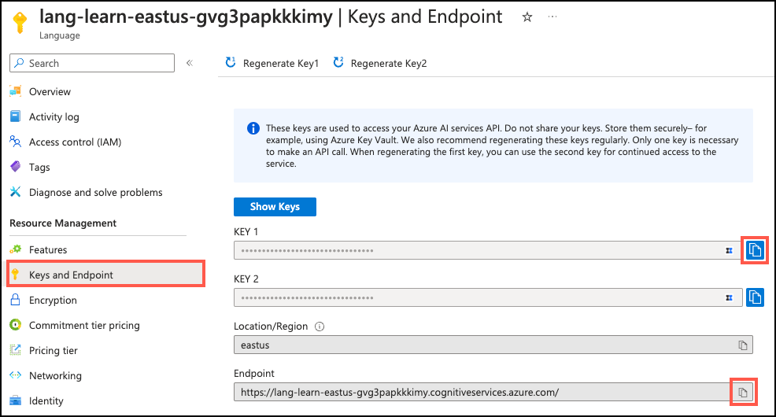

---
lab:
    title: 'Explore the Azure AI Extension'
    module: 'Explore Generative AI with Azure Database for PostgreSQL'
---

# Explore the Azure AI Extension

As the lead developer for Margie's Travel, you have been tasked with building an AI-powered application to provide your customers with intelligent recommendations on rental properties. You want to learn more about the `azure_ai` extension for Azure Database for PostgreSQL and how it can help you integrate the power of Generative AI (GenAI) into your app. In this exercise, you explore the `azure_ai` extension and its functionality by installing it in an Azure Database for PostgreSQL flexible server database and examining its capabilities for integrating Azure AI and ML services.

## Before you start

You need an [Azure subscription](https://azure.microsoft.com/free) with administrative rights.

### Deploy resources into your Azure subscription

This step guides you through using Azure CLI commands from the Azure Cloud Shell to create a resource group and run a Bicep script to deploy the Azure services necessary for completing this exercise into your Azure subscription.

1. Open a web browser and navigate to the [Azure portal](https://portal.azure.com/).

2. Select the **Cloud Shell** icon in the Azure portal toolbar to open a new [Cloud Shell](https://learn.microsoft.com/azure/cloud-shell/overview) pane at the bottom of your browser window.

    

    If prompted, select the required options to open a *Bash* shell. If you have previously used a *PowerShell* console, switch it to a *Bash* shell.

3. At the Cloud Shell prompt, enter the following to clone the GitHub repo containing exercise resources:

    ```bash
    git clone https://github.com/MicrosoftLearning/mslearn-postgresql.git
    ```

4. Next, you run three commands to define variables to reduce redundant typing when using Azure CLI commands to create Azure resources. The variables represent the name to assign to your resource group (`RG_NAME`), the Azure region (`REGION`) into which resources will be deployed, and a randomly generated password for the PostgreSQL administrator login (`ADMIN_PASSWORD`).

    In the first command, the region assigned to the corresponding variable is `eastus`, but you can also replace it with a location of your preference. However, if replacing the default, you must select another [Azure region that supports abstractive summarization](https://learn.microsoft.com/azure/ai-services/language-service/summarization/region-support) to ensure you can complete all of the tasks in the modules in this learning path.

    ```bash
    REGION=eastus
    ```

    The following command assigns the name to be used for the resource group that will house all the resources used in this exercise. The resource group name assigned to the corresponding variable is `rg-learn-postgresql-ai-$REGION`, where `$REGION` is the location you specified above. However, you can change it to any other resource group name that suits your preference.

    ```bash
    RG_NAME=rg-learn-postgresql-ai-$REGION
    ```

    The final command randomly generates a password for the PostgreSQL admin login. Copy it to a safe place to use later when connecting to your PostgreSQL flexible server.

    ```bash
    a=()
    for i in {a..z} {A..Z} {0..9};
        do
        a[$RANDOM]=$i
        done
    ADMIN_PASSWORD=$(IFS=; echo "${a[*]::18}")
    echo "Your randomly generated PostgreSQL admin user's password is:"
    echo $ADMIN_PASSWORD
    ```

5. If you have access to more than one Azure subscription, and your default subscription is not the one in which you want to create the resource group and other resources for this exercise, run this command to set the appropriate subscription, replacing the `<subscriptionName|subscriptionId>` token with either the name or ID of the subscription you want to use:

    ```azurecli
    az account set --subscription <subscriptionName|subscriptionId>
    ```

6. Run the following Azure CLI command to create your resource group:

    ```azurecli
    az group create --name $RG_NAME --location $REGION
    ```

7. Finally, use the Azure CLI to execute a Bicep deployment script to provision Azure resources in your resource group:

    ```azurecli
    az deployment group create --resource-group $RG_NAME --template-file "mslearn-postgresql/Allfiles/Labs/Shared/deploy.bicep" --parameters restore=false adminLogin=pgAdmin adminLoginPassword=$ADMIN_PASSWORD
    ```

    The Bicep deployment script provisions the Azure services required to complete this exercise into your resource group. The resources deployed include an Azure Database for PostgreSQL flexible server, Azure OpenAI, and an Azure AI Language service. The Bicep script also performs some configuration steps, such as adding the `azure_ai` and `vector` extensions to the PostgreSQL server's _allowlist_ (via the azure.extensions server parameter), creating a database named `rentals` on the server, and adding a deployment named `embedding` using the `text-embedding-ada-002` model to your Azure OpenAI service. Note that the Bicep file is shared by all modules in this learning path, so you may only use some of the deployed resources in some exercises.

    The deployment typically takes several minutes to complete. You can monitor it from the Cloud Shell or navigate to the **Deployments** page for the resource group you created above and observe the deployment progress there.

 8. Close the Cloud Shell pane once your resource deployment is complete.
 
### Troubleshooting deployment errors

You may encounter a few errors when running the Bicep deployment script.

- If you previously ran the Bicep deployment script for this learning path and subsequently deleted the resources, you may receive an error message like the following if you are attempting to rerun the script within 48 hours of deleting the resources:

    ```bash
    {"code": "InvalidTemplateDeployment", "message": "The template deployment 'deploy' is not valid according to the validation procedure. The tracking id is '4e87a33d-a0ac-4aec-88d8-177b04c1d752'. See inner errors for details."}
    
    Inner Errors:
    {"code": "FlagMustBeSetForRestore", "message": "An existing resource with ID '/subscriptions/{subscriptionId}/resourceGroups/rg-learn-postgresql-ai-eastus/providers/Microsoft.CognitiveServices/accounts/{accountName}' has been soft-deleted. To restore the resource, you must specify 'restore' to be 'true' in the property. If you don't want to restore existing resource, please purge it first."}
    ```

    If you receive this message, modify the `azure deployment group create` command above to set the `restore` parameter equal to `true` and rerun it.

- If the selected region is restricted from provisioning specific resources, you must set the `REGION` variable to a different location and rerun the commands to create the resource group and run the Bicep deployment script.

    ```bash
    {"status":"Failed","error":{"code":"DeploymentFailed","target":"/subscriptions/{subscriptionId}/resourceGroups/{resourceGrouName}/providers/Microsoft.Resources/deployments/{deploymentName}","message":"At least one resource deployment operation failed. Please list deployment operations for details. Please see https://aka.ms/arm-deployment-operations for usage details.","details":[{"code":"ResourceDeploymentFailure","target":"/subscriptions/{subscriptionId}/resourceGroups/{resourceGrouName}/providers/Microsoft.DBforPostgreSQL/flexibleServers/{serverName}","message":"The resource write operation failed to complete successfully, because it reached terminal provisioning state 'Failed'.","details":[{"code":"RegionIsOfferRestricted","message":"Subscriptions are restricted from provisioning in this region. Please choose a different region. For exceptions to this rule please open a support request with Issue type of 'Service and subscription limits'. See https://review.learn.microsoft.com/en-us/azure/postgresql/flexible-server/how-to-request-quota-increase for more details."}]}]}}
    ```

- If the script is unable to create an AI resource due to the requirement to accept the responsible AI agreement, you may experience the following error; in which case use the Azure Portal user interface to create an Azure AI Services resource, and then re-run the deployment script.

    ```bash
    {"code": "InvalidTemplateDeployment", "message": "The template deployment 'deploy' is not valid according to the validation procedure. The tracking id is 'f8412edb-6386-4192-a22f-43557a51ea5f'. See inner errors for details."}
     
    Inner Errors:
    {"code": "ResourceKindRequireAcceptTerms", "message": "This subscription cannot create TextAnalytics until you agree to Responsible AI terms for this resource. You can agree to Responsible AI terms by creating a resource through the Azure Portal then trying again. For more detail go to https://go.microsoft.com/fwlink/?linkid=2164190"}
    ```

## Connect to your database using psql in the Azure Cloud Shell

In this task, you connect to the `rentals` database on your Azure Database for PostgreSQL flexible server using the [psql command-line utility](https://www.postgresql.org/docs/current/app-psql.html) from the [Azure Cloud Shell](https://learn.microsoft.com/azure/cloud-shell/overview).

1. In the [Azure portal](https://portal.azure.com/), navigate to your newly created Azure Database for PostgreSQL flexible server.

2. In the resource menu, under **Settings**, select **Databases** select **Connect** for the `rentals` database.

    

3. At the "Password for user pgAdmin" prompt in the Cloud Shell, enter the randomly generated password for the **pgAdmin** login.

    Once logged in, the `psql` prompt for the `rentals` database is displayed.

4. Throughout the remainder of this exercise, you continue working in the Cloud Shell, so it may be helpful to expand the pane within your browser window by selecting the **Maximize** button at the top right of the pane.

    

## Populate the database with sample data

Before you explore the `azure_ai` extension, add a couple of tables to the `rentals` database and populate them with sample data so you have information to work with as you review the extension's functionality.

1. Run the following commands to create the `listings` and `reviews` tables for storing rental property listing and customer review data:

    ```sql
    DROP TABLE IF EXISTS listings;
    
    CREATE TABLE listings (
      id int,
      name varchar(100),
      description text,
      property_type varchar(25),
      room_type varchar(30),
      price numeric,
      weekly_price numeric
    );
    ```

    ```sql
    DROP TABLE IF EXISTS reviews;
    
    CREATE TABLE reviews (
      id int,
      listing_id int, 
      date date,
      comments text
    );
    ```

2. Next, use the `COPY` command to load data from CSV files into each table you created above. Start by running the following command to populate the `listings` table:

    ```sql
    \COPY listings FROM 'mslearn-postgresql/Allfiles/Labs/Shared/listings.csv' CSV HEADER
    ```

    The command output should be `COPY 50`, indicating that 50 rows were written into the table from the CSV file.

3. Finally, run the command below to load customer reviews into the `reviews` table:

    ```sql
    \COPY reviews FROM 'mslearn-postgresql/Allfiles/Labs/Shared/reviews.csv' CSV HEADER
    ```

    The command output should be `COPY 354`, indicating that 354 rows were written into the table from the CSV file.

## Install and configure the `azure_ai` extension

Before using the `azure_ai` extension, you must install it into your database and configure it to connect to your Azure AI Services resources. The `azure_ai` extension allows you to integrate the Azure OpenAI and Azure AI Language services into your database. To enable the extension in your database, follow these steps:

1. Execute the following command at the `psql` prompt to verify that the `azure_ai` and the `vector` extensions were successfully added to your server's _allowlist_ by the Bicep deployment script you ran when setting up your environment:

    ```sql
    SHOW azure.extensions;
    ```

    The command displays the list of extensions on the server's _allowlist_. If everything was correctly installed, your output must include `azure_ai` and `vector`, like this:

    ```sql
     azure.extensions 
    ------------------
     azure_ai,vector
    ```

    Before an extension can be installed and used in an Azure Database for PostgreSQL flexible server database, it must be added to the server's _allowlist_, as described in [how to use PostgreSQL extensions](https://learn.microsoft.com/azure/postgresql/flexible-server/concepts-extensions#how-to-use-postgresql-extensions).

2. Now, you are ready to install the `azure_ai` extension using the [CREATE EXTENSION](https://www.postgresql.org/docs/current/sql-createextension.html) command.

    ```sql
    CREATE EXTENSION IF NOT EXISTS azure_ai;
    ```

    `CREATE EXTENSION` loads a new extension into the database by running its script file. This script typically creates new SQL objects such as functions, data types, and schemas. An error is thrown if an extension of the same name already exists. Adding `IF NOT EXISTS` allows the command to execute without throwing an error if it is already installed.

## Review the objects contained within the `azure_ai` extension

Reviewing the objects within the `azure_ai` extension can help you better understand its capabilities. In this task, you inspect the various schemas, user-defined functions (UDFs), and composite types added to the database by the extension.

1. When working with `psql` in the Cloud Shell, enabling the extended display for query results may be helpful, as it improves the readability of output for subsequent commands. Execute the following command to allow the extended display to be automatically applied.

    ```sql
    \x auto
    ```

2. The [`\dx` meta-command](https://www.postgresql.org/docs/current/app-psql.html#APP-PSQL-META-COMMAND-DX-LC) is used to list objects contained within an extension. Run the following from the `psql` command prompt to view the objects in the `azure_ai` extension. You may need to press the space bar to view the full list of objects.

    ```psql
    \dx+ azure_ai
    ```

    The meta-command output shows the `azure_ai` extension creates four schemas, multiple user-defined functions (UDFs), several composite types in the database, and the `azure_ai.settings` table. Other than the schemas, all object names are preceded by the schema to which they belong. Schemas are used to group related functions and types the extension adds into buckets. The table below lists the schemas added by the extension and provides a brief description of each:

    | Schema      | Description                                              |
    | ----------------- | ------------------------------------------------------------------------------------------------------ |
    | `azure_ai`    | The principal schema where the configuration table and UDFs for interacting with the extension reside. |
    | `azure_openai`  | Contains the UDFs that enable calling an Azure OpenAI endpoint.                    |
    | `azure_cognitive` | Provides UDFs and composite types related to integrating the database with Azure AI Services.     |
    | `azure_ml`    | Includes the UDFs for integrating Azure Machine Learning (ML) services.                |

### Explore the Azure AI schema

The `azure_ai` schema provides the framework for directly interacting with Azure AI and ML services from your database. It contains functions for setting up connections to those services and retrieving them from the `settings` table, which is also hosted in the same schema. The `settings` table provides secure storage in the database for endpoints and keys associated with your Azure AI and ML services.

1. To review the functions defined in a schema, you can use the [`\df` meta-command](https://www.postgresql.org/docs/current/app-psql.html#APP-PSQL-META-COMMAND-DF-LC), specifying the schema whose functions should be displayed. Run the following to view the functions in the `azure_ai` schema:

    ```sql
    \df azure_ai.*
    ```

    The output of the command should be a table similar to this:

    ```sql
                  List of functions
     Schema |  Name  | Result data type | Argument data types | Type 
    ----------+-------------+------------------+----------------------+------
     azure_ai | get_setting | text      | key text      | func
     azure_ai | set_setting | void      | key text, value text | func
     azure_ai | version  | text      |           | func
    ```

    The `set_setting()` function lets you set the endpoint and key of your Azure AI and ML services so that the extension can connect to them. It accepts a **key** and the **value** to assign to it. The `azure_ai.get_setting()` function provides a way to retrieve the values you set with the `set_setting()` function. It accepts the **key** of the setting you want to view and returns the value assigned to it. For both methods, the key must be one of the following:

    | Key | Description |
    | --- | ----------- |
    | `azure_openai.endpoint` | A supported OpenAI endpoint (e.g., <https://example.openai.azure.com>). |
    | `azure_openai.subscription_key` | A subscription key for an Azure OpenAI resource. |
    | `azure_cognitive.endpoint` | A supported Azure AI Services endpoint (e.g., <https://example.cognitiveservices.azure.com>). |
    | `azure_cognitive.subscription_key` | A subscription key for an Azure AI Services resource. |
    | `azure_ml.scoring_endpoint` | A supported Azure ML scoring endpoint (e.g., <https://example.eastus2.inference.ml.azure.com/score>) |
    | `azure_ml.endpoint_key` | An endpoint key for an Azure ML deployment. |

    > Important
    >
    > Because the connection information for Azure AI services, including API keys, is stored in a configuration table in the database, the `azure_ai` extension defines a role called `azure_ai_settings_manager` to ensure this information is protected and accessible only to users who have been assigned that role. This role enables reading and writing of settings related to the extension. Only members of the `azure_ai_settings_manager` role can invoke the `azure_ai.get_setting()` and `azure_ai.set_setting()` functions. In an Azure Database for PostgreSQL flexible server, all admin users (those with the `azure_pg_admin` role assigned) are also assigned the `azure_ai_settings_manager` role.

2. To demonstrate how you use the `azure_ai.set_setting()` and `azure_ai.get_setting()` functions, configure the connection to your Azure OpenAI account. Using the same browser tab where your Cloud Shell is open, minimize or restore the Cloud Shell pane, then navigate to your Azure OpenAI resource in the [Azure portal](https://portal.azure.com/). Once you are on the Azure OpenAI resource page, in the resource menu, under the **Resource Management** section, select **Keys and Endpoint**, then copy your endpoint and one of the available keys.

    

    You can use either `KEY 1` or `KEY 2`. Always having two keys allows you to securely rotate and regenerate keys without causing service disruption.

3. Once you have your endpoint and key, maximize the Cloud Shell pane again, then use the commands below to add your values to the configuration table. Ensure you replace the `{endpoint}` and `{api-key}` tokens with the values you copied from the Azure portal.

    ```sql
    SELECT azure_ai.set_setting('azure_openai.endpoint', '{endpoint}');
    ```

    ```sql
    SELECT azure_ai.set_setting('azure_openai.subscription_key', '{api-key}');
    ```

4. You can verify the settings written into the `azure_ai.settings` table using the `azure_ai.get_setting()` function in the following queries:

    ```sql
    SELECT azure_ai.get_setting('azure_openai.endpoint');
    SELECT azure_ai.get_setting('azure_openai.subscription_key');
    ```

    The `azure_ai` extension is now connected to your Azure OpenAI account.

### Review the Azure OpenAI schema

The `azure_openai` schema provides the ability to integrate the creation of vector embedding of text values into your database using Azure OpenAI. Using this schema, you can [generate embeddings with Azure OpenAI](https://learn.microsoft.com/azure/ai-services/openai/how-to/embeddings) directly from the database to create vector representations of input text, which can then be used in vector similarity searches, as well as consumed by machine learning models. The schema contains a single function, `create_embeddings()`, with two overloads. One overload accepts a single input string, and the other expects an array of input strings.

1. As you did above, you can use the [`\df` meta-command](https://www.postgresql.org/docs/current/app-psql.html#APP-PSQL-META-COMMAND-DF-LC) to view the details of the functions in the `azure_openai` schema:

    ```sql
    \df azure_openai.*
    ```

    The output shows the two overloads of the `azure_openai.create_embeddings()` function, allowing you to review the differences between the two versions of the function and the types they return. The `Argument data types` property in the output reveals the list of arguments the two function overloads expect:

    | Argument    | Type       | Default | Description                                                          |
    | --------------- | ------------------ | ------- | ------------------------------------------------------------------------------------------------------------------------------ |
    | deployment_name | `text`      |    | Name of the deployment in Azure OpenAI Studio that contains the `text-embedding-ada-002` model.               |
    | input     | `text` or `text[]` |    | Input text (or array of text) for which embeddings are created.                                |
    | batch_size   | `integer`     | 100  | Only for the overload expecting an input of `text[]`. Specifies the number of records to process at a time.          |
    | timeout_ms   | `integer`     | 3600000 | Timeout in milliseconds after which the operation is stopped.                                 |
    | throw_on_error | `boolean`     | true  | Flag indicating whether the function should, on error, throw an exception resulting in a rollback of the wrapping transaction. |
    | max_attempts  | `integer`     | 1   | Number of times to retry the call to Azure OpenAI service in the event of a failure.                     |
    | retry_delay_ms | `integer`     | 1000  | Amount of time, in milliseconds, to wait before attempting to retry calling the Azure OpenAI service endpoint.        |

2. To provide a simplified example of using the function, run the following query, which creates a vector embedding for the `description` field in the `listings` table. The `deployment_name` parameter in the function is set to `embedding`, which is the name of the deployment of the `text-embedding-ada-002` model in your Azure OpenAI service (it was created with that name by the Bicep deployment script):

    ```sql
    SELECT
        id,
        name,
        azure_openai.create_embeddings('embedding', description) AS vector
    FROM listings
    LIMIT 1;
    ```

    The output looks similar to this:

    ```sql
     id |      name       |              vector
    ----+-------------------------------+------------------------------------------------------------
      1 | Stylish One-Bedroom Apartment | {0.020068742,0.00022734122,0.0018286322,-0.0064167166,...}
    ```

    For brevity, the vector embeddings are abbreviated in the above output.

    [Embeddings](https://learn.microsoft.com/azure/postgresql/flexible-server/generative-ai-overview#embeddings) are a concept in machine learning and natural language processing (NLP) that involves representing objects such as words, documents, or entities, as [vectors](https://learn.microsoft.com/azure/postgresql/flexible-server/generative-ai-overview#vectors) in a multi-dimensional space. Embeddings allow machine learning models to evaluate how closely two pieces of information are related. This technique efficiently identifies relationships and similarities between data, allowing algorithms to identify patterns and make accurate predictions.

    The `azure_ai` extension allows you to generate embeddings for input text. To enable the generated vectors to be stored alongside the rest of your data in the database, you must install the `vector` extension by following the guidance in the [enable vector support in your database](https://learn.microsoft.com/azure/postgresql/flexible-server/how-to-use-pgvector#enable-extension) documentation. However, that is outside of the scope of this exercise.

### Examine the azure_cognitive schema

The `azure_cognitive` schema provides the framework for directly interacting with Azure AI Services from your database. The Azure AI services integrations in the schema offer a rich set of AI Language features accessible directly from the database. The functionalities include sentiment analysis, language detection, key phrase extraction, entity recognition, text summarization, and translation. These capabilities are enabled through the [Azure AI Language service](https://learn.microsoft.com/azure/ai-services/language-service/overview).

1. To review all of the functions defined in a schema, you can use the [`\df` meta-command](https://www.postgresql.org/docs/current/app-psql.html#APP-PSQL-META-COMMAND-DF-LC) as you have done previously. To view the functions in the `azure_cognitive` schema, run:

    ```sql
    \df azure_cognitive.*
    ```

2. There are numerous functions defined in this schema, so the output from the [`\df` meta-command](https://www.postgresql.org/docs/current/app-psql.html#APP-PSQL-META-COMMAND-DF-LC) can be difficult to read, so it is best to break it apart into smaller chunks. Run the following to look at just the `analyze_sentiment()` function:

    ```sql
    \df azure_cognitive.analyze_sentiment
    ```

    In the output, observe that the function has three overloads, with one accepting a single input string and the other two expecting arrays of text. The output shows the function's schema, name, result data type, and argument data types. This information can help you understand how to use the function.

3. Repeat the above command, replacing the `analyze_sentiment` function name with each of the following function names, to inspect all of the available functions in the schema:

   - `detect_language`
   - `extract_key_phrases`
   - `linked_entities`
   - `recognize_entities`
   - `recognize_pii_entities`
   - `summarize_abstractive`
   - `summarize_extractive`
   - `translate`

    For each function, inspect the various forms of the function and their expected inputs and resulting data types.

4. Besides functions, the `azure_cognitive` schema also contains several composite types used as return data types from the various functions. It is imperative to understand the structure of the data type that a function returns so you can correctly handle the output in your queries. As an example, run the following command to inspect the `sentiment_analysis_result` type:

    ```sql
    \dT+ azure_cognitive.sentiment_analysis_result
    ```

5. The output of the above command reveals the `sentiment_analysis_result` type is a `tuple`. You can dig further into the structure of that `tuple` by running the following command to look at the columns contained within the `sentiment_analysis_result` type:

    ```sql
    \d+ azure_cognitive.sentiment_analysis_result
    ```

    The output of that command should look similar to the following:

    ```sql
             Composite type "azure_cognitive.sentiment_analysis_result"
       Column  |   Type   | Collation | Nullable | Default | Storage | Description 
    ----------------+------------------+-----------+----------+---------+----------+-------------
     sentiment   | text      |     |     |    | extended | 
     positive_score | double precision |     |     |    | plain  | 
     neutral_score | double precision |     |     |    | plain  | 
     negative_score | double precision |     |     |    | plain  |
    ```

    The `azure_cognitive.sentiment_analysis_result` is a composite type containing the sentiment predictions of the input text. It includes the sentiment, which can be positive, negative, neutral, or mixed, and the scores for positive, neutral, and negative aspects found in the text. The scores are represented as real numbers between 0 and 1. For example, in (neutral, 0.26, 0.64, 0.09), the sentiment is neutral, with a positive score of 0.26, neutral of 0.64, and negative at 0.09.

6. As with the `azure_openai` functions, to successfully make calls against Azure AI Services using the `azure_ai` extension, you must provide the endpoint and a key for your Azure AI Language service. Using the same browser tab where the Cloud Shell is open, minimize or restore the Cloud Shell pane, and then navigate to your Language service resource in the [Azure portal](https://portal.azure.com/). In the resource menu, under the **Resource Management** section, select **Keys and Endpoint**.

    

7. Copy your endpoint and access key values, and replace the `{endpoint}` and `{api-key}` tokens with values you copied from the Azure portal. Maximize the Cloud Shell again, and run the commands from the `psql` command prompt in the Cloud Shell to add your values to the configuration table.

    ```sql
    SELECT azure_ai.set_setting('azure_cognitive.endpoint', '{endpoint}');
    ```

    ```sql
    SELECT azure_ai.set_setting('azure_cognitive.subscription_key', '{api-key}');
    ```

8. Now, execute the following query to analyze the sentiment of a couple of reviews:

    ```sql
    SELECT
        id,
        comments,
        azure_cognitive.analyze_sentiment(comments, 'en') AS sentiment
    FROM reviews
    WHERE id IN (1, 3);
    ```

    Observe the `sentiment` values in the output, `(mixed,0.71,0.09,0.2)` and `(positive,0.99,0.01,0)`. These represent the `sentiment_analysis_result` returned by the `analyze_sentiment()` function in the above query. The analysis was performed over the `comments` field in the `reviews` table.

## Inspect the Azure ML schema

The `azure_ml` schema lets functions connect to Azure ML services directly from your database.

1. To review the functions defined in a schema, you can use the [`\df` meta-command](https://www.postgresql.org/docs/current/app-psql.html#APP-PSQL-META-COMMAND-DF-LC). To view the functions in the `azure_ml` schema, run:

    ```sql
    \df azure_ml.*
    ```

    In the output, observe there are two functions defined in this schema, `azure_ml.inference()` and `azure_ml.invoke()`, the details of which are displayed below:

    ```sql
                  List of functions
    -----------------------------------------------------------------------------------------------------------
    Schema       | azure_ml
    Name        | inference
    Result data type  | jsonb
    Argument data types | input_data jsonb, deployment_name text DEFAULT NULL::text, timeout_ms integer DEFAULT NULL::integer, throw_on_error boolean DEFAULT true, max_attempts integer DEFAULT 1, retry_delay_ms integer DEFAULT 1000
    Type        | func
    ```

    The `inference()` function uses a trained machine learning model to predict or generate outputs based on new, unseen data.

    By providing an endpoint and key, you can connect to an Azure ML deployed endpoint like you connected to your Azure OpenAI and Azure AI Services endpoints. Interacting with Azure ML requires having a trained and deployed model, so it is out of scope for this exercise, and you are not setting up that connection to try it out here.

## Clean up

Once you have completed this exercise, delete the Azure resources you created. You are charged for the configured capacity, not how much the database is used. Follow these instructions to delete your resource group and all resources you created for this lab.

1. Open a web browser and navigate to the [Azure portal](https://portal.azure.com/), and on the home page, select **Resource groups** under Azure services.

    

2. In the filter for any field search box, enter the name of the resource group you created for this lab, and then select your resource group from the list.

3. On the **Overview** page of your resource group, select **Delete resource group**.

    

4. In the confirmation dialog, enter the resource group name you are deleting to confirm and then select **Delete**.
