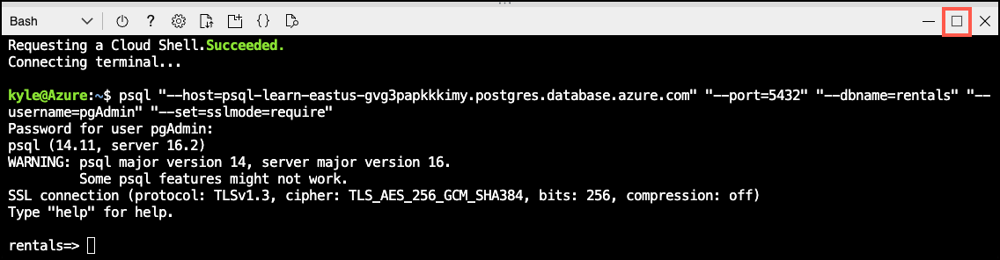
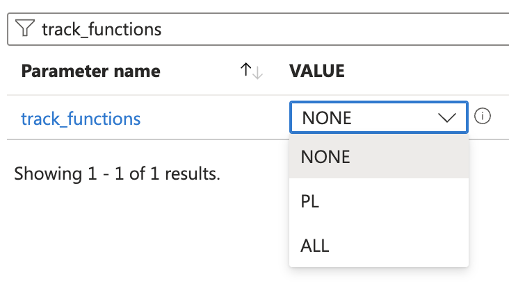

---
lab:
    title: 'Create a search function for a recommendation system'
    module: 'Enable Semantic Search with Azure Database for PostgreSQL'
---

# Create a search function for a recommendation system

Let's build a recommendation system using semantic search. The system will recommend several listings based on a provided sample listing. The sample could be from the listing the user is viewing or their preferences. We'll implement the system as a PostgreSQL function leveraging the `azure_openai` extension.

By the end of this exercise, you'll have defined a function `recommend_listing` that provides at most `numResults` listings most similar to the supplied `sampleListingId`. You can use this data to drive new opportunities, such as joining recommended listings against discounted listings.

## Before you start

You need an [Azure subscription](https://azure.microsoft.com/free) with administrative rights, and you must be approved for Azure OpenAI access in that subscription. If you need Azure OpenAI access, apply at the [Azure OpenAI limited access](https://learn.microsoft.com/legal/cognitive-services/openai/limited-access) page.

### Deploy resources into your Azure subscription

This step guides you through using Azure CLI commands from the Azure Cloud Shell to create a resource group and run a Bicep script to deploy the Azure services necessary for completing this exercise into your Azure subscription.

1. Open a web browser and navigate to the [Azure portal](https://portal.azure.com/).

2. Select the **Cloud Shell** icon in the Azure portal toolbar to open a new [Cloud Shell](https://learn.microsoft.com/azure/cloud-shell/overview) pane at the bottom of your browser window.

    

    If prompted, select the required options to open a *Bash* shell. If you have previously used a *PowerShell* console, switch it to a *Bash* shell.

3. At the Cloud Shell prompt, enter the following to clone the GitHub repo containing exercise resources:

    ```bash
    git clone https://github.com/MicrosoftLearning/mslearn-postgresql.git
    ```

4. Next, you run three commands to define variables to reduce redundant typing when using Azure CLI commands to create Azure resources. The variables represent the name to assign to your resource group (`RG_NAME`), the Azure region (`REGION`) into which resources will be deployed, and a randomly generated password for the PostgreSQL administrator login (`ADMIN_PASSWORD`).

    In the first command, the region assigned to the corresponding variable is `eastus`, but you can also replace it with a location of your preference. However, if replacing the default, you must select another [Azure region that supports abstractive summarization](https://learn.microsoft.com/azure/ai-services/language-service/summarization/region-support) to ensure you can complete all of the tasks in the modules in this learning path.

    ```bash
    REGION=eastus
    ```

    The following command assigns the name to be used for the resource group that will house all the resources used in this exercise. The resource group name assigned to the corresponding variable is `rg-learn-postgresql-ai-$REGION`, where `$REGION` is the location you specified above. However, you can change it to any other resource group name that suits your preference.

    ```bash
    RG_NAME=rg-learn-postgresql-ai-$REGION
    ```

    The final command randomly generates a password for the PostgreSQL admin login. **Make sure you copy it** to a safe place to use later to connect to your PostgreSQL flexible server.

    ```bash
    a=()
    for i in {a..z} {A..Z} {0..9}; 
     do
     a[$RANDOM]=$i
    done
    ADMIN_PASSWORD=$(IFS=; echo "${a[*]::18}")
    echo "Your randomly generated PostgreSQL admin user's password is:"
    echo $ADMIN_PASSWORD
    ```

5. If you have access to more than one Azure subscription, and your default subscription is not the one in which you want to create the resource group and other resources for this exercise, run this command to set the appropriate subscription, replacing the `<subscriptionName|subscriptionId>` token with either the name or ID of the subscription you want to use:

    ```azurecli
    az account set --subscription <subscriptionName|subscriptionId>
    ```

6. Run the following Azure CLI command to create your resource group:

    ```azurecli
    az group create --name $RG_NAME --location $REGION
    ```

7. Finally, use the Azure CLI to execute a Bicep deployment script to provision Azure resources in your resource group:

    ```azurecli
    az deployment group create --resource-group $RG_NAME --template-file "mslearn-postgresql/Allfiles/Labs/Shared/deploy.bicep" --parameters restore=false adminLogin=pgAdmin adminLoginPassword=$ADMIN_PASSWORD
    ```

    The Bicep deployment script provisions the Azure services required to complete this exercise into your resource group. The resources deployed include an Azure Database for PostgreSQL - Flexible Server, Azure OpenAI, and an Azure AI Language service. The Bicep script also performs some configuration steps, such as adding the `azure_ai` and `vector` extensions to the PostgreSQL server's _allowlist_ (via the `azure.extensions` server parameter), creating a database named `rentals` on the server, and adding a deployment named `embedding` using the `text-embedding-ada-002` model to your Azure OpenAI service. Note that the Bicep file is shared by all modules in this learning path, so you may only use some of the deployed resources in some exercises.

    The deployment typically takes several minutes to complete. You can monitor it from the Cloud Shell or navigate to the **Deployments** page for the resource group you created above and observe the deployment progress there.

8. Close the Cloud Shell pane once your resource deployment is complete.

### Troubleshooting deployment errors

You may encounter a few errors when running the Bicep deployment script.

- If you previously ran the Bicep deployment script for this learning path and subsequently deleted the resources, you may receive an error message like the following if you are attempting to rerun the script within 48 hours of deleting the resources:

    ```bash
    {"code": "InvalidTemplateDeployment", "message": "The template deployment 'deploy' is not valid according to the validation procedure. The tracking id is '4e87a33d-a0ac-4aec-88d8-177b04c1d752'. See inner errors for details."}
    
    Inner Errors:
    {"code": "FlagMustBeSetForRestore", "message": "An existing resource with ID '/subscriptions/{subscriptionId}/resourceGroups/rg-learn-postgresql-ai-eastus/providers/Microsoft.CognitiveServices/accounts/{accountName}' has been soft-deleted. To restore the resource, you must specify 'restore' to be 'true' in the property. If you don't want to restore existing resource, please purge it first."}
    ```

    If you receive this message, modify the `azure deployment group create` command above to set the `restore` parameter equal to `true` and rerun it.

- If the selected region is restricted from provisioning specific resources, you must set the `REGION` variable to a different location and rerun the commands to create the resource group and run the Bicep deployment script.

    ```bash
    {"status":"Failed","error":{"code":"DeploymentFailed","target":"/subscriptions/{subscriptionId}/resourceGroups/{resourceGrouName}/providers/Microsoft.Resources/deployments/{deploymentName}","message":"At least one resource deployment operation failed. Please list deployment operations for details. Please see https://aka.ms/arm-deployment-operations for usage details.","details":[{"code":"ResourceDeploymentFailure","target":"/subscriptions/{subscriptionId}/resourceGroups/{resourceGrouName}/providers/Microsoft.DBforPostgreSQL/flexibleServers/{serverName}","message":"The resource write operation failed to complete successfully, because it reached terminal provisioning state 'Failed'.","details":[{"code":"RegionIsOfferRestricted","message":"Subscriptions are restricted from provisioning in this region. Please choose a different region. For exceptions to this rule please open a support request with Issue type of 'Service and subscription limits'. See https://review.learn.microsoft.com/en-us/azure/postgresql/flexible-server/how-to-request-quota-increase for more details."}]}]}}
    ```

- If the script is unable to create an AI resource due to the requirement to accept the responsible AI agreement, you may experience the following error; in which case use the Azure Portal user interface to create an Azure AI Services resource, and then re-run the deployment script.

    ```bash
    {"code": "InvalidTemplateDeployment", "message": "The template deployment 'deploy' is not valid according to the validation procedure. The tracking id is 'f8412edb-6386-4192-a22f-43557a51ea5f'. See inner errors for details."}
     
    Inner Errors:
    {"code": "ResourceKindRequireAcceptTerms", "message": "This subscription cannot create TextAnalytics until you agree to Responsible AI terms for this resource. You can agree to Responsible AI terms by creating a resource through the Azure Portal then trying again. For more detail go to https://go.microsoft.com/fwlink/?linkid=2164190"}
    ```

## Connect to your database using psql in the Azure Cloud Shell

In this task, you connect to the `rentals` database on your Azure Database for PostgreSQL server using the [psql command-line utility](https://www.postgresql.org/docs/current/app-psql.html) from the [Azure Cloud Shell](https://learn.microsoft.com/azure/cloud-shell/overview).

1. In the [Azure portal](https://portal.azure.com/), navigate to your newly created Azure Database for PostgreSQL - Flexible Server.

2. In the resource menu, under **Settings**, select **Databases** select **Connect** for the `rentals` database.

    

3. At the "Password for user pgAdmin" prompt in the Cloud Shell, enter the randomly generated password for the **pgAdmin** login.

    Once logged in, the `psql` prompt for the `rentals` database is displayed.

4. Throughout the remainder of this exercise, you continue working in the Cloud Shell, so it may be helpful to expand the pane within your browser window by selecting the **Maximize** button at the top right of the pane.

    

## Setup: Configure extensions

To store and query vectors, and to generate embeddings, you need to allow-list and enable two extensions for Azure Database for PostgreSQL Flexible Server: `vector` and `azure_ai`.

1. To allow-list both extensions, add `vector` and `azure_ai` to the server parameter `azure.extensions`, as per the instructions provided in [How to use PostgreSQL extensions](https://learn.microsoft.com/en-us/azure/postgresql/flexible-server/concepts-extensions#how-to-use-postgresql-extensions).

2. Run the following SQL command to enable the `vector` extension. For detailed instructions, read [How to enable and use `pgvector` on Azure Database for PostgreSQL - Flexible Server](https://learn.microsoft.com/en-us/azure/postgresql/flexible-server/how-to-use-pgvector#enable-extension).

    ```sql
    CREATE EXTENSION vector;
    ```

3. To enable the `azure_ai` extension, run the following SQL command. You'll need the endpoint and API key for the Azure OpenAI resource. For detailed instructions, read [Enable the `azure_ai` extension](https://learn.microsoft.com/en-us/azure/postgresql/flexible-server/generative-ai-azure-overview#enable-the-azure_ai-extension).

    ```sql
    CREATE EXTENSION azure_ai;
    SELECT azure_ai.set_setting('azure_openai.endpoint', 'https://<endpoint>.openai.azure.com');
    SELECT azure_ai.set_setting('azure_openai.subscription_key', '<API Key>');
    ```

## Populate the database with sample data

Before you explore the `azure_ai` extension, add a couple of tables to the `rentals` database and populate them with sample data so you have information to work with as you review the extension's functionality.

1. Run the following commands to create the `listings` and `reviews` tables for storing rental property listing and customer review data:

    ```sql
    DROP TABLE IF EXISTS listings;
    
    CREATE TABLE listings (
        id int,
        name varchar(100),
        description text,
        property_type varchar(25),
        room_type varchar(30),
        price numeric,
        weekly_price numeric
    );
    ```

2. Next, use the `COPY` command to load data from CSV files into each table you created above. Start by running the following command to populate the `listings` table:

    ```sql
    \COPY listings FROM 'mslearn-postgresql/Allfiles/Labs/Shared/listings.csv' CSV HEADER
    ```

    The command output should be `COPY 50`, indicating that 50 rows were written into the table from the CSV file.

## Create and store embedding vectors

Now that we have some sample data, it's time to generate and store the embedding vectors. The `azure_ai` extension makes calling the Azure OpenAI embedding API easy.

1. Add the embedding vector column.

    The `text-embedding-ada-002` model is configured to return 1,536 dimensions, so use that for the vector column size.

    ```sql
    ALTER TABLE listings ADD COLUMN listing_vector vector(1536);
    ```

1. Generate an embedding vector for the description of each listing by calling Azure OpenAI through the create_embeddings user-defined function, which is implemented by the azure_ai extension:

    ```sql
    UPDATE listings
    SET listing_vector = azure_openai.create_embeddings('embedding', description, max_attempts => 5, retry_delay_ms => 500)
    WHERE listing_vector IS NULL;
    ```

    Note that this may take several minutes, depending on the available quota.

1. See an example vector by running this query:

    ```sql
    SELECT listing_vector FROM listings LIMIT 1;
    ```

    You will get a result similar to this, but with 1536 vector columns:

    ```sql
    postgres=> SELECT listing_vector FROM listings LIMIT 1;
    -[ RECORD 1 ]--+------ ...
    listing_vector | [-0.0018742813,-0.04530062,0.055145424, ... ]
    ```

## Create the recommendation function

The recommendation function takes a `sampleListingId` and returns the `numResults` most similar other listings. To do so, it creates an embedding of the sample listing's name and description and runs a semantic search of that query vector against the listing embeddings.

```sql
CREATE FUNCTION
    recommend_listing(sampleListingId int, numResults int) 
RETURNS TABLE(
            out_listingName text,
            out_listingDescription text,
            out_score real)
AS $$ 
DECLARE
    queryEmbedding vector(1536); 
    sampleListingText text; 
BEGIN 
    sampleListingText := (
     SELECT
        name || ' ' || description
     FROM
        listings WHERE id = sampleListingId
    ); 

    queryEmbedding := (
     azure_openai.create_embeddings('embedding', sampleListingText, max_attempts => 5, retry_delay_ms => 500)
    );

    RETURN QUERY 
    SELECT
        name::text,
        description,
        -- cosine distance:
        (listings.listing_vector <=> queryEmbedding)::real AS score
    FROM
        listings 
    ORDER BY score ASC LIMIT numResults;
END $$
LANGUAGE plpgsql; 
```

See the [Recommendation System](https://learn.microsoft.com/en-us/azure/postgresql/flexible-server/generative-ai-recommendation-system) example for more ways to customize this function, for instance, combining several text columns into an embedding vector.

## Query the recommendation function

To query the recommendation function, pass it a listing ID and the number of recommendations it should make.

```sql
select out_listingName, out_score from recommend_listing( (SELECT id from listings limit 1), 20); -- search for 20 listing recommendations closest to a listing
```

The result will be something like:

```sql
            out_listingname          | out_score 
-------------------------------------+-------------
 Sweet Seattle Urban Homestead 2 Bdr | 0.012512862
 Lovely Cap Hill Studio has it all!  | 0.09572035
 Metrobilly Retreat                  | 0.0982959
 Cozy Seattle Apartment Near UW      | 0.10320047
 Sweet home in the heart of Fremont  | 0.10442386
 Urban Chic, West Seattle Apartment  | 0.10654513
 Private studio apartment with deck  | 0.107096426
 Light and airy, steps to the Lake.  | 0.11008232
 Backyard Studio Apartment near UW   | 0.111279964
 2bed Rm Inner City Suite Near Dwtn  | 0.111340374
 West Seattle Vacation Junction      | 0.111758955
 Green Lake Private Ground Floor BR  | 0.112196356
 Stylish Queen Anne Apartment        | 0.11250153
 Family Friendly Modern Seattle Home | 0.11257711
 Bright Cheery Room in Seattle House | 0.11290849
 Big sunny central house with view!  | 0.11382967
 Modern, Light-Filled Fremont Flat   | 0.114443965
 Chill Central District 2BR          | 0.1153879
 Sunny Bedroom w/View: Wallingford   | 0.11549795
 Seattle Turret House (Apt 4)        | 0.11590502
```

To see the function runtime, make sure `track_functions` is enabled in the Server Parameters section on the Azure Portal (you can use `PL` or `ALL`):



Then, you can query the function statistics table:

```sql
SELECT * FROM pg_stat_user_functions WHERE funcname = 'recommend_listing';
```

The result should be something like:

```sql
 funcid | schemaname |    funcname       | calls | total_time | self_time 
--------+------------+-------------------+-------+------------+-----------
  28753 | public     | recommend_listing |     1 |    268.357 | 268.357
(1 row)
```

In this benchmark, we obtained the sample listing's embedding and performed the semantic search against about 4k documents in ~270ms.

## Check your work

1. Make sure the function exists with the correct signature:

    ```sql
    \df recommend_listing
    ```

    You should see the following:

    ```sql
    public | recommend_listing | TABLE(out_listingname text, out_listingdescription text, out_score real) | samplelistingid integer, numre
    sults integer | func
    ```

2. Make sure you can query it using the following query:

    ```sql
    select out_listingName, out_score from recommend_listing( (SELECT id from listings limit 1), 20); -- search for 20 listing recommendations closest to a listing
    ```

## Clean up

Once you have completed this exercise, delete the Azure resources you created. You are charged for the configured capacity, not how much the database is used. Follow these instructions to delete your resource group and all resources you created for this lab.

> [!Note]
>
> If you plan on completing additional modules in this learning path, you can skip this task until you have finished all the modules you intend to complete.

1. Open a web browser and navigate to the [Azure portal](https://portal.azure.com/), and on the home page, select **Resource groups** under Azure services.

    

2. In the filter for any field search box, enter the name of the resource group you created for this lab, and then select your resource group from the list.

3. On the **Overview** page of your resource group, select **Delete resource group**.

    

4. In the confirmation dialog, enter the resource group name you are deleting to confirm and then select **Delete**.
