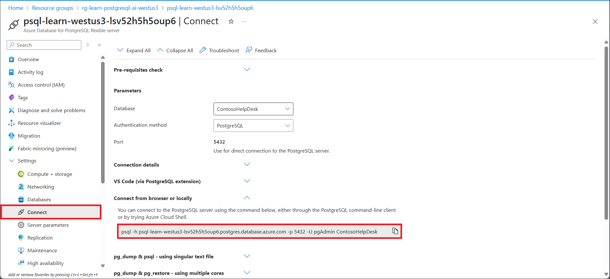

This hands-on exercise adds a lightweight knowledge-graph layer inside the same Azure Database for PostgreSQL you used in earlier units. You create two small tables for **nodes** and **edges**, link them to your existing `company_policies` rows, and then run a **graph-narrowed vector search** that first filters by relationships (Topic/Department) and then ranks with pgvector. The goal is *higher precision* on multi-concept questions without complicating prompts or moving data to a separate store.

By the end of this exercise, you will:

- Understand how to create and manage graph structures in PostgreSQL.
- Be able to perform graph-narrowed vector searches.
- Gain experience with integrating knowledge graphs into RAG applications.

## Before you start

You need an [Azure subscription](https://azure.microsoft.com/free) with administrative rights, and you must be approved for Azure OpenAI access in that subscription. If you need Azure OpenAI access, apply at the [Azure OpenAI limited access](https://learn.microsoft.com/legal/cognitive-services/openai/limited-access) page.

### Deploy resources into your Azure subscription

*If you already have a nonproduction Azure Database for PostgreSQL server and a nonproduction Azure OpenAI resource setup, you can skip this section.*

This step guides you through using Azure CLI commands from the Azure Cloud Shell to create a resource group and run a Bicep script to deploy the Azure services necessary for completing this exercise into your Azure subscription.

1. Open a web browser and navigate to the [Azure portal](https://portal.azure.com/).

1. Select the **Cloud Shell** icon in the Azure portal toolbar to open a new [Cloud Shell](https://learn.microsoft.com/azure/cloud-shell/overview) pane at the bottom of your browser window.

    

    If prompted, select the required options to open a *Bash* shell. If you previously used a *PowerShell* console, switch it to a *Bash* shell.

1. At the Cloud Shell prompt, enter the following to clone the GitHub repo containing exercise resources:

    ```bash
    git clone --branch "postgresql-ai-update" --single-branch --depth 1 https://github.com/MicrosoftLearning/mslearn-postgresql.git
    ```

1. Next, you run three commands to define variables to reduce redundant typing when using Azure CLI commands to create Azure resources. The variables represent the name to assign to your resource group (`RG_NAME`), the Azure region (`REGION`) into which resources are deployed, and a randomly generated password for the PostgreSQL administrator sign in (`ADMIN_PASSWORD`).

    In the first command, the region assigned to the corresponding variable is `westus3`, but you can also replace it with a location of your preference. However, if replacing the default, you must select another [Azure region that supports abstractive summarization](https://learn.microsoft.com/azure/ai-services/language-service/summarization/region-support) to ensure you can complete all of the tasks in the modules in this learning path.

    ```bash
    REGION=westus3
    ```

    The following command assigns the name to be used for the resource group that houses all the resources used in this exercise. The resource group name assigned to the corresponding variable is `rg-learn-postgresql-ai-$REGION`, where `$REGION` is the location you previously specified. However, you can change it to any other resource group name that suits your preference.

    ```bash
    RG_NAME=rg-learn-postgresql-ai-$REGION
    ```

    The final command randomly generates a password for the PostgreSQL admin sign in. **Make sure you copy it** to a safe place to use later to connect to your PostgreSQL.

    ```bash
    a=()
    for i in {a..z} {A..Z} {0..9}; 
     do
     a[$RANDOM]=$i
    done
    ADMIN_PASSWORD=$(IFS=; echo "${a[*]::18}")
    echo "Your randomly generated PostgreSQL admin user's password is:"
    echo $ADMIN_PASSWORD
    ```

1. *Only run this command if you want to change your current subscription*. If you have access to more than one Azure subscription, and your default subscription isn't the one in which you want to create the resource group and other resources for this exercise, run this command to set the appropriate subscription, replacing the `<subscriptionName|subscriptionId>` token with either the name or ID of the subscription you want to use:

    ```azurecli
    az account set --subscription <subscriptionName|subscriptionId>
    ```

1. Run the following Azure CLI command to create your resource group:

    ```azurecli
    az group create --name $RG_NAME --location $REGION
    ```

1. Finally, use the Azure CLI to execute Bicep deployment scripts to provision Azure resources in your resource group:

    ```azurecli
    #1 Core infra: PostgreSQL + DB + firewall + server param, AOAI account, Language account
    az deployment group create \
      --resource-group "$RG_NAME" \
      --template-file "mslearn-postgresql/Allfiles/Labs/Shared/deploy.core.bicep" \
      --parameters restore=false adminLogin=pgAdmin adminLoginPassword="$ADMIN_PASSWORD" databaseName=ContosoHelpDesk
    
    AOAI=$(az cognitiveservices account list -g "$RG_NAME" --query "[?kind=='OpenAI'].name | [0]" -o tsv)
    
    #2 Wait for the parent AOAI account to finish provisioning
    echo "Waiting for AOAI account to be ready..."
    while true; do
      STATE=$(az cognitiveservices account show -g "$RG_NAME" -n "$AOAI" --query "properties.provisioningState" -o tsv)
      echo "provisioningState=$STATE"
      [ "$STATE" = "Succeeded" ] && break
      sleep 30
    done

    #3 OpenAI deployments: embedding + chat
    az deployment group create \
      --resource-group "$RG_NAME" \
      --template-file "mslearn-postgresql/Allfiles/Labs/Shared/deploy.aoai-deployments.bicep" \
      --parameters azureOpenAIServiceName="$AOAI"
    ```

    The Bicep deployment scripts provisions the Azure services required to complete this exercise into your resource group. The resources deployed include an Azure Database for PostgreSQL server, Azure OpenAI, an Azure AI Language service. The Bicep script also performs some configuration steps, such as adding the `azure_ai` and `vector` extensions to the PostgreSQL server's _allowlist_ (via the `azure.extensions` server parameter), creating a database named `ContosoHelpDesk` on the server, and adding a deployment named `embedding` using the `text-embedding-ada-002` model to your Azure OpenAI service. Finally it adds a deployment named `chat` using the `gpt-4o-mini` model to your Azure OpenAI service. The Bicep file shares all modules in this learning path, so you might only use some of the deployed resources in some exercises.

    The deployment typically takes several minutes to complete. You can monitor it from the Cloud Shell or navigate to the **Deployments** page for the resource group you previously created and observe the deployment progress there.

1. Take note of the resource names and their corresponding ID, and the PostgreSQL server's fully qualified domain name (FQDN), username, and password, as you need them later.

### Troubleshooting deployment errors

You could encounter a few errors when running the Bicep deployment script. *If no errors are encountered, skip this section.*

- If you previously ran the Bicep deployment script for this learning path and later deleted the resources, you could receive an error message like the following if you're attempting to rerun the script within 48 hours of deleting the resources:

    ```bash
    {"code": "InvalidTemplateDeployment", "message": "The template deployment 'deploy' is not valid according to the validation procedure. The tracking id is '4e87a33d-a0ac-4aec-88d8-177b04c1d752'. See inner errors for details."}
    
    Inner Errors:
    {"code": "FlagMustBeSetForRestore", "message": "An existing resource with ID '/subscriptions/{subscriptionId}/resourceGroups/rg-learn-postgresql-ai-eastus/providers/Microsoft.CognitiveServices/accounts/{accountName}' has been soft-deleted. To restore the resource, you must specify 'restore' to be 'true' in the property. If you don't want to restore existing resource, please purge it first."}
    ```

    If you receive this message, modify the `azure deployment group create` command previously to set the `restore` parameter equal to `true` and rerun it.

- If the selected region is restricted from provisioning specific resources, you must set the `REGION` variable to a different location and rerun the commands to create the resource group and run the Bicep deployment script.

    ```bash
    {"status":"Failed","error":{"code":"DeploymentFailed","target":"/subscriptions/{subscriptionId}/resourceGroups/{resourceGrouName}/providers/Microsoft.Resources/deployments/{deploymentName}","message":"At least one resource deployment operation failed. Please list deployment operations for details. Please see https://aka.ms/arm-deployment-operations for usage details.","details":[{"code":"ResourceDeploymentFailure","target":"/subscriptions/{subscriptionId}/resourceGroups/{resourceGrouName}/providers/Microsoft.DBforPostgreSQL/flexibleServers/{serverName}","message":"The resource write operation failed to complete successfully, because it reached terminal provisioning state 'Failed'.","details":[{"code":"RegionIsOfferRestricted","message":"Subscriptions are restricted from provisioning in this region. Please choose a different region. For exceptions to this rule please open a support request with Issue type of 'Service and subscription limits'. See https://review.learn.microsoft.com/en-us/azure/postgresql/flexible-server/how-to-request-quota-increase for more details."}]}]}}
    ```

- If the script is unable to create an AI resource due to the requirement to accept the responsible AI agreement, you get the following error. If you get that error, use the Azure portal user interface to create an Azure AI Services resource, and then rerun the deployment script.

    ```bash
    {"code": "InvalidTemplateDeployment", "message": "The template deployment 'deploy' is not valid according to the validation procedure. The tracking id is 'f8412edb-6386-4192-a22f-43557a51ea5f'. See inner errors for details."}
     
    Inner Errors:
    {"code": "ResourceKindRequireAcceptTerms", "message": "This subscription cannot create TextAnalytics until you agree to Responsible AI terms for this resource. You can agree to Responsible AI terms by creating a resource through the Azure Portal then trying again. For more detail go to https://go.microsoft.com/fwlink/?linkid=2164190"}
    ```

## Connect to your database using psql in the Azure Cloud Shell

You connect to the `ContosoHelpDesk` database on your Azure Database for PostgreSQL server using the [psql command-line utility](https://www.postgresql.org/docs/current/app-psql.html) from the [Azure Cloud Shell](https://learn.microsoft.com/azure/cloud-shell/overview).

1. In the [Azure portal](https://portal.azure.com/), navigate to your newly created Azure Database for PostgreSQL server.

1. In the resource menu, under **Settings**, select **Connect**, then select **ContosoHelpDesk** for the database. 

1. Expand the section **Connect from browser or locally** and use the command shown to connect using the Azure Cloud Shell.

    

1. At the "Password for user pgAdmin" prompt in the Cloud Shell, enter the randomly generated password for the **pgAdmin** sign in.

    Once you sign in, the `psql` prompt for the `ContosoHelpDesk` database is displayed.

1. Throughout the remainder of this exercise, you continue working in the Cloud Shell, so it helps to expand the pane within your browser window by selecting the **Maximize** button at the top right of the pane.

    

## Setup: Configure extensions

To store and query vectors, and to generate embeddings, you need to allowlist and enable two extensions for Azure Database for PostgreSQL: `vector` and `azure_ai`.

1. To allowlist both extensions, add `vector` and `azure_ai` to the server parameter `azure.extensions`, as per the instructions provided in [How to use PostgreSQL extensions](https://learn.microsoft.com/en-us/azure/postgresql/flexible-server/concepts-extensions#how-to-use-postgresql-extensions).

1. Run the following SQL command to enable the `vector` and `azure_ai` extensions. For detailed instructions, read [How to enable and use `pgvector` on Azure Database for PostgreSQL](https://learn.microsoft.com/en-us/azure/postgresql/flexible-server/how-to-use-pgvector#enable-extension).

    On *ContosoHelpDesk* prompt, run the following SQL commands:

    ```sql
    -- Enable required extensions
    CREATE EXTENSION vector;
    CREATE EXTENSION azure_ai;
    ```

1. To enable the `azure_ai` extension, run the following SQL command. You need the endpoint and API key for the Azure OpenAI resource. For detailed instructions, read [Enable the `azure_ai` extension](https://learn.microsoft.com/en-us/azure/postgresql/flexible-server/generative-ai-azure-overview#enable-the-azure_ai-extension).

    On the *ContosoHelpDesk* prompt, run the following commands:

    ```sql
    -- Configure Azure OpenAI (requires azure_ai_settings_manager role)
    SELECT azure_ai.set_setting('azure_openai.endpoint', 'https://<endpoint>.openai.azure.com');      -- e.g., https://YOUR-RESOURCE.openai.azure.com
    SELECT azure_ai.set_setting('azure_openai.subscription_key', '<API Key>');
    ```

## Populate the database with sample data

Before you use the `azure_ai` extension, add a table to the `ContosoHelpDesk` database and populate them with sample data so you have information to work with as you create your application.

1. On the **ContosoHelpDesk** prompt, run the following commands to create the `company_policies` table for storing company policy data:

    ```sql
    -- Create table for policies and embeddings (matches CSV columns)
    DROP TABLE IF EXISTS company_policies CASCADE;

    CREATE TABLE company_policies (
      policy_id          BIGSERIAL PRIMARY KEY,
      title       TEXT NOT NULL,
      department  TEXT NOT NULL,
      policy_text TEXT NOT NULL,
      category    TEXT NOT NULL,
      embedding   vector(1536)  -- The `text-embedding-ada-002` model is configured to return 1,536 dimensions, so use that number for the vector column size.
    );
    ```

1. In your Azure Cloud Shell, use the `COPY` command to load data from CSV files into each table you previously created. Run the following command to populate the `company_policies` table:

    ```sql
    \COPY company_policies (title, department, policy_text, category) FROM 'mslearn-postgresql/Allfiles/Labs/Shared/company-policies.csv' WITH (FORMAT csv, HEADER)
    ```

    The command output should be `COPY 108`, indicating that 108 rows were written into the table from the CSV file.

1. Backfill embeddings for existing rows.

    Run the following command in your **psql** session (Cloud Shell) to compute embeddings for any rows that don’t have them yet. Replace `<EMBEDDING_DEPLOYMENT_NAME>` with the name of your embedding deployment.

    ```sql
    -- Create embeddings for existing rows that currently have no embeddings
    UPDATE company_policies
    SET embedding = azure_openai.create_embeddings('<EMBEDDING_DEPLOYMENT_NAME>', policy_text)::vector
    WHERE embedding IS NULL;
    ```

    This calls your Azure OpenAI embedding deployment from SQL (via `azure_ai`) and stores the result in the column `embedding`.

If you successfully backfilled the 108 rows with embeddings, exit *psql* by typing `\q` and skip the following troubleshooting section. Otherwise, continue with the following troubleshooting steps.

### Troubleshoot 429 errors if encountered

*Skip this section if your UPDATE statement successfully backfilled 108 embeddings*. 

1. Depending on your Azure OpenAI rate limits, you might experience **429 Too Many Requests** errors if you exceed the allowed number of requests. If that is the case for the previous UPDATE statement, you can run the following command to batch the requests and retry (if needed manually reduce the *batch_size* too):

    ```sql
    DO $$
    DECLARE
      batch_size       int := 50;   -- rows per batch
      optimistic_pause int := 10;   -- seconds to wait after a successful batch
      pause_secs       int := 10;   -- current wait (resets to optimistic on success)
      max_pause        int := 60;   -- cap the backoff
      updated          int;
    BEGIN
      LOOP
        BEGIN
          WITH todo AS (
            SELECT policy_id, policy_text
            FROM company_policies
            WHERE embedding IS NULL
            ORDER BY policy_id
            LIMIT batch_size
          )
          UPDATE company_policies p
          SET embedding = azure_openai.create_embeddings('embedding', t.policy_text)::vector
          FROM todo t
          WHERE p.policy_id = t.policy_id;

          GET DIAGNOSTICS updated = ROW_COUNT;
    
          IF updated = 0 THEN
            RAISE NOTICE 'No rows left to embed.';
            EXIT;
          END IF;
    
          -- Success: reset to optimistic pause and sleep briefly
          pause_secs := optimistic_pause;
          RAISE NOTICE 'Updated % rows; sleeping % seconds before next batch.', updated, pause_secs;
          PERFORM pg_sleep(pause_secs);
    
        EXCEPTION WHEN OTHERS THEN
          -- Likely throttled (429) or transient error: back off and retry
          RAISE NOTICE 'Throttled/transient error; backing off % seconds.', pause_secs;
          PERFORM pg_sleep(pause_secs);
          pause_secs := LEAST(pause_secs * 2, max_pause);
        END;
      END LOOP;
    END $$;
    
    ```

1. If you successfully backfilled the 108 rows with embeddings, exit *psql* by typing `\q`, otherwise, try reducing the *batch_size* by 10 and run the previous script again.

### Add the vector index

To improve the performance of similarity searches, you can add a vector index to the `embedding` column of the `company_policies` table.

1. On the Azure Cloud Shell, connect to the *ContosoHelpDesk* database using *psql* as before.

1. Create the IVFFlat index:

    ```sql
    -- Drop the IVFFlat index
    DROP INDEX IF EXISTS company_policies_embedding_ivfflat_idx;
    
    -- Use cosine distance (vector_cosine_ops) for text embeddings
    CREATE INDEX company_policies_embedding_ivfflat_idx
      ON company_policies
      USING ivfflat (embedding vector_cosine_ops)
      WITH (lists = 100);
    
    ANALYZE company_policies;
    ```

### Test the vector table with a similarity query

Let's make sure everything is working by verifying with a similarity search and simple filtering directly from SQL.

1. On the Azure Cloud Shell, connect to the *ContosoHelpDesk* database using *psql* as before.

1. Run the following SQL statement:

    ```sql
    -- Best match for a question (cosine)
    SELECT policy_id, title, department, policy_text
    FROM company_policies
    ORDER BY embedding <=> azure_openai.create_embeddings('embedding',
             'How many vacation days do employees get?')::vector
    LIMIT 1;
    ```

1. Add a filter plus a vector search by running the following SQL statement:

    ```sql
    -- Filter + vector (hybrid)
    SELECT policy_id, title, department, policy_text
    FROM company_policies
    WHERE department = 'HR'
    ORDER BY embedding <=> azure_openai.create_embeddings('embedding',
             'Does the company help me with college expenses')::vector
    LIMIT 3;
    ```

1. Type *\q* and press Enter to exit *psql*.

While these answers are a good start, they might not be comprehensive enough for more complex queries. To address this problem, you can create a Python RAG (Retrieval-Augmented Generation) application that retrieves relevant passages from our database and uses them as context for generating answers.

## Enable the Apache AGE Extension on the Azure portal (temporary step that will be removed and added to the bicep setup file)

Before you can use the Apache AGE extension, you need to enable it on the Azure portal.

1. Go to the Azure portal and navigate to your Azure Database for PostgreSQL instance.
1. In the left-hand menu, under *Settings*, select *Server parameters*.
1. Search for **azure.extensions**.
1. Under the **Value** column, add `AGE` to the list of enabled extensions.
1. Do a new search for **shared_preload_libraries**.
1. Under the **Value** column, add `AGE` to the list of enabled extensions.
1. Select **Save** to apply the changes.

Now you should be able to use the Apache AGE extension in your PostgreSQL database.

## Build the knowledge graph

A knowledge graph is a structured representation of information that captures entities and their relationships. In this case, you create a knowledge graph from the company policies data. You start by creating the nodes and edges tables.

### Enable AGE and create the graph (same session)

Let's first enable the Apache AGE extension and create a new graph. 

1. On the Azure Cloud Shell, connect to the *ContosoHelpDesk* database using *psql* as before.

1. Run the following SQL statement:

    ```sql
    -- Enable the AGE extension
    CREATE EXTENSION IF NOT EXISTS age CASCADE;
    
    -- Put ag_catalog in the session path
    SET search_path = public, ag_catalog;

    -- Create a fresh graph namespace
    SELECT ag_catalog.create_graph('company_policies_graph');
    ```

Time to create the nodes and edges for the knowledge graph.

### Create the graph nodes

Let's create the nodes from the company policies data.

1. On the Azure Cloud Shell, connect to the *ContosoHelpDesk* database using *psql* as before.

1. First, let's define the function for upserting the policy nodes. Run the following SQL statement:

    ```sql
    DROP FUNCTION IF EXISTS public.policy_graph_upsert(BIGINT, TEXT, TEXT, TEXT, TEXT);

    -- Create a policy node
    CREATE OR REPLACE FUNCTION public.policy_graph_upsert(
      _id BIGINT, _title TEXT, _dept TEXT, _cat TEXT, _text TEXT
    ) RETURNS void
    LANGUAGE plpgsql
    VOLATILE
    AS $BODY$
    BEGIN
      -- Use ag_catalog just for this statement (doesn't leak outside the function)
      SET LOCAL search_path TO ag_catalog, public;

      EXECUTE format(
        'SELECT * FROM cypher(''company_policies_graph'', $$ 
          MERGE (p:Policy {policy_id: %s})
          SET  p.title       = %L,
                p.department  = %L,
                p.category    = %L,
                p.policy_text = %L
        $$) AS (n agtype);',
        _id, _title, _dept, _cat, _text
      );
    END
    $BODY$;
    ```

1. Next, let's add a function to upsert the department, category, and topic nodes.

    ```sql
    DROP FUNCTION IF EXISTS public.create_entity_in_policies_graph(TEXT, TEXT);

    -- Create a new department, category, or topic entity node in the graph
    CREATE OR REPLACE FUNCTION public.create_entity_in_policies_graph(
      _type TEXT, _name TEXT
    ) RETURNS void
    LANGUAGE plpgsql
    VOLATILE
    AS $BODY$
    BEGIN
      SET LOCAL search_path TO ag_catalog, public;

      EXECUTE format(
        'SELECT * FROM cypher(''company_policies_graph'', $$ 
          MERGE (e:Entity {type: %L, name: %L})
        $$) AS (n agtype);',
        _type, _name
      );
    END
    $BODY$;
    ```

1. Run the following SQL statements to add our nodes:

    ```sql
    -- Disable pagination for better output readability
    \pset pager off
    ```

    ```sql
    -- Upsert the policy nodes
    SELECT public.policy_graph_upsert(policy_id, title, department, category, policy_text)
    FROM public.company_policies
    ORDER BY policy_id;

    -- Departments
    SELECT public.create_entity_in_policies_graph('Department', d.department)
    FROM (SELECT DISTINCT department FROM public.company_policies) AS d;

    -- Categories
    SELECT public.create_entity_in_policies_graph('Category', c.category)
    FROM (SELECT DISTINCT category FROM public.company_policies) AS c;

    -- Topics - Group policies by list of common terms that might be mentioned in a policy
    WITH topics(name) AS (
      VALUES
        ('Employees'),
        ('Approval'),
        ('Customer'),
        ('Meetings'),
        ('Exit/Termination'),
        ('Legal'),
        ('Devices'),
        ('Events'),
        ('Expense'),
        ('New Hires'),
        ('Reconciled Monthly'),
        ('Remote'),
        ('Vendors/Suppliers'),
        ('Internet/Social Media'),
        ('Onboarding'),
        ('Prior Approval'),
        ('Products'),
        ('Reviewed Quarterly'),
        ('Tickets'),
        ('Training')
    )
    SELECT public.create_entity_in_policies_graph('Topic', name)
    FROM topics;
    ```
You should now have all the nodes created, time to create the edges that connect them.

### Create the graph edges

So far you added the nodes for policies, departments, categories, and topics. It's time to create the edges that connect them.

1. On the Azure Cloud Shell, connect to the *ContosoHelpDesk* database using *psql* as before.

1. Let's create a function to establish the edges between the policy nodes and their respective department, category, and topic nodes.

   ```sql
    -- Policy -> Entity edge upsert
    --   rel ∈ ('BELONGS_TO','IN_CATEGORY','MENTIONS')
    DROP FUNCTION IF EXISTS public.create_policy_link_in_policies_graph(BIGINT, TEXT, TEXT, TEXT);

    CREATE OR REPLACE FUNCTION public.create_policy_link_in_policies_graph(
      _policy_id BIGINT, _etype TEXT, _ename TEXT, _rel TEXT
    ) RETURNS void
    LANGUAGE plpgsql
    VOLATILE
    AS $BODY$
    BEGIN
      SET LOCAL search_path TO ag_catalog, public;

      EXECUTE format(
        'SELECT * FROM cypher(''company_policies_graph'', $$ 
          MATCH (p:Policy {policy_id: %s})
          MATCH (e:Entity {type: %L, name: %L})
          MERGE (p)-[:%s]->(e)
          RETURN 1
        $$) AS (ok agtype);',
        _policy_id, _etype, _ename, _rel
      );
    END
    $BODY$;
    ```

1. Now, run the following SQL command to create the edges between the policy nodes and their respective department, category, and topic nodes:

    ```sql
    -- Disable pagination for better output readability
    \pset pager off
    ```

    ```sql
    -- BELONGS_TO
    SELECT public.create_policy_link_in_policies_graph(policy_id, 'Department', department, 'BELONGS_TO')
    FROM public.company_policies;

    -- IN_CATEGORY
    SELECT public.create_policy_link_in_policies_graph(policy_id, 'Category', category, 'IN_CATEGORY')
    FROM public.company_policies;

    -- MENTIONS - Note that you use some regex patterns to match similar terms
    WITH topics(name, pattern) AS (
      VALUES
        ('Employees',              $$\memployee(s)?\M$$),
        ('Approval',               $$\mapprov(e|al|ed|als|ing)?\M$$),
        ('Customer',               $$\mcustomer(s)?\M$$),
        ('Meetings',               $$\mmeeting(s)?\M$$),
        ('Exit/Termination',       $$\m(exit|termination)\M$$),
        ('Legal',                  $$\mlegal\M$$),
        ('Devices',                $$\m(device(s)?|laptop(s)?)\M$$),
        ('Events',                 $$\mevent(s)?\M$$),
        ('Expense',                $$\mexpense(s)?\M$$),
        ('New Hires',              $$\mnew\M\s+\mhires\M$$),
        ('Reconciled Monthly',     $$\mreconciled\M\s+\mmonthly\M$$),
        ('Remote',                 $$\mremote\M(\s+\mwork\M)?$$),
        ('Vendors/Suppliers',      $$\m(vendor(s)?|supplier(s)?)\M$$),
        ('Internet/Social Media',  $$\minternet\M|\msocial\M\s+\mmedia\M$$),
        ('Onboarding',             $$\monboard(ed|ing)?\M|\monboarding\M$$),
        ('Prior Approval',         $$\mprior\M\s+\mapproval\M$$),
        ('Products',               $$\mproduct(s)?\M$$),
        ('Reviewed Quarterly',     $$\mreviewed\M\s+\mquarterly\M$$),
        ('Tickets',                $$\mticket(s)?\M|\mhelp\M\s*\mdesk\M$$),
        ('Training',               $$\mtrain(ing|ed|s)?\M$$)
    )
    SELECT public.create_policy_link_in_policies_graph(p.policy_id, 'Topic', t.name, 'MENTIONS')
    FROM public.company_policies p
    JOIN topics t
      ON p.policy_text ~* t.pattern
    GROUP BY t.name, p.policy_id
    ORDER BY t.name, p.policy_id;
    ```

1. Let's now check the nodes and edges counts for your graph:

    ```sql
    -- Total policy nodes
    SELECT * FROM cypher('company_policies_graph',
    $$ MATCH (p:Policy) RETURN count(p) $$) AS (count agtype);

    -- Entities by type (Department/Category/Topic)
    SELECT * FROM cypher('company_policies_graph',
    $$ MATCH (e:Entity) RETURN e.type, count(e) ORDER BY e.type $$) AS (type agtype, count agtype);

    -- Edges by relationship type
    SELECT * FROM cypher('company_policies_graph',
    $$ MATCH ()-[r]->() RETURN type(r), count(r) ORDER BY type(r) $$) AS (rel agtype, count agtype);
    ```

Now you have a full graph representation of the company policies, including all relevant entities and their relationships.

## Run a graph-narrowed vector search

Now that you created policy, department, and topic nodes, and connected them with edges, you can use the graph to **narrow candidates** and then use **pgvector** to **rank** those candidates by semantic similarity to a question. This process keeps the full retrieval flow inside *Azure Database for PostgreSQL*.

### Use department plus topics to narrow candidates

Let's narrow our search to policies that belong to the **Finance** department and mention specific topics.

1. On the Azure Cloud Shell, connect to the *ContosoHelpDesk* database using *psql* as before.

1. On the *ContosoHelpDesk* prompt, set a variable with the question you want to search for:

    ```
    \set question 'What expenses require prior approval for remote work travel?'
    ```

1. Run the following SQL statement to retrieve the top five policy passages. The graph picks **Finance** policies that **mention** any of the selected topics. The vector step ranks those candidates by semantic similarity to your question. A small deduplication step keeps one row per policy, which removes duplicates.

    ```sql
    /* Graph-narrowed vector search: filter by graph, then rank with pgvector */
    WITH
    /* 1) GRAPH FILTER: candidate policy_ids from AGE */
    graph_ids AS (
      SELECT ((pid)::text)::bigint AS policy_id
      FROM ag_catalog.cypher('company_policies_graph'::name, $$
        MATCH (p:Policy)-[:BELONGS_TO]->(:Entity {type:'Department', name:'Finance'})
        MATCH (p)-[:MENTIONS]->(t:Entity {type:'Topic'})
        WHERE t.name IN ['Expense','Approval','Remote']   /* adjust topics as needed */
        RETURN p.policy_id AS pid
      $$::cstring) AS (pid agtype)
    ),

    /* 2) QUESTION EMBEDDING: compute once from the psql 'question' variable */
    q AS (
      SELECT azure_openai.create_embeddings('embedding', :'question')::vector AS qv
    ),

    /* 3) VECTOR RANK: smaller cosine distance is better */
    ranked AS (
      SELECT
        cp.policy_id,
        cp.title,
        cp.department,
        cp.category,
        cp.policy_text,
        (cp.embedding <=> q.qv) AS distance
      FROM public.company_policies cp
      JOIN graph_ids USING (policy_id)
      CROSS JOIN q
      WHERE cp.embedding IS NOT NULL
    ),

    /* 4) DEDUP: keep the best (smallest distance) row per policy */
    dedup AS (
      SELECT *,
             ROW_NUMBER() OVER (PARTITION BY policy_id ORDER BY distance) AS rn
      FROM ranked
    )

    /* 5) RESULT: unique top 5 */
    SELECT policy_id, title, department, category, policy_text
    FROM dedup
    WHERE rn = 1
    ORDER BY distance
    LIMIT 5;
    ```

> [!TIP]  
> In `psql`, run the `\set question` command on its **own line**, and press **Enter** before you run the SQL query. If you paste both at once, the CTE might not run as expected.

This query generates a ranked list of policy passages that are relevant to the specified question. It first uses the graph structure to filter candidates by department and topic, then ranks them by semantic similarity to the question.

Let's try a different filter.

- **Topic-only (no department filter)** — Previously you filtered by the *Finance* department, now let's include all departments. Run the following query:

    ```sql
    WITH graph_ids AS (
      SELECT ((pid)::text)::bigint AS policy_id
      FROM ag_catalog.cypher('company_policies_graph'::name, $$
        MATCH (p:Policy)-[:MENTIONS]->(t:Entity {type:'Topic'})
        WHERE t.name IN ['Customer','Meetings','Expense']
        RETURN p.policy_id AS pid
      $$::cstring) AS (pid agtype)
    ),
    q AS (SELECT azure_openai.create_embeddings('embedding', :'question')::vector AS qv),
    ranked AS (
      SELECT cp.policy_id, cp.title, cp.department, cp.category, cp.policy_text,
             (cp.embedding <=> q.qv) AS distance
      FROM public.company_policies cp
      JOIN graph_ids USING (policy_id)
      CROSS JOIN q
      WHERE cp.embedding IS NOT NULL
    ),
    dedup AS (
      SELECT *, ROW_NUMBER() OVER (PARTITION BY policy_id ORDER BY distance) AS rn
      FROM ranked
    )
    SELECT policy_id, title, department, category, policy_text
    FROM dedup
    WHERE rn = 1
    ORDER BY distance
    LIMIT 5;
    ```

  Notice how the candidate set changed, given a more inclusive topic filter.

- **Change the topic list** — Replace `['Expense','Approval','Remote']` in the script with any subset of the 20 topics you created earlier (for example, `['Customer','Meetings','Expense']`). Then rerun the query. Notice how the candidate set changes again based on the topics selected.

You can also change your question by modifying the `\set question` command in `psql`. Try some of the following ones and rerun the previous queries:

- What are the policies related to customer interactions?
- How do we handle meeting notes and action items?
- What are the guidelines for remote work and travel?
- How do we ensure compliance with data privacy regulations?

You can also try your own questions and change the topic list as you see fit.

Combining your graph and vector search skills allow you to create powerful search applications. The larger the dataset you work with, the more effective your search capabilities become.

## Key takeaways

In this exercise, you used a small graph to add structure to retrieval. Instead of relying on look alike text only, you first pull candidates by connections like department and topic, then rank that list with `pgvector` against your question. Because it all runs in one database inside *Azure Database for PostgreSQL*, the flow stays simple to operate and easy to explain since the filters and paths are visible.

To apply the methods discussed here on your own data, start small. Pick a few entities and relationships that matter, link them to your rows, use a short `openCypher` query to fetch candidate `ids`, then apply vector ranking. Tighten or relax the filters as needed, swap in other concepts, and keep the workflow in SQL so it's straightforward to maintain.


