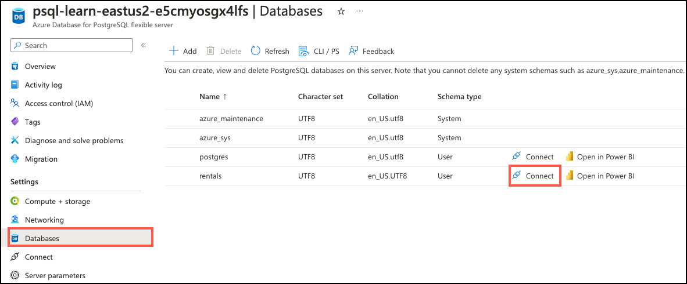
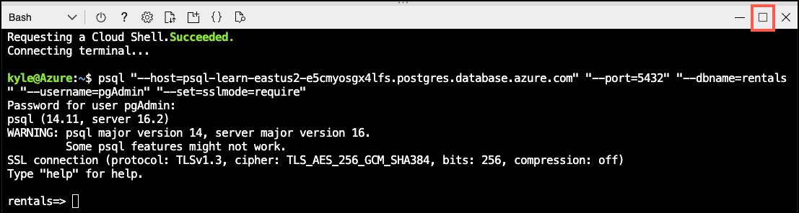

---
lab:
    title: 'Perform Extractive and Abstractive Summarization'
    module: 'Build AI apps with Azure Database for PostgreSQL'
---

# Perform Extractive and Abstractive Summarization

In this exercise, you use the `azure_ai` extension in Azure Database For PostgreSQL flexible server to perform abstractive and extractive summarization on rental property descriptions and compare the resulting summaries.

## Before you start

You need an [Azure subscription](https://azure.microsoft.com/free) with administrative rights, and you must be approved for Azure OpenAI access in that subscription. If you need Azure OpenAI access, apply at the [Azure OpenAI limited access](https://learn.microsoft.com/legal/cognitive-services/openai/limited-access) page.

### Deploy resources into your Azure subscription

This step will guide you through using Azure CLI commands from the Azure Cloud Shell to create a resource group and run a Bicep script to deploy the Azure services necessary for completing this exercise into your Azure subscription.

> Note
>
> If you are doing multiple modules in this learning path, you can share the Azure environment between them. In that case, you only need to complete this resource deployment step once.

1. Open a web browser and navigate to the [Azure portal](https://portal.azure.com/).

2. Select the **Cloud Shell** icon in the Azure portal toolbar to open a new [Cloud Shell](https://learn.microsoft.com/azure/cloud-shell/overview) pane at the bottom of your browser window.

    

3. At the Cloud Shell prompt, enter the following to clone the GitHub repo containing exercise resources:

    ```bash
    git clone https://github.com/MicrosoftLearning/mslearn-postgresql.git
    ```

4. Next, you run three commands to define variables to reduce redundant typing when using Azure CLI commands to create Azure resources. The variables represent the name to assign to your resource group (`RG_NAME`), the Azure region (`REGION`) into which resources will be deployed, and a randomly generated password for the PostgreSQL administrator login (`ADMIN_PASSWORD`).

    In the first command, the region assigned to the corresponding variable is `eastus`, but you can also replace it with a location of your preference. However, if replacing the default, you must select another [Azure region that supports abstractive summarization](https://learn.microsoft.com/azure/ai-services/language-service/summarization/region-support) to ensure you can complete all of the tasks in the modules in this learning path.

    ```bash
    REGION=eastus
    ```

    The following command assigns the name to be used for the resource group that will house all the resources used in this exercise. The resource group name assigned to the corresponding variable is `rg-learn-postgresql-ai-$REGION`, where `$REGION` is the location you specified above. However, you can change it to any other resource group name that suits your preference.

    ```bash
    RG_NAME=rg-learn-postgresql-ai-$REGION
    ```

    The final command randomly generates a password for the PostgreSQL admin login. Make sure you copy it to a safe place so that you can use it later to connect to your PostgreSQL flexible server.

    ```bash
    a=()
    for i in {a..z} {A..Z} {0..9}; 
       do
       a[$RANDOM]=$i
    done
    ADMIN_PASSWORD=$(IFS=; echo "${a[*]::18}")
    echo "Your randomly generated PostgreSQL admin user's password is:"
    echo $ADMIN_PASSWORD
    ```

5. Run the following Azure CLI command to create your resource group:

    ```azurecli
    az group create --name $RG_NAME --location $REGION
    ```

6. Finally, use the Azure CLI to execute a Bicep deployment script to provision Azure resources in your resource group:

    ```azurecli
    az deployment group create --resource-group $RG_NAME --template-file "mslearn-postgresql/Allfiles/Labs/Shared/deploy.bicep" --parameters restore=false adminLogin=pgAdmin adminLoginPassword=$ADMIN_PASSWORD
    ```

    The Bicep deployment script provisions the Azure services required to complete this exercise into your resource group. The resources deployed include an Azure Database for PostgreSQL flexible server, Azure OpenAI, and an Azure AI Language service. The Bicep script also performs some configuration steps, such as adding the `azure_ai` and `vector` extensions to the PostgreSQL server's _allowlist_ (via the azure.extensions server parameter), creating a database named `rentals` on the server, and adding a deployment named `embedding` using the `text-embedding-ada-002` model to your Azure OpenAI service. Note that the Bicep file is shared by all modules in this learning path, so you may only use some of the deployed resources in some exercises.

    The deployment typically takes several minutes to complete. You can monitor it from the Cloud Shell or navigate to the **Deployments** page for the resource group you created above and observe the deployment progress there.

    You may encounter a few errors when running the Bicep deployment script. The most common messages and the steps to resolve them are:

    - If you have not previously created an Azure AI Services resource, you may receive a message that the Responsible AI terms have not been read and accepted in your subscription:

        ```bash
        {"code": "ResourceKindRequireAcceptTerms", "message": "This subscription cannot create TextAnalytics until you agree to Responsible AI terms for this resource. You can agree to Responsible AI terms by creating a resource through the Azure Portal and trying again.}
        ```

        To resolve this error, run this command to create a Language service in your resource group and accept the Responsible AI terms for your subscription. Once the resource is created, you can rerun the command to execute the Bicep deployment script.

        ```bash
        az cognitiveservices account create --name lang-temp-$region-$ADMIN_PASSWORD --resource-group $RG_NAME --kind TextAnalytics --sku F0 --location $REGION --yes
        ```

    - If you previously ran the Bicep deployment script for this learning path and subsequently deleted the resources, you may receive an error message like the following if you are attempting to rerun the script within 48 hours of deleting the resources:

        ```bash
        {"code": "InvalidTemplateDeployment", "message": "The template deployment 'deploy' is not valid according to the validation procedure. The tracking id is '4e87a33d-a0ac-4aec-88d8-177b04c1d752'. See inner errors for details."}
    
        Inner Errors:
        {"code": "FlagMustBeSetForRestore", "message": "An existing resource with ID '/subscriptions/{subscriptionId}/resourceGroups/rg-learn-postgresql-ai-eastus/providers/Microsoft.CognitiveServices/accounts/oai-learn-eastus-gvg3papkkkimy' has been soft-deleted. To restore the resource, you must specify 'restore' to be 'true' in the property. If you don't want to restore existing resource, please purge it first."}
        ```

        If you receive this message, modify the `azure deployment group create` command above to set the `restore` parameter equal to `true` and rerun it.

    - If the selected region is restricted from provisioning specific resources, you must set the `REGION` variable to a different location and try rerunning the Bicep deployment script.

        ```bash
        {"status":"Failed","error":{"code":"DeploymentFailed","target":"/subscriptions/{subscriptionId}/resourceGroups/rg-learn-postgresql-ai-eastus2/providers/Microsoft.Resources/deployments/deploy","message":"At least one resource deployment operation failed. Please list deployment operations for details. Please see https://aka.ms/arm-deployment-operations for usage details.","details":[{"code":"ResourceDeploymentFailure","target":"/subscriptions/{subscriptionId}/resourceGroups/rg-learn-postgresql-ai-eastus/providers/Microsoft.DBforPostgreSQL/flexibleServers/psql-learn-eastus2-gvg3papkkkimy","message":"The resource write operation failed to complete successfully, because it reached terminal provisioning state 'Failed'.","details":[{"code":"RegionIsOfferRestricted","message":"Subscriptions are restricted from provisioning in this region. Please choose a different region. For exceptions to this rule please open a support request with Issue type of 'Service and subscription limits'. See https://review.learn.microsoft.com/en-us/azure/postgresql/flexible-server/how-to-request-quota-increase for more details."}]}]}}
        ```

7. Close the Cloud Shell pane once your resource deployment is complete.

## Connect to your database using psql in the Azure Cloud Shell

In this task, you connect to the `rentals` database on your Azure Database for PostgreSQL server using the [psql command-line utility](https://www.postgresql.org/docs/current/app-psql.html) from the [Azure Cloud Shell](https://learn.microsoft.com/azure/cloud-shell/overview).

1. In the [Azure portal](https://portal.azure.com/), navigate to your newly created Azure Database for PostgreSQL flexible server.

2. In the resource menu, under **Settings**, select **Databases** select **Connect** for the `rentals` database.

    

3. At the "Password for user pgAdmin" prompt in the Cloud Shell, enter the randomly generated password for the **pgAdmin** login.

    Once logged in, the `psql` prompt for the `rentals` database is displayed.

4. Throughout the remainder of this exercise, you continue working in the Cloud Shell, so it may be helpful to expand the pane within your browser window by selecting the **Maximize** button at the top right of the pane.

    

## Populate the database with sample data

Before you get started exploring the `azure_ai` extension, you will add a couple of tables to the `rentals` database and populate them with sample data.

1. Run the following command to create the tables for storing data in the shape used by this lab:

    ```sql
    CREATE TABLE listings (
        id int,
        name varchar(100),
        description text,
        property_type varchar(25),
        room_type varchar(30),
        price numeric,
        weekly_price numeric
    );
    ```

    TODO: Remove the reviews table from this one. It isn't used.

    ```sql
    CREATE TABLE reviews (
        id int,
        listing_id int, 
        date date,
        comments text
    );
    ```

2. Next, you will use the `COPY` command to load data from CSV files into each of the tables you created above. Start by running the following command to populate the `listings` table:

    ```sql
    \COPY listings FROM 'mslearn-postgresql/Allfiles/Labs/Shared/listings.csv' CSV HEADER
    ```

    The output of the command should be `COPY 50`, indicating that 50 rows were written into the table from the CSV file.

3. Finally, run the command below to load customer reviews into the `reviews` table:

    TODO: Remove the reviews table from this one. It isn't used.

    ```sql
    \COPY reviews FROM 'mslearn-postgresql/Allfiles/Labs/Shared/reviews.csv' CSV HEADER
    ```

    The output of the command should be `COPY 354`, indicating that 354 rows were written into the table from the CSV file.

## Procedure 1

Procedure overview

1. Step 1
2. Step 2
3. etc.

## Procedure n

Procedure overview

1. Step 1
2. Step 2
3. etc.

## Clean up

After you have completed this exercise, you should delete the Azure resources you have created. You are charged for the configured capacity, not how much the database is used. To delete your resource group and all resources you created for this lab, follow the instructions below.

> Note
>
> If you plan on completing additional modules in this learning path, you can skip this task until you have finished all the modules you intend to complete.

1. Open a web browser and navigate to the [Azure portal](https://portal.azure.com/), and on the home page, select **Resource groups** under Azure services.

    

2. In the filter for any field search box, enter the name of the resource group you created for these labs in Lab 1, and then select the resource group from the list.

3. On the **Overview** page of your resource group, select **Delete resource group**.

    

4. In the confirmation dialog, enter the name of the resource group you are deleting to confirm and then select **Delete**.


## TODO: Lab steps

1. Create Language Service
2. Get Language service key and endpoint
3. Set up connection to database
4. Configure azure_ai extension with endpoint and key for azure_cognitive schema
5. Connect to reviews table
6. Use `azure_cognitive.summarize_extractive()` method to generate extractive summaries for a few records (limit this to just showcase the capability and not to do it for all records in the table, as it is a large table.)
7. Use `azure_cognitive.summarize_abstractive()` method to generate abstractive summaries for a few records (limit this to just showcase the capability and not to do it for all records in the table, as it is a large table.)
8. Compare the outputs from the two methods
9. Talk about performance and implications for using each method?

- The steps to create an Azure AI Services Language service in the Azure portal are as follows:
  - Navigate to the [Azure portal](https://portal.azure.com/).
  - Select **Create a resource** under **Azure services** on the Azure home page, then enter "Language service" into the **Search the Marketplace** box on the Marketplace page and select the **Language service** tile in the search results.
  - Select **Create** on the **Language service** page to create a new language service resource.
  - Select **Continue to create your resource** on the **Select additional features** page.
  - On the Create Language **Basics** tab:
    - Ensure you select the same resource group that you chose for your Azure OpenAI service.
    - Set the region to one of the [regions that supports abstractive summarization](https://learn.microsoft.com/azure/ai-services/language-service/summarization/region-support) (**North Europe**, **East US**, **UK South**, or **Southeast Asia**). This does not have to be the same region associated with your other resources.
    - Provide a _globally unique_ service name.
    - You can choose either the **Free F0** or **S** pricing tier for this service.
    - Ensure the box certifying you have reviewed and acknowledge the terms in the Responsible AI Notice is checked.
  - Select the **Review + create** button to review your choices and then select **Create** to provision the service.

    

- The steps to retrieve the endpoint and key values for your Language service and add them to `config.json` are as follows:
  - Navigate to your Language service resource in the [Azure portal](https://portal.azure.com/).
  - Select the **Keys and Endpoint** menu item under **Resource Management** in the left-hand menu.
  - Copy the **Endpoint** value and paste it into the `config.json` file as the **LanguageEndpoint** value.
  - Copy the **KEY 1** value and paste it into the `config.json` file as the **LanguageKey** value.

    