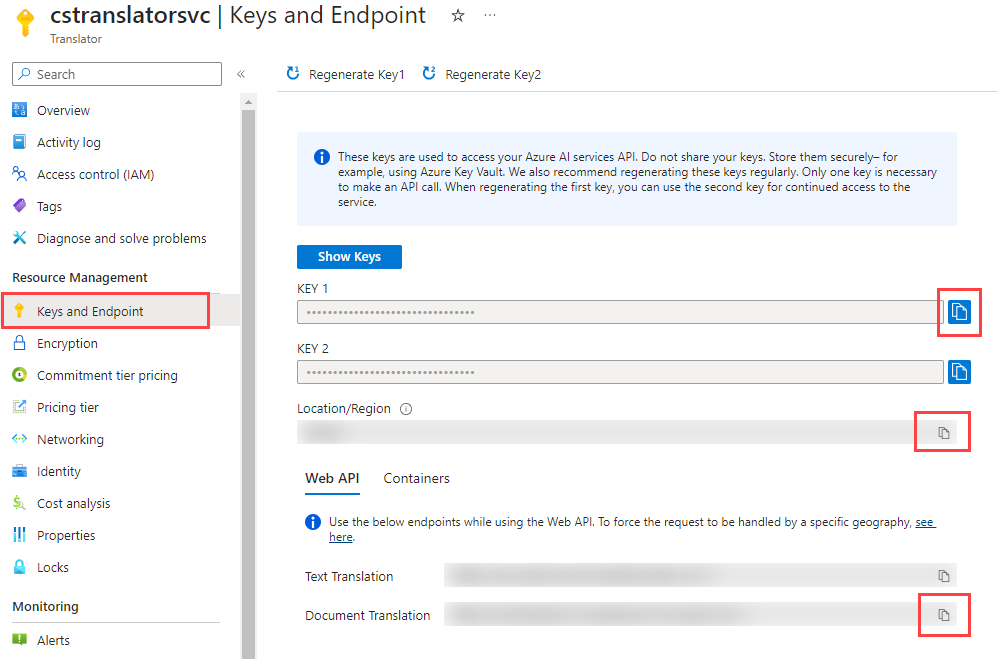

---
lab:
    title: 'Translate Text with Azure AI Translator'
    module: 'Translate Text using the Azure AI Translator and Azure Database for PostgreSQL'
---

# Translate Text with Azure AI Translator

As the lead developer for Margie's Travel, you have been asked to assist in an internationalization effort. Today, all rental listings for the company's short-term rental service are in English. You want to translate these listings into a variety of languages without extensive development effort. All of your data is hosted in an Azure Database for PostgreSQL flexible server, and you would like to use Azure AI Services to perform translation.

In this exercise, you will translate English-language text into various languages using the Azure AI Translator service via an Azure Database for PostgreSQL flexible server database.

## Before you start

You need an [Azure subscription](https://azure.microsoft.com/free) with administrative rights.

### Deploy resources into your Azure subscription

This step will guide you through using Azure CLI commands from the Azure Cloud Shell to create a resource group and run a Bicep script to deploy the Azure services necessary for completing this exercise into your Azure subscription.

1. Open a web browser and navigate to the [Azure portal](https://portal.azure.com/).

2. Select the **Cloud Shell** icon in the Azure portal toolbar to open a new [Cloud Shell](https://learn.microsoft.com/azure/cloud-shell/overview) pane at the bottom of your browser window.

    

    If prompted, select the required options to open a *Bash* shell. If you have previously used a *PowerShell* console, switch it to a *Bash* shell.

3. At the Cloud Shell prompt, enter the following to clone the GitHub repo containing exercise resources:

    ```bash
    git clone https://github.com/MicrosoftLearning/mslearn-postgresql.git
    ```

    If you have already cloned this GitHub repo in a prior module, it will still be available to you, and you may receive the following error message:

    ```bash
    fatal: destination path 'mslearn-postgresql' already exists and is not an empty directory.
    ```

    If you receive this message, you can safely continue to the next step.

4. Next, you run three commands to define variables to reduce redundant typing when using Azure CLI commands to create Azure resources. The variables represent the name to assign to your resource group (`RG_NAME`), the Azure region (`REGION`) into which resources will be deployed, and a randomly generated password for the PostgreSQL administrator login (`ADMIN_PASSWORD`).

    In the first command, the region assigned to the corresponding variable is `eastus`, but you can also replace it with a location of your preference. However, if replacing the default, you must select another [Azure region that supports abstractive summarization](https://learn.microsoft.com/azure/ai-services/language-service/summarization/region-support) to ensure you can complete all of the tasks in the modules in this learning path.

    ```bash
    REGION=eastus
    ```

    The following command assigns the name to be used for the resource group that will house all the resources used in this exercise. The resource group name assigned to the corresponding variable is `rg-learn-postgresql-ai-$REGION`, where `$REGION` is the location you specified above. However, you can change it to any other resource group name that suits your preference.

    ```bash
    RG_NAME=rg-learn-postgresql-ai-$REGION
    ```

    The final command randomly generates a password for the PostgreSQL admin login. Make sure you copy it to a safe place to use later to connect to your PostgreSQL flexible server.

    ```bash
    a=()
    for i in {a..z} {A..Z} {0..9}; 
        do
        a[$RANDOM]=$i
        done
    ADMIN_PASSWORD=$(IFS=; echo "${a[*]::18}")
    echo "Your randomly generated PostgreSQL admin user's password is:"
    echo $ADMIN_PASSWORD
    ```

5. If you have access to more than one Azure subscription, and your default subscription is not the one in which you want to create the resource group and other resources for this exercise, run this command to set the appropriate subscription, replacing the `<subscriptionName|subscriptionId>` token with either the name or ID of the subscription you want to use:

    ```azurecli
    az account set --subscription <subscriptionName|subscriptionId>
    ```

6. Run the following Azure CLI command to create your resource group:

    ```azurecli
    az group create --name $RG_NAME --location $REGION
    ```

7. Finally, use the Azure CLI to execute a Bicep deployment script to provision Azure resources in your resource group:

    ```azurecli
    az deployment group create --resource-group $RG_NAME --template-file "mslearn-postgresql/Allfiles/Labs/Shared/deploy-translate.bicep" --parameters restore=false adminLogin=pgAdmin adminLoginPassword=$ADMIN_PASSWORD
    ```

    The Bicep deployment script provisions the Azure services required to complete this exercise into your resource group. The resources deployed include an Azure Database for PostgreSQL flexible server and Azure AI Translator service. The Bicep script also performs some configuration steps, such as adding the `azure_ai` and `vector` extensions to the PostgreSQL server's _allowlist_ (via the azure.extensions server parameter) and creating a database named `rentals` on the server. **Note that the Bicep file differs from the other modules in this learning path.**

    The deployment typically takes several minutes to complete. You can monitor it from the Cloud Shell or navigate to the **Deployments** page for the resource group you created above and observe the deployment progress there.

8. Close the Cloud Shell pane once your resource deployment is complete.

### Troubleshooting deployment errors

You may encounter a few errors when running the Bicep deployment script.

- If you previously ran the Bicep deployment script for this learning path and subsequently deleted the resources, you may receive an error message like the following if you are attempting to rerun the script within 48 hours of deleting the resources:

    ```bash
    {"code": "InvalidTemplateDeployment", "message": "The template deployment 'deploy' is not valid according to the validation procedure. The tracking id is '4e87a33d-a0ac-4aec-88d8-177b04c1d752'. See inner errors for details."}
    
    Inner Errors:
    {"code": "FlagMustBeSetForRestore", "message": "An existing resource with ID '/subscriptions/{subscriptionId}/resourceGroups/rg-learn-postgresql-ai-eastus/providers/Microsoft.CognitiveServices/accounts/{accountName}' has been soft-deleted. To restore the resource, you must specify 'restore' to be 'true' in the property. If you don't want to restore existing resource, please purge it first."}
    ```

    If you receive this message, modify the `azure deployment group create` command above to set the `restore` parameter equal to `true` and rerun it.

- If the selected region is restricted from provisioning specific resources, you must set the `REGION` variable to a different location and rerun the commands to create the resource group and run the Bicep deployment script.

    ```bash
    {"status":"Failed","error":{"code":"DeploymentFailed","target":"/subscriptions/{subscriptionId}/resourceGroups/{resourceGrouName}/providers/Microsoft.Resources/deployments/{deploymentName}","message":"At least one resource deployment operation failed. Please list deployment operations for details. Please see https://aka.ms/arm-deployment-operations for usage details.","details":[{"code":"ResourceDeploymentFailure","target":"/subscriptions/{subscriptionId}/resourceGroups/{resourceGrouName}/providers/Microsoft.DBforPostgreSQL/flexibleServers/{serverName}","message":"The resource write operation failed to complete successfully, because it reached terminal provisioning state 'Failed'.","details":[{"code":"RegionIsOfferRestricted","message":"Subscriptions are restricted from provisioning in this region. Please choose a different region. For exceptions to this rule please open a support request with Issue type of 'Service and subscription limits'. See https://review.learn.microsoft.com/en-us/azure/postgresql/flexible-server/how-to-request-quota-increase for more details."}]}]}}
    ```

- If the script is unable to create an AI resource due to the requirement to accept the responsible AI agreement, you may experience the following error; in which case use the Azure Portal user interface to create an Azure AI Services resource, and then re-run the deployment script.

    ```bash
    {"code": "InvalidTemplateDeployment", "message": "The template deployment 'deploy' is not valid according to the validation procedure. The tracking id is 'f8412edb-6386-4192-a22f-43557a51ea5f'. See inner errors for details."}
     
    Inner Errors:
    {"code": "ResourceKindRequireAcceptTerms", "message": "This subscription cannot create TextAnalytics until you agree to Responsible AI terms for this resource. You can agree to Responsible AI terms by creating a resource through the Azure Portal then trying again. For more detail go to https://go.microsoft.com/fwlink/?linkid=2164190"}
    ```

## Connect to your database using psql in the Azure Cloud Shell

In this task, you connect to the `rentals` database on your Azure Database for PostgreSQL server using the [psql command-line utility](https://www.postgresql.org/docs/current/app-psql.html) from the [Azure Cloud Shell](https://learn.microsoft.com/azure/cloud-shell/overview).

1. In the [Azure portal](https://portal.azure.com/), navigate to your newly created Azure Database for PostgreSQL flexible server.

2. In the resource menu, under **Settings**, select **Databases** select **Connect** for the `rentals` database.

    

3. At the "Password for user pgAdmin" prompt in the Cloud Shell, enter the randomly generated password for the **pgAdmin** login.

    Once logged in, the `psql` prompt for the `rentals` database is displayed.

4. Throughout the remainder of this exercise, you continue working in the Cloud Shell, so it may be helpful to expand the pane within your browser window by selecting the **Maximize** button at the top right of the pane.

    

## Populate the database with listings data

You need to have English-language listings data available in order to translate them. If you have not created the `listings` table in the `rentals` database in a prior module, follow these instructions to create it.

1. Run the following commands to create the `listings` table for storing rental property listing data:

    ```sql
    CREATE TABLE listings (
        id int,
        name varchar(100),
        description text,
        property_type varchar(25),
        room_type varchar(30),
        price numeric,
        weekly_price numeric
    );
    ```

2. Next, use the `COPY` command to load data from CSV files into each table you created above. Start by running the following command to populate the `listings` table:

    ```sql
    \COPY listings FROM 'mslearn-postgresql/Allfiles/Labs/Shared/listings.csv' CSV HEADER
    ```

    The command output should be `COPY 50`, indicating that 50 rows were written into the table from the CSV file.

## Create additional tables for translation

You have the `listings` data in place but need two additional tables to perform translation.

1. Run the following commands to create the `languages` and `listing_translations` tables.

    ```sql
    CREATE TABLE languages (
        code VARCHAR(7) NOT NULL PRIMARY KEY
    );
    ```

    ```sql
    CREATE TABLE listing_translations(
        id INT GENERATED ALWAYS AS IDENTITY PRIMARY KEY,
        listing_id INT,
        language_code VARCHAR(7),
        description TEXT
    );
    ```

2. Next, insert one row per language for translation. In this case, you will create rows for five languages: German, Chinese Simplified, Hindi, Hungarian, and Swahili.

    ```sql
    INSERT INTO languages(code)
    VALUES
        ('de'),
        ('zh-Hans'),
        ('hi'),
        ('hu'),
        ('sw');
    ```

    The command output should be `INSERT 0 5`, indicating that you have inserted five new rows into the table.

## Install and configure the `azure_ai` extension

Before using the `azure_ai` extension, you must install it into your database and configure it to connect to your Azure AI Services resources. The `azure_ai` extension allows you to integrate the Azure OpenAI and Azure AI Language services into your database. To enable the extension in your database, follow these steps:

1. Execute the following command at the `psql` prompt to verify that the `azure_ai` and the `vector` extensions were successfully added to your server's _allowlist_ by the Bicep deployment script you ran when setting up your environment:

    ```sql
    SHOW azure.extensions;
    ```

    The command displays the list of extensions on the server's _allowlist_. If everything was correctly installed, your output must include `azure_ai` and `vector`, like this:

    ```sql
     azure.extensions 
    ------------------
     azure_ai,vector
    ```

    Before an extension can be installed and used in Azure Database for PostgreSQL flexible server, it must be added to the server's _allowlist_, as described in [how to use PostgreSQL extensions](https://learn.microsoft.com/azure/postgresql/flexible-server/concepts-extensions#how-to-use-postgresql-extensions).

2. Now, you are ready to install the `azure_ai` extension using the [CREATE EXTENSION](https://www.postgresql.org/docs/current/sql-createextension.html) command.

    ```sql
    CREATE EXTENSION IF NOT EXISTS azure_ai;
    ```

    `CREATE EXTENSION` loads a new extension into the database by running its script file. This script typically creates new SQL objects such as functions, data types, and schemas. An error is thrown if an extension of the same name already exists. Adding `IF NOT EXISTS` allows the command to execute without throwing an error if it is already installed.

3. You must then use the `azure_ai.set_setting()` function to configure the connection to your Azure AI Translator service. Using the same browser tab where your Cloud Shell is open, minimize or restore the Cloud Shell pane, then navigate to your Azure AI Translator resource in the [Azure portal](https://portal.azure.com/). Once you are on the Azure AI Translator resource page, in the resource menu, under the **Resource Management** section, select **Keys and Endpoint**, then copy one of the available keys, your region, and your Document Translation endpoint.

    

    You can use either `KEY 1` or `KEY 2`. Always having two keys allows you to securely rotate and regenerate keys without causing service disruption.

4. Configure the `azure_cognitive` settings to point to your AI Translator endpoint, subscription key, and region. The value for `azure_cognitive.endpoint` will be your service's Document Translation URL. The value for `azure_cognitive.subscription_key` will be Key 1 or Key 2. The value for `azure_cognitive.region` will be the Azure AI Translator instance's region.

    ```sql
    SELECT azure_ai.set_setting('azure_cognitive.endpoint','https://<YOUR_ENDPOINT>.cognitiveservices.azure.com/');
    SELECT azure_ai.set_setting('azure_cognitive.subscription_key', '<YOUR_KEY>');
    SELECT azure_ai.set_setting('azure_cognitive.region', '<YOUR_REGION>');
    ```

## Create a stored procedure to translate listings data

To populate the language translation table, you will create a stored procedure to load data in batches.

1. Run the following command at the `psql` prompt to create a new stored procedure named `translate_listing_descriptions`.

    ```sql
    CREATE OR REPLACE PROCEDURE translate_listing_descriptions(max_num_listings INT DEFAULT 10)
    LANGUAGE plpgsql
    AS $$
    BEGIN
        WITH batch_to_load(id, description) AS
        (
            SELECT id, description
            FROM listings l
            WHERE NOT EXISTS (SELECT * FROM listing_translations ll WHERE ll.listing_id = l.id)
            LIMIT max_num_listings
        )
        INSERT INTO listing_translations(listing_id, language_code, description)
        SELECT b.id, l.code, (unnest(tr.translations)).TEXT
        FROM batch_to_load b
            CROSS JOIN languages l
            CROSS JOIN LATERAL azure_cognitive.translate(b.description, l.code) tr;
    END;
    $$;
    ```

    This stored procedure will load a batch of 5 records, translate the description in each language you select, and insert the translated descriptions into the `listing_translations` table.

2. Execute the stored procedure using the following SQL command:

    ```sql
    CALL translate_listing_descriptions(10);
    ```

    This call will take approximately one second per rental listing to translate into five languages, so each run should take approximately 10 seconds. The command output should be `CALL`, indicating that the stored procedure call succeeded.

3. Call the stored procedure four more times, for five times that you have called this procedure. That will generate translations for every listing in the table.

4. Run the following script to get the count of listing translations.

    ```sql
    SELECT COUNT(*) FROM listing_translations;
    ```

    The call should return a value of 250, indicating that each listing has been translated into five languages. You may further analyze the data by querying the `listing_translations` table.

## Create a procedure to add a new listing with translations

You have a stored procedure to translate existing listings, but your internationalization plans also require translating new listings as they are entered. To do so, you will create another stored procedure.

1. Run the following command at the `psql` prompt to create a new stored procedure named `add_listing`.

    ```sql
    CREATE OR REPLACE PROCEDURE add_listing(id INT, name VARCHAR(255), description TEXT)
    LANGUAGE plpgsql
    AS $$
    DECLARE
    listing_id INT;
    BEGIN
        INSERT INTO listings(id, name, description)
        VALUES(id, name, description);

        INSERT INTO listing_translations(listing_id, language_code, description)
        SELECT id, l.code, (unnest(tr.translations)).TEXT
        FROM languages l
            CROSS JOIN LATERAL azure_cognitive.translate(description, l.code) tr;
    END;
    $$;
    ```

    This stored procedure will insert a row into the `listings` table. Then, it will translate the description for each language in the `languages` table and insert these translations into the `listing_translations` table.

2. Execute the stored procedure using the following SQL command:

    ```sql
    CALL add_listing(51, 'A Beautiful Home', 'This is a beautiful home in a great location.');
    ```

    The command output should be `CALL`, indicating that the stored procedure call succeeded.

3. Run the following script to get the translations for your new listing.

    ```sql
    SELECT l.id, l.name, l.description, lt.language_code, lt.description AS translated_description
    FROM listing_translations lt
        INNER JOIN listings l ON lt.listing_id = l.id
    WHERE l.name = 'A Beautiful Home';
    ```

    The call should return five rows, with values similar to the following table.

    ```sql
     id  | listing_id | language_code |                    description                     
    -----+------------+---------------+------------------------------------------------------
     126 |          2 | de            | Dies ist ein schönes Haus in einer großartigen Lage.
     127 |          2 | zh-Hans       | 这是一个美丽的家，地理位置优越。
     128 |          2 | hi            | यह एक महान स्थान में एक सुंदर घर है।
     129 |          2 | hu            | Ez egy gyönyörű otthon egy nagyszerű helyen.
     130 |          2 | sw            | Hii ni nyumba nzuri katika eneo kubwa.
    ```

## Clean up

Once you have completed this exercise, delete the Azure resources you created. You are charged for the configured capacity, not how much the database is used. Follow these instructions to delete your resource group and all resources you created for this lab.

1. Open a web browser and navigate to the [Azure portal](https://portal.azure.com/), and on the home page, select **Resource groups** under Azure services.

    

2. In the filter for any field search box, enter the name of the resource group you created for this lab, and then select the resource group from the list.

3. On the **Overview** page of your resource group, select **Delete resource group**.

    

4. In the confirmation dialog, enter the resource group name you are deleting to confirm and then select **Delete**.
