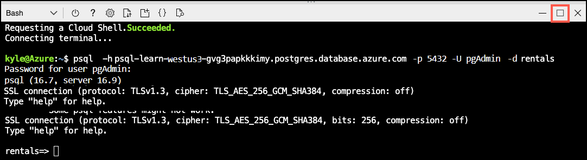
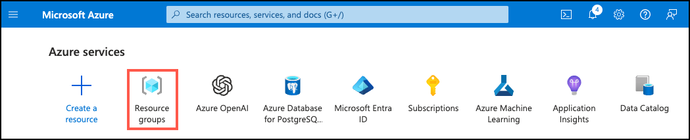
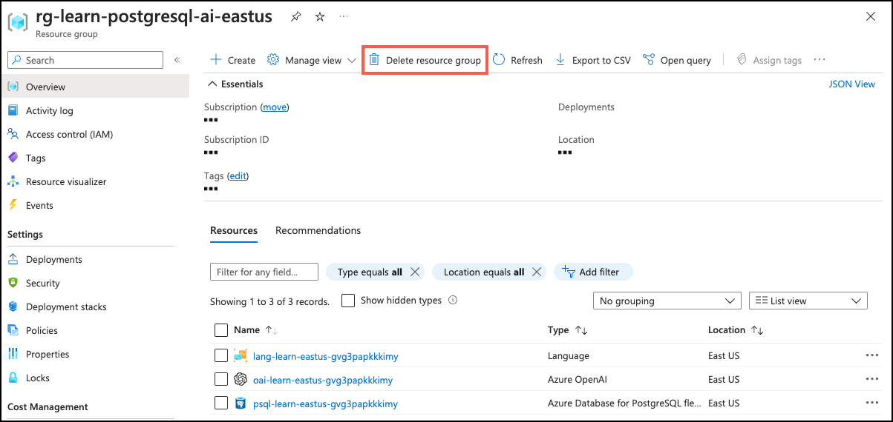

---
lab:
  title: Explore the Visual Studio Code PostgreSQL Extension and GitHub Copilot
  module: Develop PostgreSQL solutions in Visual Studio Code with the PostgreSQL extension and GitHub Copilot
  description: Earlier in this exercise, you deployed an Azure Database for PostgreSQL flexible server and created a rentals database with sample data. Now, you connect to that database using the PostgreSQL extension in Visual Studio Code. You need the server name, admin username, and password generated during deployment.
  duration: 45 minutes
  level: 400
  islab: true
  primarytopics:
    - Azure
    - Azure Database for PostgreSQL
    - GitHub
    - Visual Studio
    - Visual Studio Code
---

#  Explore the Visual Studio Code PostgreSQL Extension and GitHub Copilot

As the lead developer for Margie’s Travel, you're tasked with improving your team’s productivity when working with Azure Database for PostgreSQL. You want to learn how the PostgreSQL extension for Visual Studio Code, together with GitHub Copilot, can help you write and refine SQL more efficiently. In this exercise, you deploy the required Azure resources, connect to your database, and prepare sample data so you can use the extension and Copilot in later steps.

## Before you start

You need an [Azure subscription](https://azure.microsoft.com/free) with administrative rights.

## Deploy resources into your Azure subscription

This step guides you through using Azure CLI commands from the Azure Cloud Shell to create a resource group and run a Bicep script to deploy the Azure services necessary for completing this exercise into your Azure subscription.

1. Open a web browser and navigate to the [Azure portal](https://portal.azure.com/).

2. Select the **Cloud Shell** icon in the Azure portal toolbar to open a new [Cloud Shell](https://learn.microsoft.com/azure/cloud-shell/overview) pane at the bottom of your browser window.

    

    If prompted, select the required options to open a *Bash* shell. If you previously used a *PowerShell* console, switch it to a *Bash* shell.

3. Clone the GitHub repo containing the exercise resources.

    ```bash
    git clone https://github.com/MicrosoftLearning/mslearn-postgresql.git
    ```

4. Define variables for the Azure region, resource group name, and PostgreSQL admin password.

    ```bash
    REGION=eastus
    ```

    ```bash
    RG_NAME=rg-learn-postgresql-ai-$REGION
    ```

    ```bash
    a=()
    for i in {a..z} {A..Z} {0..9};
        do
        a[$RANDOM]=$i
        done
    ADMIN_PASSWORD=$(IFS=; echo "${a[*]::18}")
    echo "Your randomly generated PostgreSQL admin user's password is:"
    echo $ADMIN_PASSWORD
    ```

5. If necessary, switch to the correct Azure subscription.

    ```azurecli
    az account set --subscription <subscriptionName|subscriptionId>
    ```

6. Create a resource group.

    ```azurecli
    az group create --name $RG_NAME --location $REGION
    ```

7. Run the Bicep deployment.

    ```azurecli
    az deployment group create --resource-group $RG_NAME --template-file "mslearn-postgresql/Allfiles/Labs/Shared/deploy.bicep" --parameters restore=false adminLogin=pgAdmin adminLoginPassword=$ADMIN_PASSWORD

    ```

8. Throughout this exercise, you authenticate to Azure OpenAI using **one** of two methods. Choose the one that applies to your environment and follow only those instructions at each step:

    - **API keys** — use a key copied from the Azure portal (works in most environments).
    - **Managed identity** — use Microsoft Entra ID token-based authentication (required when API keys are disabled at the organization level).

    If you're using **managed identity**, run the following commands now to set it up. Otherwise skip to the next step.

    ```bash
    # Re-derive all variables (in case your Cloud Shell session was reset)
    PGSERVER=$(az postgres flexible-server list -g "$RG_NAME" --query "[0].name" -o tsv)
    AOAI=$(az cognitiveservices account list -g "$RG_NAME" --query "[?kind=='OpenAI'].name | [0]" -o tsv)
    AOAI_ID=$(az cognitiveservices account show -g "$RG_NAME" -n "$AOAI" --query "id" -o tsv)
    SUB_ID=$(az account show --query "id" -o tsv)

    # Enable system-assigned managed identity on the PostgreSQL server
    az rest --method patch \
      --url "https://management.azure.com/subscriptions/$SUB_ID/resourceGroups/$RG_NAME/providers/Microsoft.DBforPostgreSQL/flexibleServers/$PGSERVER?api-version=2024-08-01" \
      --body '{"identity":{"type":"SystemAssigned"}}'

    # Wait for the identity to be assigned, then get the principal ID
    echo "Waiting for system-assigned managed identity..."
    SYS_MI=""
    while [ -z "$SYS_MI" ] || [ "$SYS_MI" = "null" ]; do
      sleep 15
      SYS_MI=$(az rest --method get \
        --url "https://management.azure.com/subscriptions/$SUB_ID/resourceGroups/$RG_NAME/providers/Microsoft.DBforPostgreSQL/flexibleServers/$PGSERVER?api-version=2024-08-01" \
        --query "identity.principalId" -o tsv)
      echo "principalId=$SYS_MI"
    done

    # Grant 'Cognitive Services OpenAI User' to the system MI (for in-database embeddings)
    az role assignment create \
      --assignee "$SYS_MI" \
      --role "Cognitive Services OpenAI User" \
      --scope "$AOAI_ID"

    # Restart the server so it picks up the new identity
    az postgres flexible-server restart -g "$RG_NAME" -n "$PGSERVER"
    ```

    > **Note:** Wait 2-3 minutes after the restart for the server to come back up and for role assignments to propagate. If you receive authorization errors in later steps, wait a couple of minutes and retry.

9. Close the Cloud Shell when the deployment completes.

## Troubleshooting deployment errors

(Full troubleshooting text remains unchanged from your original source.)

---

## Connect to your database using psql in the Azure Cloud Shell

In this task, you connect to the `rentals` database on your Azure Database for PostgreSQL flexible server using the `psql` command-line utility.

1. In the [Azure portal](https://portal.azure.com/), open the Cloud Shell by selecting the **Cloud Shell** icon in the toolbar.

1. Run the following command to connect to your `rentals` database, replacing `<server-name>` with the name of your PostgreSQL flexible server (found on the **Overview** page of your PostgreSQL resource in the Azure portal):

    ```bash
    psql -h <server-name>.postgres.database.azure.com -U pgAdmin -d rentals
    ```

1. When prompted, enter the randomly generated password for the `pgAdmin` sign in.

1. After sign in, ensure you're connected to the `rentals` database.

1. Select **Maximize** in Cloud Shell to create more space.

    

## Populate the database with sample data

Before you explore the PostgreSQL extension and use GitHub Copilot in Visual Studio Code, add sample data to your database.

1. Create the `listings` table.

    ```sql
    DROP TABLE IF EXISTS listings;

    CREATE TABLE listings (
        id int,
        name varchar(100),
        description text,
        property_type varchar(25),
        room_type varchar(30),
        price numeric,
        weekly_price numeric
    );
    ```

2. Create the `reviews` table.

    ```sql
    DROP TABLE IF EXISTS reviews;

    CREATE TABLE reviews (
        id int,
        listing_id int,
        date date,
        comments text
    );
    ```

3. Load listings data.

    ```sql
    \COPY listings FROM 'mslearn-postgresql/Allfiles/Labs/Shared/listings.csv' CSV HEADER
    ```

4. Load reviews data.

    ```sql
    \COPY reviews FROM 'mslearn-postgresql/Allfiles/Labs/Shared/reviews.csv' CSV HEADER
    ```

## Use the PostgreSQL extension and GitHub Copilot in Visual Studio Code

With your Azure Database for PostgreSQL server deployed and sample data loaded, you're now ready to use the PostgreSQL extension and GitHub Copilot in Visual Studio Code. Follow the steps in the subsequent units to connect to your database, explore database objects, generate SQL queries with Copilot, and validate query results.

### Install the Visual Studio Code PostgreSQL extension

This section assumes you already installed Visual Studio Code on your development machine. If you haven't, download and install it from [here](https://code.visualstudio.com/).

Once you have Visual Studio Code installed, follow these steps to install the PostgreSQL extension (if you haven't already):

1. Open Visual Studio Code.

1. Select the **Extensions** icon in the Activity Bar on the side of the window.

1. In the **Extensions** view, search for ***PostgreSQL*** and select the extension named **PostgreSQL** published by Microsoft.

1. Select the **Install** button to add the extension to Visual Studio Code.

After installing the PostgreSQL extension, you can proceed to connect to your Azure Database for PostgreSQL server and start exploring the database objects and using GitHub Copilot for SQL generation and assistance.

### Connect to your Azure Database for PostgreSQL server

Earlier in this exercise, you deployed an Azure Database for PostgreSQL flexible server and created a `rentals` database with sample data. Now, you connect to that database using the PostgreSQL extension in Visual Studio Code. You need the server name, admin username, and password generated during deployment.

1. Open Visual Studio Code (if it isn't already open).

1. In the **Activity Bar**, select the **PostgreSQL** icon to open the PostgreSQL extension view.

1. In the PostgreSQL extension view, select the **Add New Connection** button (represented by a plug icon with a plus sign).

1. In the **New Connection** dialog, enter the following details:

    - **Server name**: `<your-server-name>.postgres.database.azure.com` (replace `<your-server-name>` with the actual server name from your deployment)
    - **Authentication type**: Password
    - **Username**: `pgAdmin`
    - **Password**: `<your-generated-password>` (use the password generated during deployment)
    - **(Optional) Save password**: Select this box if you want Visual Studio Code to remember your password for future connections.
    - **Database name**: `rentals`
    - **Connection name**: (any name you prefer)

1. Select the **Test Connection** button to verify that the connection details are correct.

1. Select the **Save & Connect** button to save and establish the connection to your Azure Database for PostgreSQL server.

After completing these steps, you should be connected to your `rentals` database in Azure Database for PostgreSQL. You can now explore the database objects, write SQL queries, and use GitHub Copilot to assist with your PostgreSQL development tasks within Visual Studio Code.

### Test the PostgreSQL extension

With the PostgreSQL extension installed and connected to your Azure Database for PostgreSQL server, you can now test its functionality by exploring database objects and executing SQL queries.

1. In the **PostgreSQL** extension view, expand the connection you created to see the list of databases (if not already expanded).

1. Expand the `rentals` database to view its schemas, tables, and other objects.

1. Expand the `schemas` node, then the `public` schema, and finally the `Tables` node to see the `listings` and `reviews` tables you created earlier.

1. Right-click on the `listings` table and select **Select Top 1000** to return the first 1,000 rows from the `listings` table. A new SQL query editor tab opens with the generated SQL query and its results.

1. Review the results in the **Results** pane below the query editor to verify that the data loaded correctly.

1. Right-click on the `rentals` database and select **New Query** to open a new SQL query editor tab.

1. In the new query editor, write and execute a SQL query, such as:

    ```sql
    SELECT COUNT(*) AS total_listings FROM listings;
    ```

    Your query should return the total number of listings in the `listings` table.

By following these steps, you successfully tested the PostgreSQL extension by exploring database objects and executing SQL queries against your Azure Database for PostgreSQL server. You can now proceed to use GitHub Copilot to assist with generating and refining SQL queries in Visual Studio Code.

### Install GitHub Copilot in Visual Studio Code

To use GitHub Copilot with the PostgreSQL extension in Visual Studio Code, you first need to install the GitHub Copilot extension. Follow these steps to install and set up GitHub Copilot (if you haven't already):

1. Open Visual Studio Code (if it isn't already open).

1. Select the **Extensions** icon in the Activity Bar on the side of the window.

1. In the **Extensions** view, search for ***GitHub Copilot Chat*** and select the extension named **GitHub Copilot Chat** published by GitHub.

1. Select the **Install** button to install the GitHub Copilot extension.

After installing the GitHub Copilot extension, you may need to sign in to your GitHub account and enable Copilot if prompted. Once set up, you can start using GitHub Copilot to assist with generating and refining SQL queries while working with your PostgreSQL database in Visual Studio Code.

### Use GitHub Copilot with the PostgreSQL extension

Now that you have both the PostgreSQL extension and GitHub Copilot installed in Visual Studio Code, we can inject GitHub Copilot into your PostgreSQL development workflow.

You start by applying GitHub Copilot from the PostgreSQL extension.

1. In the PostgreSQL extension view, let's create a new query. Right-click on the `rentals` database and select **New Query**.

1. lets add a query to get GitHub Copilot started. Type the following SQL query in the new query editor:

    ```sql
    SELECT * FROM listings WHERE price < 100;
    ```
1. Now, highlight the SQL query you typed, right-click on the highlighted text, and select **Explain** from the context menu. Note how the GitHub Copilot Chat pane opens with an explanation of the SQL query you provided. It might ask you to allow to Activate MCP extensions. If so, select **Allow** to enable GitHub Copilot to connect to your database and provide more contextual responses.

Let's try something slightly more interesting.

1. Replace the previous query with the following SQL query in the query editor but don't execute it yet:

    ```sql
    SELECT * FROM listings l, reviews r 
    WHERE l.name LIKE '%" + searchInput + "%' 
    AND r.listing_id = l.id 
    AND price < 100
    ORDER BY date;
    ```

1. Highlight the new SQL query, right-click on the highlighted text, and select **Review** from the context menu.

1. This step returns a **Code Review** response from GitHub Copilot with suggestions on how to improve the SQL query.

1. You can choose to **Apply** or **Discard** the suggestions provided by GitHub Copilot. Select **Apply** to update your SQL query with the suggested improvements.

1. Notice how the SQL query in the editor was updated based on GitHub Copilot's suggestions.    

While the context menu options are a great way to use GitHub Copilot, the real power comes from using Copilot Chat directly.

1. In the **PostgreSQL** extension view, right-click on the `rentals` database and select **Connect Copilot** to open the Copilot Chat pane (pane might already be opened).

1. You should see a message that the chat is connected to the `rentals` database, indicating that GitHub Copilot uses the context of your PostgreSQL database for this chat session.

1. In the chat input box, type the following prompt:

    ```
    Generate a SQL query to find the top 5 most expensive listings.
    ```

1. Notice that it not only generates the query but it also returns the results of the query executed against your connected PostgreSQL database.

1. In the chat input box, type the following prompt:

    ```
    Run the query.
    ```

1. Notice that the generated query is executed and the results are returned in the chat.

Let's try to troubleshoot a couple of queries we might have issues with.

1. In the PostgreSQL extension view, let's create a new query. Right-click on the `rentals` database and select **New Query**.

1. Type the following SQL query in the new query editor, highlight the query, but don't execute it:

    ```sql
    SELECT id, title, price FROM listings WHERE price < 100;
    ```

1. Go back to the Copilot Chat pane and type and run the following prompt. 

    ```
    There is an error in the query in the query editor. Can you help me identify and fix it?
    ```

1. It should identify that the `title` column doesn't exist in the `listings` table and provide a corrected version of the SQL query. It should recommend changing `title` to `name`.

1. Go back to the Copilot Chat pane and type and run the following prompt. 

    ```
    Fix the query in the query editor and execute it.
    ```

1. It should ask for confirmation to `Keep` or `Undo` the changes. Select **Keep** to apply the fix. The fixed query should execute and return results in the chat.

Let's try one more complex query.

1. Replace the previous query for the following SQL query in the new query editor and execute it (the query will fail initially as it has some intentional issues that we will troubleshoot in the next steps):

    ```sql
    WITH listing_stats AS (
        SELECT 
            name,
            price,
            description,
            LENGTH(description) AS desc_length,
            AVG(price) OVER () AS avg_price
        FROM listings
        WHERE price IS NOT NULL
    ),
    expensive_listings AS (
        SELECT 
            name,
            price,
            desc_length,
            avg_price,
            price - avg_price AS price_diff,
            CASE 
                WHEN price > avg_price THEN 'Above Average'
                ELSE 'Below Average'
            END AS price_category
        FROM listing_stats
        WHERE price > avg_price * 1.5
    ),
    categorized AS (
        SELECT 
            price_category,
            COUNT(*) AS listing_count,
            AVG(price) AS category_avg_price,
            SUM(desc_length) AS total_desc_length
        FROM expensive_listings
        GROUP BY price_category
    )
    SELECT 
        price_category,
        listing_count,
        category_avg_price,
        total_desc_length / listing_count AS avg_desc_length,
        ROUND(listing_count / SUM(listing_count) OVER () * 100, 2) AS pct_of_total
    FROM categorized
    WHERE avg_desc_length > 50
    ORDER BY category_avg_price DESC;
    ```

    This query analyzes listings to identify expensive items (those items priced more than 150% of the average). The query then categorizes them as "Above Average" or "Below Average" and calculates statistics for each category. Finally, the query filters to show only categories where the average description length exceeds 50 characters.

1. Now, go back to the Copilot Chat pane and type and run the following prompt. 

    ```
    This query is erroring out. Can you help me fix it and explain what I did wrong?
    ```

1. It should identify any errors in the SQL query and provide a corrected version along with an explanation of what was wrong. Allow it to apply the fix and rerun the query. The query's results should be similar to the following:

    | price_category | listing_count | category_avg_price | avg_desc_length | pct_of_total |
    | --------------- | -------------- | ------------------ | ---------------- | ------------- |
    | Above Average | 8 | 287.375 | 895 | 100.00 |

So far we explored data manipulation language (DML) queries. Let's try a couple of data definition language (DDL) commands next. Let's start by creating a new table.

1. In the Copilot Chat pane, type and run the following prompt. 

    ```
    Create a new table called customers.
    ```

1. This request is very generic, so Copilot likely asks for more details about the table structure or recommend a table structure. If so, respond to the prompt with the following details:

    ```
    The customers table should have the following columns: id (integer, primary key), first_name (varchar(50)), last_name (varchar(50)), email (varchar(100), unique), created_at (timestamp, default current_timestamp).
    ```

1. Since this request is a DDL command that modifies the database schema, Copilot won't execute it immediately. Copilot will ask for confirmation to execute the DDL command. However, be careful when selecting to Allow the command. Review the pulldown options, and only choose **Allow Once** to execute this specific command, and not blanket permission for all DDL commands.

1. Copilot should create the table in the database.

1. Once the table is created, you can verify its existence by expanding the `Tables` node under the `public` schema in the PostgreSQL extension view. You might need to refresh the view to see the new `customers` table.

Now, let's try modifying the `customers` table to add a new column, and say 

1. In the Copilot Chat pane, type and run the following prompt. 

    ```
    Add a new column called phone_number (varchar(15)) to the customers table.
    ```

1. Since this is another DDL command, and you previously chose to only allow DDL commands once, Copilot will ask for confirmation again. Select **Allow Once** to execute this specific command.

1. Ask Copilot to add 10 sample records to the `customers` table and confirm the change if prompted.

    ```
    Insert 10 sample records into the customers table.
    ```

1. Finally, verify that the records were added successfully by running the following SQL query in a new query editor:

    ```sql
    SELECT * FROM customers;
    ```
1. While this is a simple DML, if you have so far chosen to only allow DDL commands once, Copilot will ask for confirmation to allow DML commands now. You can choose to allow DML commands for the session or just this once. If you choose to allow for the session, Copilot will be able to execute any DML command without asking for confirmation for the rest of the session, so be sure to review the implications of this choice.

1. Review the results in the **Results** pane below the query editor to verify that the sample data was inserted correctly.

Go ahead and come up with a few more DDL or DML commands. Use the Copilot Chat pane to assist you with generating the SQL and executing it against your connected PostgreSQL database.

### Explore the extension agent mode

So far we focused on using Copilot Chat in a question-and-answer format. GitHub Copilot Chat also supports an agent mode that can autonomously perform multi-step database tasks.

1. In the Copilot Chat pane, select **Agent** from the pull-down menu under the chat input box if not already selected.

1. Select the ***Model*** pull-down menu and choose **GPT-5.2** or your preferred model.

1. In the chat input box, type the following prompt:

    ```
    Add a new table under the rental database for cities, make sure to include the country name, the city name and an id for the city.
    ```

1. You might get a dialog box asking for permission to allow the agent to access your workspace. Select **Allow in this session** to proceed.

1. Notice the steps the agent takes to complete the task. It might request more permissions as it works through the task. Review each step and provide permission as needed.

1. Once the agent completes the task, verify that the `cities` table was created successfully by expanding the `Tables` node under the `public` schema in the PostgreSQL extension view. You might need to refresh the view to see the new `cities` table.

1. In the chat input box, type the following prompt:

    ```
    How could we improve this current database?
    ```

1. Review the agent's response and recommendations for improving the database. You can ask the agent to implement any or all of the recommended improvements and verify the changes in the PostgreSQL extension view or by running SQL queries against your database. 


While this example was a simple task, an agent can handle much more complex multi-step tasks. The agent could create a new database schema, populate it with sample data, and generate reports based on that data.

## Clean up

Once you have completed this exercise, delete the Azure resources you created. You are charged for the configured capacity, not how much the database is used. Follow these instructions to delete your resource group and all resources you created for this lab.

1. Open a web browser and navigate to the [Azure portal](https://portal.azure.com/), and on the home page, select **Resource groups** under Azure services.

    

2. In the filter for any field search box, enter the name of the resource group you created for this lab, and then select the resource group from the list.

3. On the **Overview** page of your resource group, select **Delete resource group**.

    

4. In the confirmation dialog, enter the resource group name you are deleting to confirm and then select **Delete**.

## Key takeaways

In this exercise, you explored how to use the PostgreSQL extension for Visual Studio Code with GitHub Copilot to enhance your PostgreSQL development workflow. You connected to an Azure Database for PostgreSQL server, populated it with sample data, and used GitHub Copilot to generate, refine, and troubleshoot SQL queries. The Copilot Chat feature allowed you to interactively request SQL generation and modifications, making it easier to work with your database directly within Visual Studio Code. And that is just the beginning of what you can do with these powerful tools. You can go from a simple query to complex database operations asking copilot to create a whole application that interacts with your database.
